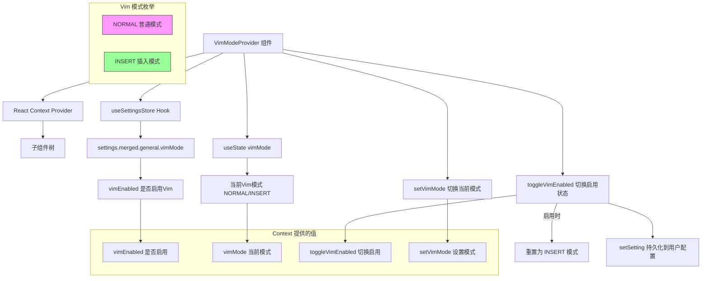

# VimModeContext.tsx

## 概述

`VimModeContext.tsx` 是 Gemini CLI 的 Vim 模式管理上下文模块。它通过 React Context 为整个 UI 组件树提供 Vim 编辑模式的状态管理，支持在 NORMAL（普通模式）和 INSERT（插入模式）之间切换，并将 Vim 模式的启用/禁用偏好持久化到用户设置中。

这是一个相对轻量的 Context 模块，只管理两个状态维度：Vim 功能是否启用（持久化设置）以及当前的 Vim 模式（运行时状态）。

核心职责：
- 管理 Vim 模式的启用/禁用状态（持久化到用户设置）
- 管理当前 Vim 模式（NORMAL / INSERT）
- 提供模式切换方法给 UI 组件使用
- 确保启用 Vim 时默认进入 INSERT 模式

## 架构图（Mermaid）



## 核心组件

### 1. 类型定义

#### `VimMode`
```typescript
export type VimMode = 'NORMAL' | 'INSERT';
```
Vim 模式的联合字面量类型：
- `NORMAL` - 普通模式：按键被解释为命令（如移动光标、删除等）
- `INSERT` - 插入模式：按键被直接输入为文本字符

#### `VimModeContextType`
```typescript
interface VimModeContextType {
  vimEnabled: boolean;                      // Vim 功能是否启用
  vimMode: VimMode;                         // 当前 Vim 模式
  toggleVimEnabled: () => Promise<boolean>; // 切换启用状态，返回新值
  setVimMode: (mode: VimMode) => void;      // 直接设置 Vim 模式
}
```
Context 向消费者暴露的完整接口。

### 2. `VimModeProvider` 组件

Provider 组件，管理 Vim 模式的完整生命周期。

#### 状态来源

| 状态 | 来源 | 持久化 | 说明 |
|------|------|--------|------|
| `vimEnabled` | `useSettingsStore()` -> `settings.merged.general.vimMode` | 是（用户配置文件） | 从合并后的设置中读取，随设置变化自动更新 |
| `vimMode` | `useState('INSERT')` | 否（运行时） | 本地状态，默认为 INSERT 模式 |

#### `toggleVimEnabled()` 方法

```typescript
const toggleVimEnabled = useCallback(async () => {
  const newValue = !vimEnabled;
  if (newValue) {
    setVimMode('INSERT');
  }
  setSetting(SettingScope.User, 'general.vimMode', newValue);
  return newValue;
}, [vimEnabled, setSetting]);
```

切换 Vim 功能的核心方法：
1. 取反当前 `vimEnabled` 值
2. 如果是从禁用变为启用（`newValue` 为 true），则重置 `vimMode` 为 `INSERT`，确保用户启用 Vim 后立即处于可输入状态
3. 通过 `setSetting` 将新值持久化到用户作用域（`SettingScope.User`）的配置中
4. 返回新的启用状态值

该方法是异步的（`async`），因为 `setSetting` 可能涉及文件 I/O 操作。

#### `setVimMode(mode)` 方法

直接来自 `useState` 的 setter 函数，用于在运行时切换 NORMAL 和 INSERT 模式。无持久化行为，重启后 vimMode 总是重置为 INSERT。

### 3. `useVimMode()` Hook

```typescript
export const useVimMode = () => {
  const context = useContext(VimModeContext);
  if (context === undefined) {
    throw new Error('useVimMode must be used within a VimModeProvider');
  }
  return context;
};
```
类型安全的消费者 Hook。注意这里检查的是 `undefined`（而非 `null`），因为 Context 的初始值为 `undefined`。

## 依赖关系

### 内部依赖

| 模块 | 路径 | 用途 |
|------|------|------|
| `SettingScope` | `../../config/settings.js` | 设置作用域枚举，此处使用 `SettingScope.User` 表示用户级别设置 |
| `useSettingsStore` | `./SettingsContext.js` | 设置存储 Hook，提供 `settings`（读取设置值）和 `setSetting`（写入设置值）方法 |

### 外部依赖

| 包名 | 导入内容 | 用途 |
|------|----------|------|
| `react` | `createContext`, `useCallback`, `useContext`, `useState` | React 核心 Hook 和 Context API |

## 关键实现细节

1. **持久化与运行时状态的混合管理**：`vimEnabled` 来自持久化的用户设置（通过 `useSettingsStore` 读取），而 `vimMode` 是纯运行时状态（通过 `useState` 管理）。这意味着 Vim 启用/禁用的偏好在重启后保持，但具体的 NORMAL/INSERT 模式总是从 INSERT 开始。

2. **启用时自动重置为 INSERT 模式**：`toggleVimEnabled` 在启用 Vim 时会将模式重置为 INSERT。这是一个重要的用户体验细节——如果用户在 NORMAL 模式下禁用 Vim，然后重新启用，不应停留在 NORMAL 模式（此时按键不会输入文本，可能让用户困惑）。

3. **设置层级架构**：使用 `SettingScope.User` 作为设置作用域，意味着 Vim 模式偏好保存在用户级配置中（通常为 `~/.config/gemini-cli/` 下的配置文件），对用户的所有项目全局生效，而非仅限于当前项目。

4. **设置合并策略**：`settings.merged.general.vimMode` 中的 `merged` 表示这是经过多层合并后的最终设置值（可能合并了默认值、全局配置、项目配置等），确保 `vimEnabled` 反映的是最终有效的设置。

5. **轻量级设计**：与 `UIStateContext`（100+ 字段）和 `UIActionsContext`（46 个方法）相比，`VimModeContext` 只管理 2 个状态和 2 个方法，是一个聚焦于单一关注点的小型 Context。这种设计使得只关心 Vim 模式的组件不需要订阅庞大的全局状态。

6. **与 UIActionsContext 的关系**：`UIActionsContext` 中定义了 `vimHandleInput(key: Key) => boolean` 方法，它是 Vim 按键处理的实际逻辑入口。`VimModeContext` 负责状态管理（启用、模式），而按键到具体操作的映射逻辑在 `UIActions` 的实现中。
