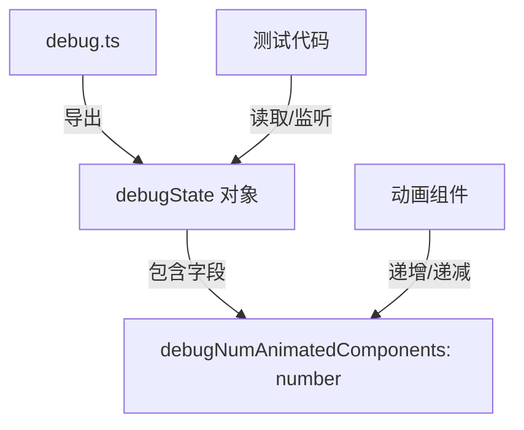

# debug.ts

## 概述

`debug.ts` 是 Gemini CLI 项目中 UI 层的调试状态模块。该文件非常精简，仅导出一个全局调试状态对象 `debugState`，用于追踪当前活跃的动画组件数量。其主要用途是在**测试环境**中确保所有动画完成后再进行断言，避免因动画未结束而导致的测试不稳定（flaky test）问题。

## 架构图（Mermaid）

## 核心组件

### `debugState`

| 属性 | 类型 | 默认值 | 说明 |
|------|------|--------|------|
| `debugNumAnimatedComponents` | `number` | `0` | 追踪当前活跃的动画组件总数 |

- **导出方式**：`export const`，即命名导出的常量对象。
- **可变性**：虽然 `debugState` 本身是 `const`，但其内部属性 `debugNumAnimatedComponents` 是可变的（mutable），可以在外部被递增或递减。
- **作用域**：顶层模块变量（top-level field），在整个应用生命周期内为单例状态。

## 依赖关系

### 内部依赖

无。`debug.ts` 不依赖项目中的任何其他模块，是一个完全独立的叶子模块。

### 外部依赖

无。不依赖任何第三方库或 Node.js 内置模块。

## 关键实现细节

1. **全局可变单例模式**：`debugState` 作为模块级常量导出，所有导入该模块的代码共享同一个对象引用。由于 ES Module 的单例特性，无论被导入多少次，`debugNumAnimatedComponents` 始终指向同一块内存。

2. **测试导向设计**：从注释 `"This is used for testing to ensure we wait for animations to finish"` 可以看出，此模块的存在完全是为了测试基础设施服务。在生产运行时此值同样会被维护，但不会对业务逻辑产生影响。

3. **动画组件计数协议**：使用该模块的动画组件需要遵循以下约定：
   - 动画开始时：`debugState.debugNumAnimatedComponents++`
   - 动画结束时：`debugState.debugNumAnimatedComponents--`
   - 测试代码通过轮询或等待 `debugNumAnimatedComponents === 0` 来判断所有动画是否完成。

4. **许可证**：文件头部声明了 Apache-2.0 许可证，版权归 Google LLC 2025 所有。
