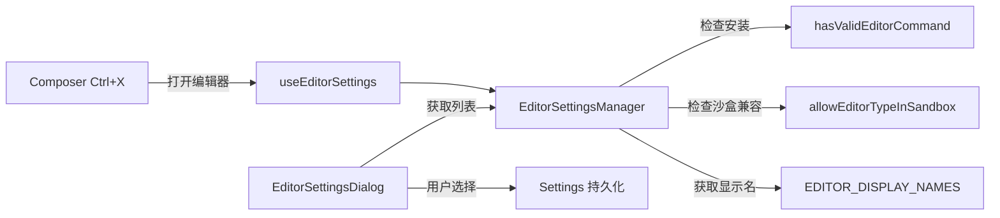

# editors

## 概述

`editors` 目录负责外部编辑器的设置管理。它维护可用编辑器列表，并检测每个编辑器是否已安装以及是否在沙盒环境中可用。用户可以通过设置对话框选择偏好的外部编辑器（如 VS Code、Vim、Nano 等），用于在外部编辑长文本输入或查看计划内容。

## 目录结构

```
editors/
└── editorSettingsManager.ts  # 编辑器设置管理器
```

## 架构图



## 核心组件

### `EditorSettingsManager`

编辑器设置管理器类（单例模式，导出为 `editorSettingsManager`）：

- **`availableEditors: EditorDisplay[]`**: 可用编辑器列表，每个条目包含：
  - `name`: 显示名称（如 "VS Code"、"Vim"）
  - `type`: 编辑器类型标识符
  - `disabled`: 是否禁用（未安装或沙盒中不可用）

- **`getAvailableEditorDisplays()`**: 返回所有编辑器选项，包括 "None" 选项

### `EditorDisplay` 接口

```typescript
interface EditorDisplay {
  name: string;           // 显示名称 + 可选后缀
  type: EditorType | 'not_set';  // 编辑器类型
  disabled: boolean;      // 是否禁用
}
```

初始化时自动检测：
- 编辑器是否已安装（`hasValidEditorCommand`）
- 是否在沙盒中可用（`allowEditorTypeInSandbox`）
- 不可用时添加后缀说明："(Not installed)" 或 "(Not available in sandbox)"

## 依赖关系

### 内部依赖
- `@google/gemini-cli-core`: `EditorType`、`EDITOR_DISPLAY_NAMES`、`hasValidEditorCommand`、`allowEditorTypeInSandbox`

### 外部依赖
- 无

## 数据流

### 编辑器选择流程
1. 用户打开编辑器设置对话框（`/editor` 命令）
2. `EditorSettingsDialog` 通过 `editorSettingsManager.getAvailableEditorDisplays()` 获取列表
3. 禁用的编辑器显示为灰色并附带原因说明
4. 用户选择编辑器 -> `useEditorSettings` 持久化到设置文件
5. 用户在 Composer 中按 `Ctrl+X` -> 使用选中的编辑器打开临时文件
