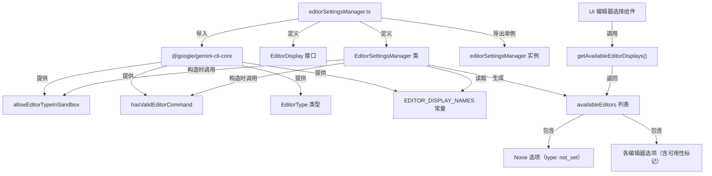

# editorSettingsManager.ts

## 概述

`editorSettingsManager.ts` 是 Gemini CLI 项目中负责**编辑器设置管理**的模块。它的核心职责是：在应用启动时扫描系统中所有支持的编辑器类型，检测每种编辑器是否已安装、是否在沙箱环境中可用，并生成一个带有可用性标记的编辑器显示列表。该列表可用于 UI 中的编辑器选择菜单，让用户从可用编辑器中做出选择。

模块最终以**单例模式**导出一个 `editorSettingsManager` 实例，供应用全局使用。

## 架构图（Mermaid）

## 核心组件

### `EditorDisplay` 接口

| 属性 | 类型 | 说明 |
|------|------|------|
| `name` | `string` | 编辑器的显示名称，可能附带后缀提示（如 "Not installed"、"Not available in sandbox"） |
| `type` | `EditorType \| 'not_set'` | 编辑器类型标识符，`'not_set'` 表示用户未选择任何编辑器 |
| `disabled` | `boolean` | 该编辑器是否不可选（未安装或在沙箱中不可用时为 `true`） |

### `EditorSettingsManager` 类

一个私有类（不直接导出），通过单例实例对外提供服务。

#### 私有属性

| 属性 | 类型 | 说明 |
|------|------|------|
| `availableEditors` | `EditorDisplay[]` | 只读数组，包含所有编辑器的显示信息（含可用性状态） |

#### 构造函数逻辑

1. 从 `EDITOR_DISPLAY_NAMES` 常量中提取所有已注册的编辑器类型键名（`EditorType[]`）。
2. 对键名进行字母排序（`.sort()`），确保显示顺序一致。
3. 在列表头部插入一个 `"None"` 选项（`type: 'not_set'`, `disabled: false`），作为默认/取消选择项。
4. 对每个编辑器类型调用：
   - `hasValidEditorCommand(type)` — 检测系统中是否安装了该编辑器的命令行工具。
   - `allowEditorTypeInSandbox(type)` — 检测该编辑器类型在沙箱模式下是否被允许使用。
5. 根据检测结果：
   - 若沙箱不允许，附加后缀 `" (Not available in sandbox)"`。
   - 若未安装，附加后缀 `" (Not installed)"`（此条件优先级更高，会覆盖沙箱提示）。
   - 若两者都不满足，`disabled` 为 `false`，名称无后缀。

#### 公共方法

| 方法 | 返回类型 | 说明 |
|------|----------|------|
| `getAvailableEditorDisplays()` | `EditorDisplay[]` | 返回构造时生成的编辑器显示列表（只读引用） |

### `editorSettingsManager` 单例

模块底部通过 `export const editorSettingsManager = new EditorSettingsManager()` 导出单例。由于 ES Module 的加载机制，该实例在首次 `import` 时创建，后续所有导入共享同一实例。

## 依赖关系

### 内部依赖

| 依赖模块 | 导入项 | 用途 |
|----------|--------|------|
| `@google/gemini-cli-core` | `allowEditorTypeInSandbox` | 检查编辑器类型在沙箱环境中是否可用 |
| `@google/gemini-cli-core` | `hasValidEditorCommand` | 检查编辑器的命令行工具是否已安装在系统中 |
| `@google/gemini-cli-core` | `EditorType`（类型） | 编辑器类型的 TypeScript 类型定义 |
| `@google/gemini-cli-core` | `EDITOR_DISPLAY_NAMES` | 编辑器类型到人类可读显示名称的映射常量 |

### 外部依赖

无。不依赖任何第三方 npm 包或 Node.js 内置模块。

## 关键实现细节

1. **后缀优先级逻辑**：代码中 `labelSuffix` 的赋值顺序决定了优先级——先检查沙箱限制，再检查安装状态。由于第二次赋值使用了覆盖式写法（`labelSuffix = !hasEditor ? ... : labelSuffix`），当编辑器未安装时，`" (Not installed)"` 会覆盖 `" (Not available in sandbox)"`。这意味着**未安装提示的优先级高于沙箱限制提示**，这在逻辑上是合理的：未安装的编辑器讨论沙箱可用性没有意义。

2. **disabled 的双重条件**：`disabled: !hasEditor || !isAllowedInSandbox`，只要编辑器未安装**或**沙箱不允许，该选项就会被禁用。UI 组件可据此将对应选项置灰。

3. **单例模式 + 构造时计算**：所有编辑器可用性检测在模块加载（构造函数执行）时一次性完成，后续调用 `getAvailableEditorDisplays()` 仅返回缓存结果。这意味着如果用户在运行期间安装/卸载了编辑器，需要重启应用才能更新列表。

4. **排序稳定性**：`Object.keys(...).sort()` 使用默认的 Unicode 字符串排序，确保编辑器列表的显示顺序不受对象键的插入顺序影响，在不同环境下保持一致。

5. **类型安全**：代码使用 `as EditorType[]` 进行类型断言，并通过 ESLint 注释 `@typescript-eslint/no-unsafe-type-assertion` 显式压制了不安全类型断言的警告。这是因为 `Object.keys()` 返回 `string[]`，而开发者确信 `EDITOR_DISPLAY_NAMES` 的键集合与 `EditorType` 完全对应。
