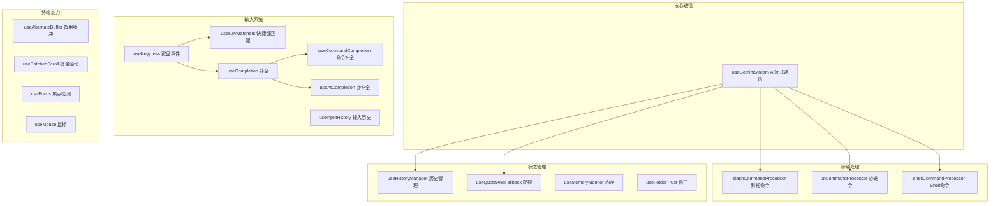

# hooks

## 概述

`hooks` 目录包含 Gemini CLI UI 层的所有自定义 React Hooks。这些 hooks 封装了各种业务逻辑和副作用，包括与 Gemini API 的流式通信、命令处理（斜杠命令、@命令、Shell 命令）、输入历史、补全提示、权限管理、加载动画、终端特性检测等。它们是连接 UI 组件和底层核心逻辑的桥梁。

## 目录结构

```
hooks/
├── useGeminiStream.ts           # 与 Gemini API 的流式通信核心 hook
├── useHistoryManager.ts         # 聊天历史管理
├── useInputHistory.ts           # 输入历史（上下键回顾）
├── useInputHistoryStore.ts      # 输入历史持久化存储
│
├── slashCommandProcessor.ts     # 斜杠命令处理器
├── atCommandProcessor.ts        # @命令处理器（文件引用、代理调用等）
├── shellCommandProcessor.ts     # Shell 命令处理器
├── shellReducer.ts              # Shell 状态管理 Reducer
│
├── useKeypress.ts               # 键盘事件监听 hook
├── useKeyMatchers.tsx           # 键盘绑定匹配 hook
├── useKittyKeyboardProtocol.ts  # Kitty 键盘协议支持
├── useFocus.ts                  # 终端焦点检测
├── useMouse.ts                  # 鼠标事件 hook
├── useMouseClick.ts             # 鼠标点击 hook
│
├── useCompletion.ts             # 通用补全逻辑
├── useCommandCompletion.tsx     # 斜杠命令补全
├── useAtCompletion.ts           # @命令补全
├── usePromptCompletion.ts       # 提示补全
│
├── useAlternateBuffer.ts        # 备用屏幕缓冲区管理
├── useBatchedScroll.ts          # 批量滚动优化
├── useAnimatedScrollbar.ts      # 滚动条动画
│
├── useEditorSettings.ts         # 编辑器设置管理
├── useSettingsCommand.ts        # /settings 命令处理
├── useModelCommand.ts           # /model 命令处理
├── useThemeCommand.ts           # /theme 命令处理
│
├── useFolderTrust.ts            # 文件夹信任管理
├── usePermissionsModifyTrust.ts # 权限修改信任
├── useIdeTrustListener.ts       # IDE 信任变更监听
├── useIncludeDirsTrust.ts       # 包含目录信任
│
├── useLoadingIndicator.ts       # 加载指示器逻辑
├── usePhraseCycler.ts           # 短语循环动画（加载时）
├── useFlickerDetector.ts        # 闪烁检测
│
├── useConsoleMessages.ts        # 控制台消息收集
├── useLogger.ts                 # 日志记录
├── useMemoryMonitor.ts          # 内存监控
│
├── useQuotaAndFallback.ts       # 配额和降级处理
├── useBanner.ts                 # 横幅通知管理
├── useExtensionUpdates.ts       # 扩展更新检测
├── useExtensionRegistry.ts      # 扩展注册表
├── useMcpStatus.ts              # MCP 状态管理
├── useMessageQueue.ts           # 消息队列管理
│
├── useComposerStatus.ts         # 输入框状态
├── useConfirmingTool.ts         # 工具确认状态
├── useInlineEditBuffer.ts       # 内联编辑缓冲区
├── useApprovalModeIndicator.ts  # 审批模式指示
├── useGitBranchName.ts          # Git 分支名获取
├── useTerminalSize.ts           # 终端尺寸监听
├── useBackgroundShellManager.ts # 后台 Shell 管理
├── useHookDisplayState.ts       # Hook 显示状态
├── usePrivacySettings.ts        # 隐私设置
├── useInactivityTimer.ts        # 不活跃计时器
│
├── toolMapping.ts               # 工具名映射
├── creditsFlowHandler.ts        # AI Credits 流程处理
│
├── shell-completions/           # Shell 补全子系统
│   ├── index.ts                 # Shell 补全入口
│   ├── gitProvider.ts           # Git 命令补全提供者
│   ├── npmProvider.ts           # npm 命令补全提供者
│   └── types.ts                 # 补全类型定义
│
└── vim.ts                       # Vim 模式 hook
```

## 架构图



## 核心组件

### 流式通信

| Hook | 职责 |
|------|------|
| `useGeminiStream` | 核心 hook，管理与 Gemini API 的双向流式通信。处理提交、流式响应接收、工具调用分发、错误处理、重试、配额管理等 |

### 命令处理系统

| 模块 | 职责 |
|------|------|
| `slashCommandProcessor` | 处理斜杠命令（/help、/model、/theme、/tools 等），返回处理结果 |
| `atCommandProcessor` | 处理 @命令（@file、@agent 等），解析文件引用和权限检查 |
| `shellCommandProcessor` | 处理 Shell 命令（`!` 前缀），管理 Shell 进程和 PTY |
| `shellReducer` | Shell 状态 Reducer，管理活跃/后台/已完成的 Shell 进程 |

### 输入与补全

| Hook | 职责 |
|------|------|
| `useKeypress` | 封装 `KeypressContext` 的订阅/取消订阅逻辑 |
| `useKeyMatchers` | 加载键盘绑定配置并创建匹配器 |
| `useCompletion` | 通用补全逻辑框架 |
| `useCommandCompletion` | 斜杠命令补全（触发 `/` 开头输入） |
| `useAtCompletion` | @命令补全（文件路径、Agent 名称等） |
| `useInputHistory` | 输入历史回顾（Ctrl+P / Ctrl+N） |

### 终端特性

| Hook | 职责 |
|------|------|
| `useAlternateBuffer` | 管理终端备用屏幕缓冲区（全屏模式） |
| `useFocus` | 检测终端窗口焦点状态 |
| `useMouse` | 鼠标事件订阅（滚轮、点击、拖拽） |
| `useBatchedScroll` | 批量处理滚动事件以优化性能 |
| `useFlickerDetector` | 检测 UI 闪烁问题 |

### 状态与生命周期

| Hook | 职责 |
|------|------|
| `useHistoryManager` | 管理聊天历史记录的添加、更新、清除 |
| `useQuotaAndFallback` | 处理 API 配额超限和模型降级逻辑 |
| `useMemoryMonitor` | 监控 Node.js 内存使用 |
| `useFolderTrust` | 管理文件夹信任状态和对话框 |
| `useExtensionUpdates` | 检测和管理扩展更新 |
| `useLoadingIndicator` | 加载状态动画管理 |

## 依赖关系

### 内部依赖
- `../contexts/`: 所有 Context（UIState、Config、Keypress、Settings 等）
- `../types.ts`: HistoryItem、StreamingState 等类型
- `../key/`: 键盘绑定和匹配器
- `@google/gemini-cli-core`: 核心 API、配置、事件系统

### 外部依赖
- `react`: useState、useEffect、useCallback 等
- `ink`: useStdin、useStdout、useApp
- `fzf`: 模糊搜索（用于补全）

## 数据流

### Gemini 流式通信流程
1. 用户提交输入 -> `handleFinalSubmit`
2. `useGeminiStream` 调用核心层 `runLoop` 启动 Gemini 会话
3. 收到流式 `content` 事件 -> 更新 `pendingGeminiHistoryItems`
4. 收到 `tool_call_request` -> 添加工具调用到 `ToolGroup`
5. 工具需要确认 -> 设置 `StreamingState.WaitingForConfirmation`
6. 用户确认/拒绝 -> 通过 `ToolActionsContext` 回复
7. 会话完成 -> 将所有 pending 项目提交到历史记录

### 命令补全流程
1. 用户输入 `/` -> 触发 `useCommandCompletion`
2. 获取可用斜杠命令列表
3. 用 `fzf` 模糊匹配当前输入
4. 在输入框下方展示补全建议
5. Tab 键接受建议
