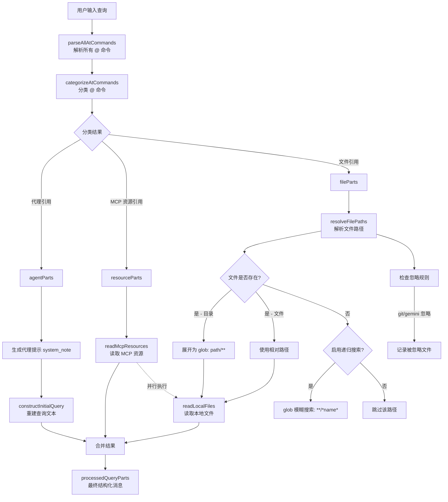

# atCommandProcessor.ts

## 概述

`atCommandProcessor.ts` 是 Gemini CLI 中处理用户输入中 `@<path>` 命令的核心模块。当用户在聊天输入中使用 `@` 前缀引用文件路径、MCP 资源 URI 或代理（Agent）名称时，该模块负责：

1. **解析**：从用户输入中解析出所有 `@` 命令及其路径。
2. **分类**：将 `@` 命令区分为代理引用（Agent）、MCP 资源引用（Resource）和本地文件引用（File）。
3. **路径解析**：将文件引用解析为绝对路径，支持目录递归展开、glob 模糊搜索、`.gitignore` / `.geminiignore` 过滤。
4. **内容读取**：并行读取 MCP 资源和本地文件内容。
5. **查询重建**：将原始用户查询重写为包含内联文件/资源内容的结构化消息部件列表，直接提供给 LLM 作为上下文。

该模块是用户输入预处理管道中的关键环节，使得 LLM 能够直接访问用户引用的文件和资源内容。

## 架构图（Mermaid）

## 核心组件

### 导出函数

#### `escapeAtSymbols(text: string): string`

将文本中未转义的 `@` 符号转义为 `\@`，防止被误解析为 `@path` 命令。使用负向后行断言正则 `/(?<!\\)@/g`。

#### `unescapeLiteralAt(text: string): string`

将 `\@` 还原为 `@`，同时保留 `\\@` 序列（即已转义的反斜杠后跟 `@`）。通过计算匹配位置前连续反斜杠数量的奇偶性来判断是否需要还原。

#### `AT_COMMAND_PATH_REGEX_SOURCE: string`

导出的正则表达式源字符串，定义了 `@` 后面路径/命令部分的匹配规则：
- 支持双引号包裹的路径（适配 Windows 带空格路径）
- 支持反斜杠转义字符（如 `\ ` 转义空格）
- 使用严格的 ASCII 空白分隔符，允许文件名中包含 Unicode 字符（如 NNBSP）
- 句号仅在不位于字符串末尾或空白前时匹配（避免误匹配句末句号）

#### `checkPermissions(query: string, config: Config): Promise<string[]>`

检查用户查询中是否包含需要读权限的文件路径。返回需要权限验证的绝对路径列表。用于在执行读取前进行权限预检。

#### `handleAtCommand(params: HandleAtCommandParams): Promise<HandleAtCommandResult>`

**主入口函数**。接收用户查询和相关配置，完成整个 `@` 命令处理流程，返回处理后的查询消息部件列表。

### 内部函数

#### `parseAllAtCommands(query: string, escapePastedAtSymbols?: boolean): AtCommandPart[]`

使用正则表达式遍历查询字符串，将其拆分为 `text`（纯文本段）和 `atPath`（`@` 路径段）两类部件的数组。支持在粘贴模式下自动还原转义的 `@` 符号。

#### `categorizeAtCommands(commandParts, config): { agentParts, resourceParts, fileParts }`

将解析出的 `@` 命令按类型分类：
- **agentParts**：匹配已注册的代理名称
- **resourceParts**：匹配已注册的 MCP 资源 URI
- **fileParts**：其余视为文件路径引用

#### `resolveFilePaths(fileParts, config, onDebugMessage, signal): Promise<{ resolvedFiles, ignoredFiles }>`

将文件路径引用解析为实际可用的文件路径。处理逻辑包括：
1. 检查 `.gitignore` / `.geminiignore` 忽略规则
2. 遍历工作区目录尝试解析路径
3. 目录路径自动展开为 `path/**` glob 模式
4. 文件不存在时可选使用 glob 工具进行模糊搜索
5. 记录所有被忽略的文件及原因

#### `constructInitialQuery(commandParts, resolvedFiles): string`

根据解析和分类结果重建用户查询文本，将 `@` 路径替换为解析后的路径规格。

#### `readMcpResources(resourceParts, config, signal): Promise<{ parts, displays, error? }>`

通过 MCP 客户端并行读取所有 MCP 资源内容。返回内容部件和 UI 显示信息。

#### `readLocalFiles(resolvedFiles, config, signal, userMessageTimestamp): Promise<{ parts, display?, error? }>`

使用 `ReadManyFilesTool` 批量读取本地文件内容。解析工具返回的格式化输出，提取每个文件的路径和内容，生成对应的消息部件。

#### `reportIgnoredFiles(ignoredFiles, onDebugMessage): void`

将被忽略的文件按原因（git / gemini / both）分组，输出到调试日志。

#### `convertResourceContentsToParts(response): PartUnion[]`

将 MCP 资源响应内容转换为 LLM 消息部件：
- 文本内容直接转为 `{ text }` 部件
- 二进制内容（blob）转为描述性文本，包含 MIME 类型和字节数

### 接口定义

| 接口 | 说明 |
|------|------|
| `HandleAtCommandParams` | `handleAtCommand` 函数参数：查询文本、配置、历史管理器的 `addItem`、调试回调、消息 ID、中止信号、转义选项 |
| `HandleAtCommandResult` | 处理结果：`processedQuery`（结构化消息部件列表或 null）和可选的 `error` |
| `AtCommandPart` | 解析出的命令部件：`type`（'text' 或 'atPath'）和 `content` |
| `ResolvedFile` | 已解析的文件信息：原始部件、路径规格、显示标签、可选绝对路径 |
| `IgnoredFile` | 被忽略的文件信息：路径和忽略原因（'git'、'gemini' 或 'both'） |

### 模块级常量

| 常量 | 值 | 说明 |
|------|-----|------|
| `REF_CONTENT_HEADER` | `"\n" + REFERENCE_CONTENT_START` | 引用内容块的起始标记 |
| `REF_CONTENT_FOOTER` | `"\n" + REFERENCE_CONTENT_END` | 引用内容块的结束标记 |

## 依赖关系

### 内部依赖

| 依赖模块 | 导入项 | 用途 |
|----------|--------|------|
| `@google/gemini-cli-core` | `debugLogger` | 调试日志输出 |
| `@google/gemini-cli-core` | `getErrorMessage` | 从错误对象提取可读错误消息 |
| `@google/gemini-cli-core` | `isNodeError` | 判断错误是否为 Node.js 标准错误（用于检查 `ENOENT`） |
| `@google/gemini-cli-core` | `unescapePath` | 还原路径中的转义字符 |
| `@google/gemini-cli-core` | `resolveToRealPath` | 将路径解析为真实路径（解析符号链接等） |
| `@google/gemini-cli-core` | `fileExists` | 异步检查文件是否存在 |
| `@google/gemini-cli-core` | `ReadManyFilesTool` | 批量文件读取工具类 |
| `@google/gemini-cli-core` | `REFERENCE_CONTENT_START` / `REFERENCE_CONTENT_END` | 引用内容块标记常量 |
| `@google/gemini-cli-core` | `CoreToolCallStatus` | 工具调用状态枚举（Success / Error） |
| `@google/genai` | `PartListUnion` / `PartUnion`（类型） | Gemini SDK 的消息部件类型定义 |
| `../types.js` | `HistoryItemToolGroup` / `IndividualToolCallDisplay`（类型） | UI 层工具调用显示相关类型 |
| `./useHistoryManager.js` | `UseHistoryManagerReturn`（类型） | 历史管理器返回值类型 |

### 外部依赖

| 依赖 | 用途 |
|------|------|
| `node:fs/promises` | 异步文件系统操作（`fs.stat`） |
| `node:path` | 路径操作（`resolve`、`relative`、`join`、`isAbsolute`） |
| `node:buffer` | `Buffer` 类，用于计算 base64 编码的二进制资源大小 |

## 关键实现细节

1. **正则解析策略**：`parseAllAtCommands` 每次调用都创建新的 `RegExp` 实例，避免全局正则的 `lastIndex` 状态在多次调用间串扰。正则使用负向后行断言 `(?<!\\)` 来跳过已转义的 `@` 符号。

2. **三级分类机制**：`categorizeAtCommands` 按优先级查找——先查 Agent 注册表，再查 Resource 注册表，最后默认为文件路径。这意味着如果一个名称同时匹配 Agent 和文件路径，会被优先当作 Agent 处理。

3. **多目录工作区支持**：`resolveFilePaths` 遍历 `config.getWorkspaceContext().getDirectories()` 中的所有目录，尝试在每个目录下解析路径。找到第一个匹配后 `break`，实现优先级查找。

4. **优雅降级的 glob 搜索**：当文件不直接存在且启用了递归搜索时，使用 `**/*${pathName}*` 模式进行 glob 搜索，取第一个匹配结果。多层 try-catch 确保 glob 失败不会中断整个流程。

5. **并行 I/O**：`handleAtCommand` 使用 `Promise.all` 并行执行 MCP 资源读取和本地文件读取，最大化 I/O 吞吐量。同样在 `readMcpResources` 内部，多个资源也是并行读取的。

6. **内容块封装**：读取到的文件/资源内容被包裹在 `REFERENCE_CONTENT_START` / `REFERENCE_CONTENT_END` 标记之间，便于 LLM 识别引用内容的边界。注意：当有本地文件读取结果时不添加 footer（因为 `ReadManyFilesTool` 自带），仅在只有 MCP 资源时手动添加。

7. **代理提示注入**：当检测到 `@agent` 引用时，在查询中注入 `<system_note>` XML 标签，明确提示 LLM 使用指定代理工具来完成任务。

8. **权限预检**：`checkPermissions` 函数独立于主处理流程，用于在实际读取前检查哪些路径需要权限验证，支持 UI 层在读取前向用户展示权限确认对话框。

9. **AbortSignal 传播**：整个调用链传递 `AbortSignal`，支持用户在处理过程中取消操作，所有异步操作（文件读取、glob 搜索、MCP 资源读取）均可被中止。

10. **二进制资源处理**：MCP 资源中的 blob 内容不会直接传递给 LLM，而是转换为包含 MIME 类型和字节数的描述文本，避免向 LLM 发送无法理解的二进制数据。
