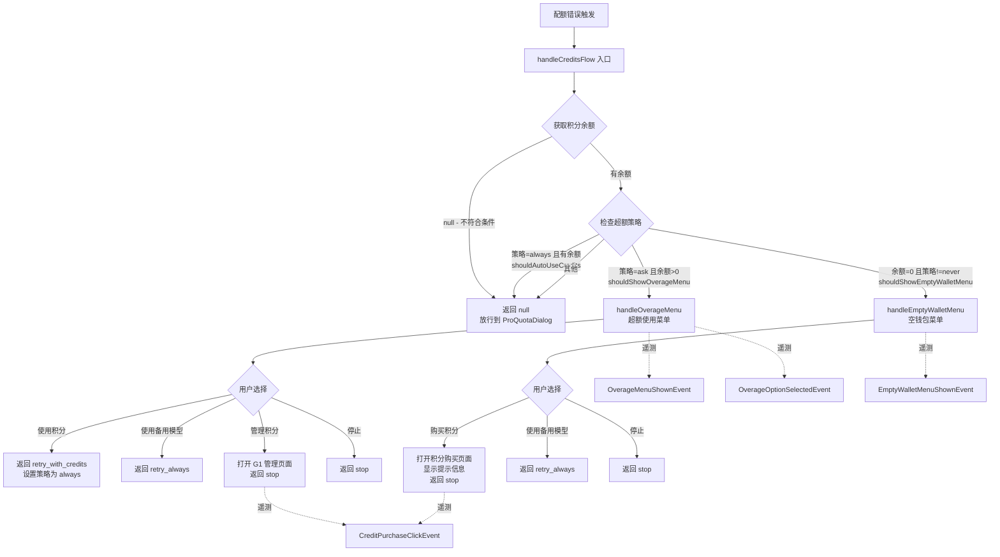

# creditsFlowHandler.ts

## 概述

`creditsFlowHandler.ts` 是 Gemini CLI 中处理 **G1 AI 积分（Credits）流程**的模块。当用户在使用 Gemini CLI 时遇到配额错误（quota error）——即免费使用额度已用尽时，该模块负责根据用户的积分余额和超额策略（overage strategy）决定下一步操作：

- **有积分且策略为"询问"**：弹出超额使用菜单（Overage Menu），让用户选择是否使用积分继续、降级到备用模型、管理积分或停止。
- **积分为零且策略不是"从不"**：弹出空钱包菜单（Empty Wallet Menu），引导用户购买积分、降级模型或停止。
- **积分已自动启用（策略为"总是"）**：直接放行到默认的 ProQuotaDialog 处理。
- **用户不具备 G1 积分资格**：直接返回 null，由上层逻辑处理。

该模块同时负责记录计费相关的遥测事件（telemetry），包括菜单展示、用户选项选择和积分购买点击。

## 架构图（Mermaid）

## 核心组件

### 导出函数

#### `handleCreditsFlow(args: CreditsFlowArgs): Promise<FallbackIntent | null>`

**主入口函数**。接收积分流程所需的全部参数，按以下优先级判断处理策略：

1. 积分余额为 `null`（用户不具备 G1 资格） → 返回 `null`
2. 积分已自动使用（`shouldAutoUseCredits` 为 `true`） → 返回 `null`（本次请求已带积分但仍失败，说明积分也不够）
3. 应显示超额菜单（`shouldShowOverageMenu`） → 调用 `handleOverageMenu`
4. 应显示空钱包菜单（`shouldShowEmptyWalletMenu`） → 调用 `handleEmptyWalletMenu`
5. 以上均不满足 → 返回 `null`

返回值 `FallbackIntent` 可能为：
- `'retry_with_credits'`：使用积分重试
- `'retry_always'`：使用备用模型重试
- `'stop'`：停止当前操作
- `null`：不处理，由上层 ProQuotaDialog 接管

### 内部函数

#### `handleOverageMenu(args, creditBalance): Promise<FallbackIntent>`

处理有积分时的超额菜单流程：

1. 记录 `OverageMenuShownEvent` 遥测事件
2. 检查是否已有对话框挂起（`isDialogPending`），防止重复弹出
3. 通过 `setOverageMenuRequest` 将对话框请求传递给 UI 层，使用 Promise 等待用户选择
4. 记录用户选择的遥测事件
5. 根据用户选择返回对应的 `FallbackIntent`：
   - `'use_credits'` → 设置策略为 `'always'`，返回 `'retry_with_credits'`
   - `'use_fallback'` → 返回 `'retry_always'`
   - `'manage'` → 打开 G1 管理页面，返回 `'stop'`
   - `'stop'` → 返回 `'stop'`

#### `handleEmptyWalletMenu(args): Promise<FallbackIntent>`

处理积分为零时的空钱包菜单流程：

1. 记录 `EmptyWalletMenuShownEvent` 遥测事件
2. 检查是否已有对话框挂起
3. 通过 `setEmptyWalletRequest` 将对话框请求传递给 UI 层
4. 对话框中包含 `onGetCredits` 回调，点击时打开积分购买页面
5. 根据用户选择返回对应的 `FallbackIntent`：
   - `'get_credits'` → 显示提示信息（积分更新可能需几分钟），返回 `'stop'`
   - `'use_fallback'` → 返回 `'retry_always'`
   - `'stop'` → 返回 `'stop'`

#### `logOverageOptionSelected(config, model, option, creditBalance): void`

记录超额菜单选项选择的遥测事件。同时调用 `logBillingEvent` 和 `recordOverageOptionSelected` 两个遥测通道。

#### `logCreditPurchaseClick(config, source, model): void`

记录积分购买点击的遥测事件。`source` 参数标识点击来源：`'overage_menu'`、`'empty_wallet_menu'` 或 `'manage'`。

#### `openG1Url(path, campaign): Promise<string | undefined>`

构建并打开 G1 平台 URL：

1. 获取用户缓存的 Google 账号邮箱
2. 通过 `buildG1Url` 构建包含 UTM 参数的 URL
3. 如果环境支持浏览器打开（`shouldLaunchBrowser()`），直接调用 `openBrowserSecurely` 打开
4. 如果环境不支持浏览器（如无头终端），返回 URL 字符串供用户手动打开
5. 浏览器打开失败时静默忽略错误

### 接口定义

#### `CreditsFlowArgs`

| 属性 | 类型 | 说明 |
|------|------|------|
| `config` | `Config` | 全局配置对象 |
| `paidTier` | `GeminiUserTier` | 用户付费层级 |
| `overageStrategy` | `'ask' \| 'always' \| 'never'` | 超额使用策略 |
| `failedModel` | `string` | 请求失败的模型名称 |
| `fallbackModel` | `string` | 备用降级模型名称 |
| `usageLimitReachedModel` | `string` | 触发使用限额的模型名称 |
| `resetTime` | `string \| undefined` | 配额重置时间 |
| `historyManager` | `UseHistoryManagerReturn` | 历史记录管理器（用于添加消息） |
| `setModelSwitchedFromQuotaError` | `(value: boolean) => void` | 设置模型因配额错误切换状态的回调 |
| `isDialogPending` | `React.MutableRefObject<boolean>` | React ref，标记是否有对话框挂起 |
| `setOverageMenuRequest` | `(req \| null) => void` | 设置超额菜单请求的回调 |
| `setEmptyWalletRequest` | `(req \| null) => void` | 设置空钱包对话框请求的回调 |

## 依赖关系

### 内部依赖

| 依赖模块 | 导入项 | 用途 |
|----------|--------|------|
| `@google/gemini-cli-core` | `Config`（类型） | 全局配置接口 |
| `@google/gemini-cli-core` | `FallbackIntent`（类型） | 降级意图类型定义 |
| `@google/gemini-cli-core` | `GeminiUserTier`（类型） | 用户付费层级类型 |
| `@google/gemini-cli-core` | `OverageOption`（类型） | 超额选项类型 |
| `@google/gemini-cli-core` | `getG1CreditBalance` | 获取用户 G1 积分余额 |
| `@google/gemini-cli-core` | `shouldAutoUseCredits` | 判断是否应自动使用积分 |
| `@google/gemini-cli-core` | `shouldShowOverageMenu` | 判断是否应显示超额菜单 |
| `@google/gemini-cli-core` | `shouldShowEmptyWalletMenu` | 判断是否应显示空钱包菜单 |
| `@google/gemini-cli-core` | `openBrowserSecurely` | 安全地打开浏览器 |
| `@google/gemini-cli-core` | `shouldLaunchBrowser` | 判断环境是否支持浏览器打开 |
| `@google/gemini-cli-core` | `logBillingEvent` | 记录计费遥测事件 |
| `@google/gemini-cli-core` | `OverageMenuShownEvent` | 超额菜单展示事件类 |
| `@google/gemini-cli-core` | `OverageOptionSelectedEvent` | 超额选项选择事件类 |
| `@google/gemini-cli-core` | `EmptyWalletMenuShownEvent` | 空钱包菜单展示事件类 |
| `@google/gemini-cli-core` | `CreditPurchaseClickEvent` | 积分购买点击事件类 |
| `@google/gemini-cli-core` | `buildG1Url` | 构建 G1 平台 URL |
| `@google/gemini-cli-core` | `G1_UTM_CAMPAIGNS` | UTM 活动标识常量 |
| `@google/gemini-cli-core` | `UserAccountManager` | 用户账号管理器（获取缓存账号） |
| `@google/gemini-cli-core` | `recordOverageOptionSelected` | 记录超额选项选择（另一遥测通道） |
| `@google/gemini-cli-core` | `recordCreditPurchaseClick` | 记录积分购买点击（另一遥测通道） |
| `../types.js` | `MessageType` | 消息类型枚举 |
| `./useHistoryManager.js` | `UseHistoryManagerReturn`（类型） | 历史管理器返回类型 |
| `../contexts/UIStateContext.js` | `OverageMenuIntent` / `EmptyWalletIntent` / `EmptyWalletDialogRequest`（类型） | UI 状态上下文中的意图和对话框请求类型 |

### 外部依赖

| 依赖 | 用途 |
|------|------|
| React（隐式） | `React.MutableRefObject<boolean>` 类型用于 `isDialogPending` ref |

## 关键实现细节

1. **Promise-based 对话框模式**：`handleOverageMenu` 和 `handleEmptyWalletMenu` 使用了一种将 React UI 对话框与异步逻辑桥接的模式——通过 `new Promise((resolve) => { setXxxRequest({...resolve}) })` 创建 Promise，将 `resolve` 函数传递给 UI 组件。当用户在 UI 中做出选择后，UI 组件调用 `resolve(intent)`，使得异步函数继续执行。这是 React 中处理命令式对话框的常见模式。

2. **对话框互斥锁**：`isDialogPending` 是一个 `React.MutableRefObject<boolean>`，用作互斥标记防止多个对话框同时弹出。如果已有对话框挂起，直接返回 `'stop'`。对话框关闭后重置为 `false`。

3. **双重遥测通道**：选项选择和购买点击事件同时通过 `logBillingEvent`（事件对象方式）和 `recordXxx`（结构化参数方式）两个通道记录，可能服务于不同的遥测后端。

4. **浏览器打开降级策略**：`openG1Url` 先检查 `shouldLaunchBrowser()` 环境能力。如果环境不支持（如 SSH 远程终端），返回 URL 字符串，由调用方通过 `historyManager.addItem` 将 URL 显示给用户手动打开。

5. **策略状态持久化**：当用户选择"使用积分"时，通过 `config.setOverageStrategy('always')` 将策略从 `'ask'` 升级为 `'always'`，后续请求将自动使用积分，无需再次询问。

6. **配额错误状态追踪**：通过 `setModelSwitchedFromQuotaError(true)` 和 `config.setQuotaErrorOccurred(true)` 在菜单弹出时标记状态，在用户选择"使用积分"时重置。这些状态可能用于 UI 中显示模型切换提示。

7. **错误静默处理**：`openG1Url` 中的浏览器打开操作使用空 `catch` 块静默处理错误，确保浏览器打开失败不会影响主流程。

8. **版权年份为 2026**：该文件的版权声明注释中标注年份为 2026，说明这是一个较新的功能模块。
