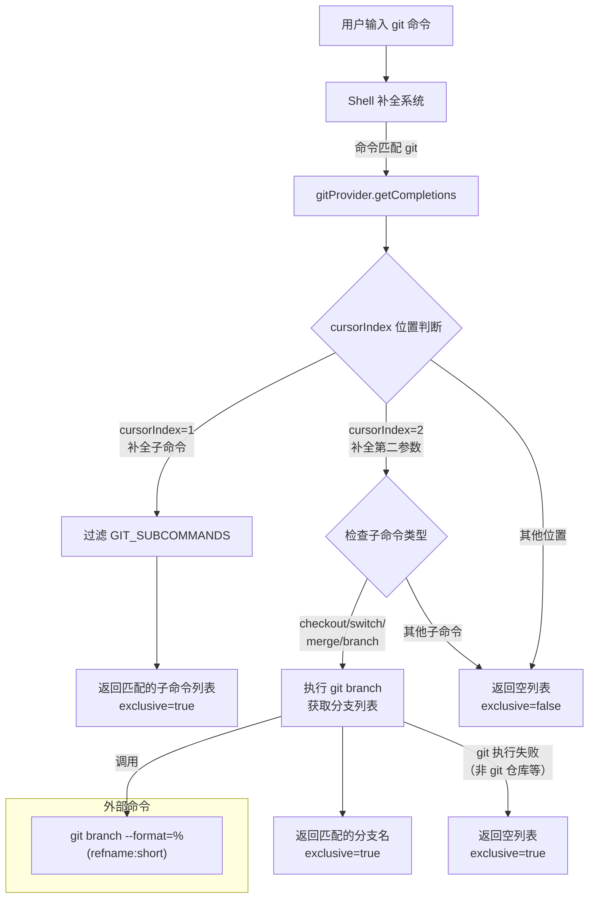

# gitProvider.ts

## 概述

`gitProvider.ts` 是 Gemini CLI Shell 补全系统中的 **Git 命令补全提供者**。当用户在 Gemini CLI 的 Shell 模式下输入 `git` 命令时，该模块提供智能自动补全功能：

- **第一级补全（子命令）**：输入 `git ` 后，补全常用 Git 子命令（如 `add`、`commit`、`push` 等）。
- **第二级补全（分支名）**：对于 `checkout`、`switch`、`merge`、`branch` 子命令，动态查询本地 Git 分支列表进行补全。
- **其他情况**：返回空结果并标记为非独占（`exclusive: false`），允许回退到默认的文件路径补全。

该模块实现了 `ShellCompletionProvider` 接口，是 Shell 补全系统的可插拔提供者之一。

## 架构图（Mermaid）

## 核心组件

### 导出常量

#### `gitProvider: ShellCompletionProvider`

实现 `ShellCompletionProvider` 接口的 Git 补全提供者对象。

| 属性/方法 | 类型 | 说明 |
|-----------|------|------|
| `command` | `string` | 值为 `'git'`，标识该提供者负责处理 `git` 命令的补全 |
| `getCompletions(tokens, cursorIndex, cwd, signal?)` | `async function` | 核心补全方法，根据当前输入 token 和光标位置返回补全建议 |

#### `getCompletions` 方法详细参数

| 参数 | 类型 | 说明 |
|------|------|------|
| `tokens` | `string[]` | 用户当前输入的命令分词数组，`tokens[0]` 为 `'git'` |
| `cursorIndex` | `number` | 光标所在 token 的索引位置 |
| `cwd` | `string` | 当前工作目录路径 |
| `signal` | `AbortSignal?` | 可选的中止信号，传递给子进程以支持取消 |

#### `getCompletions` 返回值 `CompletionResult`

| 属性 | 类型 | 说明 |
|------|------|------|
| `suggestions` | `Array<{label, value, description}>` | 补全建议列表 |
| `exclusive` | `boolean` | 是否独占补全。`true` 表示只使用本提供者的结果；`false` 表示可以混合默认的文件路径补全 |

### 内部常量

#### `GIT_SUBCOMMANDS: string[]`

预定义的常用 Git 子命令列表，按字母序排列：

| 子命令 | 说明 |
|--------|------|
| `add` | 添加文件到暂存区 |
| `branch` | 分支管理 |
| `checkout` | 切换分支或恢复文件 |
| `commit` | 提交更改 |
| `diff` | 查看差异 |
| `merge` | 合并分支 |
| `pull` | 拉取远程更新 |
| `push` | 推送到远程 |
| `rebase` | 变基操作 |
| `status` | 查看工作区状态 |
| `switch` | 切换分支（较新的 Git 命令） |

#### `execFileAsync`

`node:child_process` 的 `execFile` 的 Promise 化版本，通过 `promisify` 转换。

## 依赖关系

### 内部依赖

| 依赖模块 | 导入项 | 用途 |
|----------|--------|------|
| `./types.js` | `ShellCompletionProvider`（类型） | Shell 补全提供者接口定义 |
| `./types.js` | `CompletionResult`（类型） | 补全结果类型定义 |
| `../useShellCompletion.js` | `escapeShellPath` | 转义 Shell 路径中的特殊字符（用于分支名中的特殊字符处理） |

### 外部依赖

| 依赖 | 用途 |
|------|------|
| `node:child_process` | `execFile` — 执行外部 `git` 命令 |
| `node:util` | `promisify` — 将回调式 API 转为 Promise |

## 关键实现细节

1. **基于光标位置的分级补全**：通过 `cursorIndex` 判断用户正在输入命令的哪个部分：
   - `cursorIndex === 1`：正在输入子命令（第一个参数）
   - `cursorIndex === 2`：正在输入第二个参数（可能是分支名）
   - 其他位置：不提供补全，回退到默认行为

2. **静态子命令 vs 动态分支列表**：子命令补全使用硬编码的静态列表（零 I/O 开销），而分支补全通过实际执行 `git branch --format=%(refname:short)` 命令动态获取。`--format=%(refname:short)` 确保输出的是简短分支名（不含 `refs/heads/` 前缀）。

3. **选择性分支补全**：只有 `checkout`、`switch`、`merge`、`branch` 这四个与分支操作直接相关的子命令才触发分支名补全。其他子命令（如 `add`、`diff`）则回退到文件路径补全（`exclusive: false`）。

4. **`exclusive` 标志的语义**：
   - `exclusive: true`：补全系统只显示本提供者的结果，不混合其他来源。用于子命令补全和分支名补全——这些场景下文件路径补全没有意义。
   - `exclusive: false`：补全系统可以额外显示文件路径补全。用于 `git add`、`git diff` 等操作文件的子命令。

5. **容错处理**：`git branch` 执行失败时（如当前目录不是 Git 仓库），通过空 `catch` 块返回空列表，不会抛出异常影响 UI。

6. **AbortSignal 传递**：`signal` 参数被传递给 `execFileAsync` 的 `options`，当用户继续输入或取消操作时，可以中止正在进行的 `git branch` 子进程调用，避免资源浪费。

7. **分支名转义**：补全建议的 `value` 使用 `escapeShellPath(b)` 处理，确保包含特殊字符的分支名（如含空格或斜杠的分支名）在 Shell 中能正确使用。而 `label` 使用原始分支名用于显示。

8. **部分匹配过滤**：子命令和分支名都使用 `startsWith(partial)` 进行前缀过滤。`partial` 为用户已输入的部分字符串，如用户输入 `git ch`，`partial` 为 `'ch'`，匹配到 `'checkout'`。
