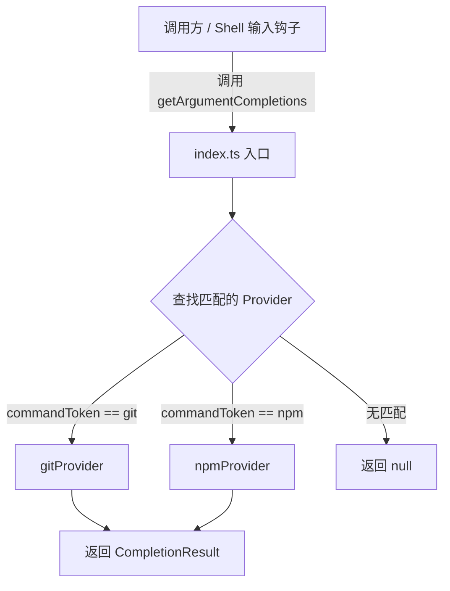

# index.ts

## 概述

`index.ts` 是 shell 自动补全模块的入口文件，负责统一管理和调度所有命令行补全提供器（Provider）。当用户在 shell 输入框中输入命令并触发自动补全时，该模块会根据当前输入的命令 token 查找对应的补全提供器，并委托其生成补全建议。

目前注册了两个内置提供器：
- `gitProvider` —— 针对 `git` 命令的参数补全
- `npmProvider` —— 针对 `npm` 命令的参数补全

## 架构图（Mermaid）



## 核心组件

### `providers` 数组

```typescript
const providers: ShellCompletionProvider[] = [gitProvider, npmProvider];
```

一个静态注册表，包含所有可用的 `ShellCompletionProvider` 实例。新增提供器只需将其追加到此数组即可。

### `getArgumentCompletions()` 函数

```typescript
export async function getArgumentCompletions(
  commandToken: string,
  tokens: string[],
  cursorIndex: number,
  cwd: string,
  signal?: AbortSignal,
): Promise<CompletionResult | null>
```

这是模块唯一的导出函数，也是外部获取补全结果的统一入口。

**参数说明：**

| 参数 | 类型 | 描述 |
|------|------|------|
| `commandToken` | `string` | 当前用户输入的命令名（如 `git`、`npm`） |
| `tokens` | `string[]` | 完整的命令行 token 数组（已分词） |
| `cursorIndex` | `number` | 光标在 token 数组中的位置索引 |
| `cwd` | `string` | 当前工作目录的绝对路径 |
| `signal` | `AbortSignal?` | 可选的取消信号，用于中断耗时的补全操作 |

**执行逻辑：**

1. 遍历 `providers` 数组，查找 `command` 属性与 `commandToken` 相匹配的提供器。
2. 若找到，调用该提供器的 `getCompletions()` 方法并返回结果。
3. 若未找到匹配的提供器，返回 `null`，表示该命令无可用补全。

## 依赖关系

### 内部依赖

| 模块 | 导入内容 | 用途 |
|------|---------|------|
| `./types.js` | `ShellCompletionProvider`, `CompletionResult` | 补全提供器接口和补全结果类型定义 |
| `./gitProvider.js` | `gitProvider` | Git 命令补全提供器实例 |
| `./npmProvider.js` | `npmProvider` | NPM 命令补全提供器实例 |

### 外部依赖

无外部第三方依赖。

## 关键实现细节

1. **Provider 查找策略**：使用 `Array.find()` 进行线性查找，由于提供器数量极少（目前仅 2 个），性能完全可以接受。若将来提供器数量增长，可考虑改用 `Map<string, ShellCompletionProvider>` 以实现 O(1) 查找。

2. **异步设计**：`getArgumentCompletions` 是一个 `async` 函数，返回 `Promise`，这意味着各提供器的补全逻辑可以包含异步操作（如文件系统访问、进程调用等）。

3. **可取消性**：通过可选的 `AbortSignal` 参数支持取消正在进行的补全请求，这在用户快速输入导致频繁触发补全时非常关键，可以避免过时请求的资源浪费。

4. **扩展性**：新增命令补全支持只需两步：(a) 实现 `ShellCompletionProvider` 接口创建新的提供器；(b) 将其添加到 `providers` 数组。无需修改核心调度逻辑。

5. **空值语义**：返回 `null` 表示"该命令不支持补全"，调用方可据此决定是否回退到默认的文件系统路径补全等通用补全机制。
