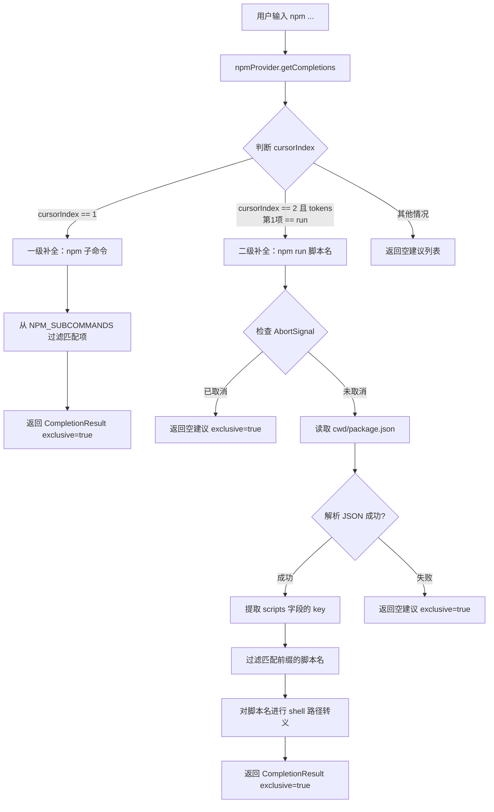

# npmProvider.ts

## 概述

`npmProvider.ts` 实现了针对 `npm` 命令的 shell 自动补全提供器。它为用户提供两级补全能力：

1. **一级补全（子命令）**：当光标位于 `npm` 之后的第一个参数位置时，提供常用 npm 子命令的补全建议（如 `install`、`run`、`test` 等）。
2. **二级补全（脚本名）**：当用户输入 `npm run` 后，自动读取当前工作目录下的 `package.json` 文件，提取 `scripts` 字段中定义的所有脚本名称作为补全建议。

## 架构图（Mermaid）



## 核心组件

### `NPM_SUBCOMMANDS` 常量

```typescript
const NPM_SUBCOMMANDS = [
  'build', 'ci', 'dev', 'install', 'publish', 'run', 'start', 'test',
];
```

预定义的常用 npm 子命令列表，用于一级补全。这是一个精选子集，并非 npm 的全部子命令，重点覆盖了日常开发中最常用的命令。

### `npmProvider` 对象

```typescript
export const npmProvider: ShellCompletionProvider = {
  command: 'npm',
  async getCompletions(tokens, cursorIndex, cwd, signal?): Promise<CompletionResult>
}
```

实现了 `ShellCompletionProvider` 接口的 npm 补全提供器实例。

**`command` 属性**：值为 `'npm'`，用于在 `index.ts` 的 provider 查找中匹配命令名。

**`getCompletions` 方法**：核心补全逻辑，根据光标位置提供不同级别的补全。

#### 补全逻辑分支

| 条件 | 行为 | exclusive |
|------|------|-----------|
| `cursorIndex === 1` | 从 `NPM_SUBCOMMANDS` 中筛选以用户输入开头的子命令 | `true` |
| `cursorIndex === 2 && tokens[1] === 'run'` | 读取 `package.json` 并列出匹配的脚本名 | `true` |
| 其他情况 | 返回空建议列表 | `false` |

## 依赖关系

### 内部依赖

| 模块 | 导入内容 | 用途 |
|------|---------|------|
| `./types.js` | `ShellCompletionProvider`, `CompletionResult` | 类型定义 |
| `../useShellCompletion.js` | `escapeShellPath` | 对脚本名进行 shell 安全转义，防止特殊字符导致命令注入或解析错误 |

### 外部依赖

| 模块 | 导入内容 | 用途 |
|------|---------|------|
| `node:fs/promises` | `fs` | 异步读取 `package.json` 文件 |
| `node:path` | `path` | 拼接 `package.json` 的绝对路径 |

## 关键实现细节

1. **两级补全策略**：通过 `cursorIndex` 判断用户正在输入的参数位置来决定提供哪一级补全。`cursorIndex === 1` 表示用户正在输入子命令（`npm <这里>`），`cursorIndex === 2` 表示用户正在输入子命令的参数（`npm run <这里>`）。

2. **前缀匹配**：所有补全都使用 `startsWith()` 进行前缀匹配过滤。`partial` 变量通过 `tokens[N] || ''` 获取，当 token 尚不存在时（用户刚输入空格）回退为空字符串，此时所有选项都会匹配。

3. **package.json 安全解析**：
   - 使用 `JSON.parse(content) as unknown` 将解析结果类型化为 `unknown`，避免 `any` 类型。
   - 通过层层类型守卫（`typeof pkg === 'object'`、`'scripts' in pkg`）安全地访问 `scripts` 字段。
   - 整个读取和解析过程包裹在 `try/catch` 中，当 `package.json` 不存在或格式非法时，静默返回空建议列表而非抛出错误。

4. **AbortSignal 支持**：在执行文件 I/O 之前先检查 `signal?.aborted`，如果请求已被取消则立即返回空结果，避免不必要的文件系统操作。

5. **Shell 路径转义**：脚本名通过 `escapeShellPath()` 处理后作为 `value` 返回，而原始脚本名作为 `label` 用于显示。这确保了含有空格或特殊字符的脚本名在补全插入时不会造成 shell 解析问题。

6. **`exclusive` 标志语义**：
   - 一级和二级补全返回 `exclusive: true`，表示补全结果是该位置的全部可选项，调用方不需要再提供文件路径等额外补全。
   - 未匹配任何分支时返回 `exclusive: false`，允许调用方回退到通用补全（如文件路径补全）。
