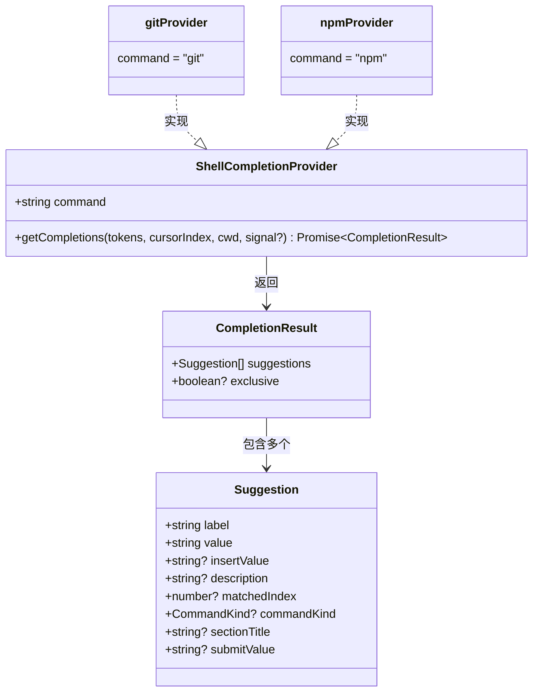

# types.ts

## 概述

`types.ts` 是 shell 自动补全模块的类型定义文件，定义了补全系统的两个核心接口：

- **`CompletionResult`**：补全结果的数据结构，包含建议列表和排他性标志。
- **`ShellCompletionProvider`**：补全提供器的契约接口，所有命令补全器（如 gitProvider、npmProvider）都必须实现此接口。

这两个接口构成了整个 shell 补全子系统的类型基础，确保了提供器注册表（`index.ts`）与各具体提供器之间的类型安全交互。

## 架构图（Mermaid）



## 核心组件

### `CompletionResult` 接口

```typescript
export interface CompletionResult {
  suggestions: Suggestion[];
  exclusive?: boolean;
}
```

补全操作的返回结果。

| 字段 | 类型 | 必填 | 描述 |
|------|------|------|------|
| `suggestions` | `Suggestion[]` | 是 | 补全建议列表，每个建议包含标签、值、描述等信息 |
| `exclusive` | `boolean` | 否 | 排他性标志。为 `true` 时，shell 补全系统不会在该列表之外追加通用的文件/路径补全。适用于某些参数位置只接受特定值的场景（如 git 分支名） |

**`Suggestion` 类型结构**（来自 `SuggestionsDisplay.js`）：

| 字段 | 类型 | 必填 | 描述 |
|------|------|------|------|
| `label` | `string` | 是 | 在补全列表中显示给用户的文本 |
| `value` | `string` | 是 | 补全选中后插入到输入框的值 |
| `insertValue` | `string` | 否 | 如果指定，使用此值替代 `value` 插入 |
| `description` | `string` | 否 | 对该建议的简短描述，通常显示在标签旁边 |
| `matchedIndex` | `number` | 否 | 匹配高亮的索引位置 |
| `commandKind` | `CommandKind` | 否 | 命令类型标记 |
| `sectionTitle` | `string` | 否 | 建议所属的分组标题 |
| `submitValue` | `string` | 否 | 选中后直接提交的值 |

### `ShellCompletionProvider` 接口

```typescript
export interface ShellCompletionProvider {
  command: string;
  getCompletions(
    tokens: string[],
    cursorIndex: number,
    cwd: string,
    signal?: AbortSignal,
  ): Promise<CompletionResult>;
}
```

所有命令补全提供器必须实现的接口。

| 字段/方法 | 类型 | 描述 |
|-----------|------|------|
| `command` | `string` | 触发命令名，如 `'git'`、`'npm'`。`index.ts` 使用此值进行提供器匹配 |
| `getCompletions()` | 异步方法 | 核心补全逻辑方法 |

**`getCompletions` 参数说明：**

| 参数 | 类型 | 描述 |
|------|------|------|
| `tokens` | `string[]` | 用户输入经分词后的 token 列表 |
| `cursorIndex` | `number` | 光标当前所在的 token 索引位置（0 为命令名本身） |
| `cwd` | `string` | 当前工作目录路径 |
| `signal` | `AbortSignal?` | 可选的取消信号 |

## 依赖关系

### 内部依赖

| 模块 | 导入内容 | 用途 |
|------|---------|------|
| `../../components/SuggestionsDisplay.js` | `Suggestion` | 单个补全建议的类型定义，被 `CompletionResult` 的 `suggestions` 数组使用 |

### 外部依赖

无外部第三方依赖。本文件为纯类型定义文件，运行时零开销。

## 关键实现细节

1. **接口而非类**：采用 TypeScript `interface` 而非 `abstract class` 定义提供器契约，这使得提供器可以是简单的对象字面量（如 `npmProvider`），无需 class 实例化开销，更加轻量灵活。

2. **`exclusive` 的默认语义**：`exclusive` 字段是可选的（`boolean?`），未设置时默认行为取决于调用方的处理逻辑。通常未设置等同于 `false`，即允许追加通用补全。这种设计保证了向后兼容——现有提供器无需修改即可在引入 `exclusive` 功能后正常工作。

3. **类型导入方式**：文件中所有导入都使用 `import type` 语法，确保这些导入在编译后完全被擦除，不会产生任何运行时 JavaScript 代码。

4. **异步契约**：`getCompletions` 返回 `Promise<CompletionResult>` 而非同步的 `CompletionResult`，这允许提供器内部执行异步操作（如读取文件系统、调用子进程获取 git 分支列表等），是实际使用场景的必要设计。

5. **与 UI 层的桥接**：通过复用 `SuggestionsDisplay.js` 中定义的 `Suggestion` 类型，补全系统的数据模型与 UI 渲染层保持一致，避免了中间转换层的复杂性。补全结果可以直接传递给 `SuggestionsDisplay` 组件进行渲染。
