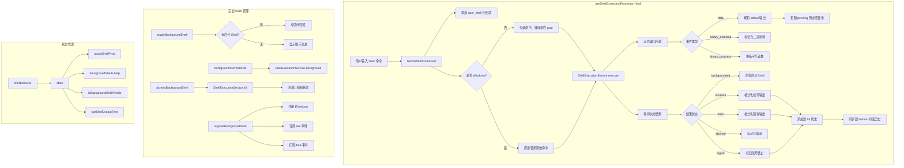

# shellCommandProcessor.ts

## 概述

`shellCommandProcessor.ts` 是 Gemini CLI 中 shell 命令处理的核心模块，导出一个 React 自定义 Hook `useShellCommandProcessor`。该 Hook 负责以下职责：

1. **Shell 命令执行**：接收用户在 shell 模式下输入的命令，通过 `ShellExecutionService` 在子进程中执行，并实时流式传输输出。
2. **后台 Shell 管理**：支持将正在运行的命令移到后台，提供注册、查看、切换可见性和关闭后台 Shell 的能力。
3. **历史记录维护**：将命令的执行结果添加到 UI 历史记录和 Gemini 对话历史中，使 AI 能感知用户的 shell 操作上下文。
4. **工作目录变更检测**：在非 Windows 系统上，通过在命令后附加 `pwd` 写入临时文件的方式，检测命令是否改变了工作目录，并发出警告。

## 架构图（Mermaid）



## 核心组件

### 常量

| 常量 | 值 | 描述 |
|------|------|------|
| `OUTPUT_UPDATE_INTERVAL_MS` | `1000` | 输出更新的节流间隔（毫秒），已导出供外部使用 |
| `RESTORE_VISIBILITY_DELAY_MS` | `300` | 前台任务结束后恢复后台 Shell 可见性的延迟（毫秒），防止闪烁 |
| `MAX_OUTPUT_LENGTH` | `10000` | 同步到 Gemini 历史的输出最大字符数，超出部分被截断 |

### `addShellCommandToGeminiHistory()` 函数

```typescript
function addShellCommandToGeminiHistory(
  geminiClient: GeminiClient,
  rawQuery: string,
  resultText: string,
): void
```

将用户执行的 shell 命令及其输出结果作为 `user` 角色的消息添加到 Gemini 对话历史中。这使 AI 模型能够感知用户在 shell 模式下的操作上下文。

**安全处理**：
- 输出超过 `MAX_OUTPUT_LENGTH`（10000字符）时自动截断，避免 token 溢出。
- 对命令和输出中的反斜杠和反引号进行转义，防止 prompt 注入攻击。

### `useShellCommandProcessor` Hook

这是模块的主要导出，接收大量参数并返回一组方法和状态值。

**参数：**

| 参数 | 类型 | 描述 |
|------|------|------|
| `addItemToHistory` | `UseHistoryManagerReturn['addItem']` | 添加历史项到 UI 历史列表 |
| `setPendingHistoryItem` | `React.Dispatch<...>` | 设置正在进行中的（临时）历史项 |
| `onExec` | `(command: Promise<void>) => void` | 执行命令的回调（将 Promise 传递给上层管理） |
| `onDebugMessage` | `(message: string) => void` | 输出调试信息 |
| `config` | `Config` | 应用配置对象 |
| `geminiClient` | `GeminiClient` | Gemini API 客户端实例 |
| `setShellInputFocused` | `(value: boolean) => void` | 设置 shell 输入框焦点状态 |
| `terminalWidth` | `number?` | 终端宽度（列数） |
| `terminalHeight` | `number?` | 终端高度（行数） |
| `activeBackgroundExecutionId` | `number?` | 当前活跃的后台执行 PID |
| `isWaitingForConfirmation` | `boolean?` | 是否正在等待用户确认 |

**返回值：**

| 字段 | 类型 | 描述 |
|------|------|------|
| `handleShellCommand` | `(rawQuery, abortSignal) => boolean` | 执行 shell 命令的入口函数 |
| `activeShellPtyId` | `number \| null` | 当前前台运行的 PTY 进程 ID |
| `lastShellOutputTime` | `number` | 最后一次 shell 输出的时间戳 |
| `backgroundShellCount` | `number` | 正在运行中的后台 Shell 数量 |
| `isBackgroundShellVisible` | `boolean` | 后台 Shell 面板是否可见 |
| `toggleBackgroundShell` | `() => void` | 切换后台 Shell 面板可见性 |
| `backgroundCurrentShell` | `() => void` | 将当前前台 Shell 移到后台 |
| `registerBackgroundShell` | `(pid, command, initialOutput) => void` | 注册新的后台 Shell |
| `dismissBackgroundShell` | `(pid: number) => Promise<void>` | 关闭并清理指定后台 Shell |
| `backgroundShells` | `Map<number, BackgroundShell>` | 所有后台 Shell 的映射表 |

#### `manager` Ref

```typescript
const manager = useRef<{
  wasVisibleBeforeForeground: boolean;
  restoreTimeout: NodeJS.Timeout | null;
  backgroundedPids: Set<number>;
  subscriptions: Map<number, () => void>;
} | null>(null);
```

一个整合了多个跟踪状态的管理器对象，通过 `useRef` 持久化以避免不必要的重渲染：

- `wasVisibleBeforeForeground`：记录前台任务启动前后台面板是否可见，用于自动恢复。
- `restoreTimeout`：可见性恢复定时器句柄，用于防抖。
- `backgroundedPids`：已被移到后台的进程 PID 集合。
- `subscriptions`：后台 Shell 事件订阅的取消函数映射。

#### `handleShellCommand` 回调

核心命令执行逻辑，流程如下：

1. 验证输入非空。
2. 添加 `user_shell` 类型的历史项。
3. **非 Windows 平台的 PWD 捕获**：将用户命令包装为 `{ <命令>; }; __code=$?; pwd > "<临时文件>"; exit $__code`，在命令执行完毕后将最终工作目录写入临时文件。
4. 调用 `ShellExecutionService.execute()` 执行命令，传入流式输出回调。
5. 输出回调中处理 `data`、`binary_detected`、`binary_progress` 三种事件，实时更新 UI。
6. 如果进程已被移到后台，输出重定向到后台 Shell 面板。
7. 等待执行结果后，根据退出状态（成功、错误、取消、信号终止、后台化）格式化最终输出。
8. 检查 PWD 临时文件，如果工作目录发生变化则发出警告。
9. 将结果同时添加到 UI 历史和 Gemini 对话历史。
10. 清理资源（移除 abort 监听器、删除临时文件、重置 PTY ID 和焦点）。

#### 可见性自动管理（useEffect）

当前台有活跃的 PTY 或正在等待确认时：
- 自动隐藏后台 Shell 面板（记录之前的可见状态）。
- 前台任务结束后，延迟 300ms 恢复原来的可见状态（防止任务切换间的闪烁）。

## 依赖关系

### 内部依赖

| 模块 | 导入内容 | 用途 |
|------|---------|------|
| `../types.js` | `HistoryItemWithoutId`, `IndividualToolCallDisplay` | UI 历史项和工具调用显示的类型 |
| `./useHistoryManager.js` | `UseHistoryManagerReturn` | 历史管理器返回值类型 |
| `../constants.js` | `SHELL_COMMAND_NAME` | Shell 命令名称常量 |
| `../utils/formatters.js` | `formatBytes` | 字节数格式化工具（用于二进制输出显示） |
| `../../ui/themes/theme-manager.js` | `themeManager` | 主题管理器，获取终端前景/背景色 |
| `./shellReducer.js` | `shellReducer`, `initialState`, `BackgroundShell` | Shell 状态管理的 reducer 和类型 |

### 外部依赖

| 模块 | 导入内容 | 用途 |
|------|---------|------|
| `react` | `useCallback`, `useReducer`, `useRef`, `useEffect` | React Hooks |
| `@google/gemini-cli-core` | `isBinary`, `ShellExecutionService`, `CoreToolCallStatus`, `AnsiOutput`, `Config`, `GeminiClient` | 核心服务：Shell 执行、二进制检测、配置和客户端类型 |
| `@google/genai` | `PartListUnion` | Gemini API 消息部分类型 |
| `node:crypto` | `crypto` | 生成临时文件名的随机字节 |
| `node:path` | `path` | 路径拼接 |
| `node:os` | `os` | 平台检测和临时目录获取 |
| `node:fs` | `fs` | 同步文件操作（读取/删除临时 PWD 文件） |

## 关键实现细节

1. **PWD 捕获机制**：在非 Windows 系统上，用户命令被包装在花括号中形成子 shell，执行完毕后通过 `pwd > <临时文件>` 将最终工作目录持久化。使用 `__code=$?` 保存原始退出码，确保命令退出状态不受 `pwd` 命令的影响。临时文件名包含 6 字节随机 hex 字符串以避免冲突。

2. **Prompt 注入防护**：`addShellCommandToGeminiHistory` 对反斜杠和反引号进行转义处理（`\` -> `\\`，`` ` `` -> `` \` ``），防止命令输出中的特殊字符被 Gemini 模型解释为 prompt 指令的一部分。

3. **二进制流处理**：当检测到二进制输出时，立即停止累积文本输出，转而显示字节接收进度。最终输出替换为 `[Command produced binary output, which is not shown.]`，避免在终端中渲染不可读的二进制数据。

4. **后台 Shell 的事件订阅**：`registerBackgroundShell` 同时订阅 `exit` 事件和 `data` 事件，分别用于更新 Shell 状态和追加输出。所有订阅在组件卸载时通过 `useEffect` 清理函数批量取消，防止内存泄漏。

5. **前台/后台输出切换**：在流式输出回调中，通过检查 `backgroundedPids.has(executionPid)` 判断进程是否已被移到后台。若已后台化，输出通过 `dispatch` 直接发送给后台 Shell 的 reducer，不再更新前台的 pending 历史项。

6. **可见性防抖**：后台面板的自动恢复使用 300ms 延迟（`RESTORE_VISIBILITY_DELAY_MS`），避免在模型推理的多个 turn 之间快速显隐造成的视觉闪烁。`wasVisibleBeforeForeground` 标志确保只在面板被自动隐藏（非手动隐藏）时才触发恢复。

7. **状态架构选择**：使用 `useReducer` + `shellReducer` 管理复杂的 Shell 状态，而将不触发重渲染的跟踪变量（如 PID 集合、订阅映射）集中在单个 `useRef` 管理器中。这种设计在保持 React 状态管理规范性的同时，避免了不必要的重渲染开销。

8. **命令执行的所有权模型**：`handleShellCommand` 不直接 await 命令执行，而是将 `executeCommand()` 返回的 Promise 传递给 `onExec` 回调，由上层组件管理执行生命周期。函数本身同步返回 `true` 表示命令已被接受。
