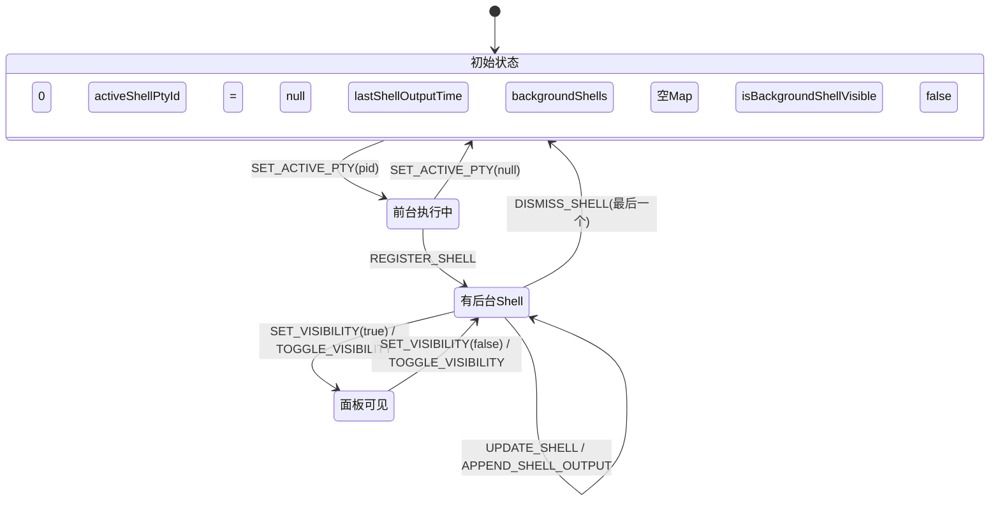
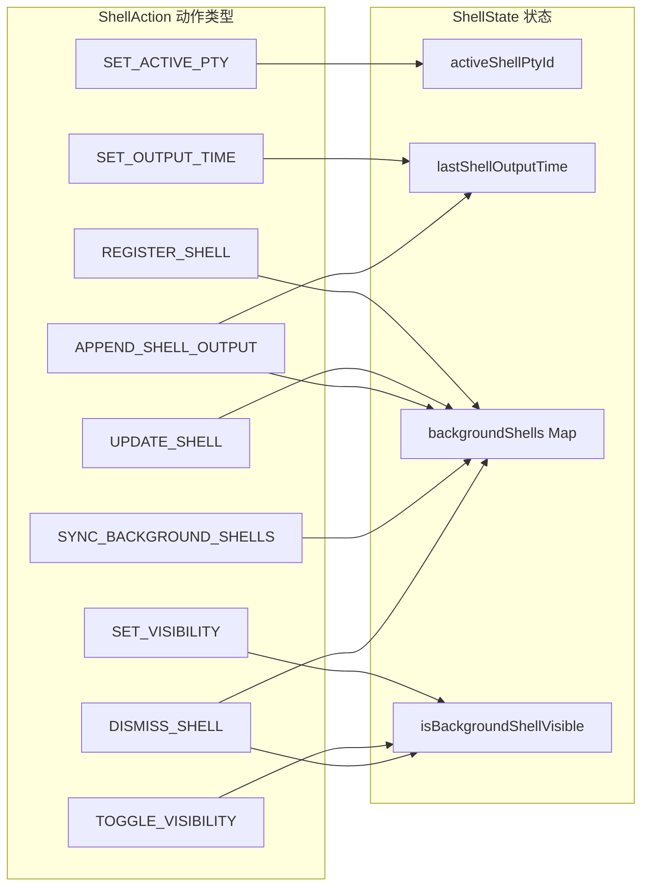

# shellReducer.ts

## 概述

`shellReducer.ts` 是 Gemini CLI shell 功能的状态管理模块，采用 Redux 风格的 Reducer 模式管理 Shell 相关的所有状态。该模块定义了：

- **`BackgroundShell`** 接口：描述单个后台 Shell 进程的数据结构。
- **`ShellState`** 接口：整个 Shell 子系统的状态树。
- **`ShellAction`** 联合类型：所有可能的状态变更操作。
- **`shellReducer`** 函数：纯函数 Reducer，根据 Action 计算新状态。
- **`initialState`** 常量：状态的初始值。

该 Reducer 被 `shellCommandProcessor.ts` 中的 `useReducer` Hook 消费，是前台命令执行和后台 Shell 管理的状态核心。

## 架构图（Mermaid）





## 核心组件

### `BackgroundShell` 接口

```typescript
export interface BackgroundShell {
  pid: number;
  command: string;
  output: string | AnsiOutput;
  isBinary: boolean;
  binaryBytesReceived: number;
  status: 'running' | 'exited';
  exitCode?: number;
}
```

描述一个后台运行的 Shell 进程的完整状态。

| 字段 | 类型 | 描述 |
|------|------|------|
| `pid` | `number` | 进程 ID，同时也是 `backgroundShells` Map 的键 |
| `command` | `string` | 用户输入的原始命令字符串 |
| `output` | `string \| AnsiOutput` | 累积输出。纯文本模式为 `string`，PTY 模式为 `AnsiOutput`（包含 ANSI 转义序列的结构化输出） |
| `isBinary` | `boolean` | 是否检测到二进制输出流 |
| `binaryBytesReceived` | `number` | 已接收的二进制字节数 |
| `status` | `'running' \| 'exited'` | 进程状态 |
| `exitCode` | `number?` | 退出码，仅在 `status === 'exited'` 时有值 |

### `ShellState` 接口

```typescript
export interface ShellState {
  activeShellPtyId: number | null;
  lastShellOutputTime: number;
  backgroundShells: Map<number, BackgroundShell>;
  isBackgroundShellVisible: boolean;
}
```

Shell 子系统的完整状态树。

| 字段 | 类型 | 描述 |
|------|------|------|
| `activeShellPtyId` | `number \| null` | 当前前台执行的 PTY 进程 ID，`null` 表示无前台活跃进程 |
| `lastShellOutputTime` | `number` | 最近一次 Shell 输出的时间戳（毫秒），用于 UI 更新节流 |
| `backgroundShells` | `Map<number, BackgroundShell>` | 后台 Shell 映射表，键为 PID |
| `isBackgroundShellVisible` | `boolean` | 后台 Shell 面板是否可见 |

### `ShellAction` 联合类型

定义了 9 种 Action 类型：

| Action 类型 | 载荷 | 描述 |
|------------|------|------|
| `SET_ACTIVE_PTY` | `pid: number \| null` | 设置/清除当前前台活跃的 PTY 进程 ID |
| `SET_OUTPUT_TIME` | `time: number` | 更新最后一次输出时间戳 |
| `SET_VISIBILITY` | `visible: boolean` | 显式设置后台面板可见性 |
| `TOGGLE_VISIBILITY` | 无 | 切换后台面板可见性 |
| `REGISTER_SHELL` | `pid, command, initialOutput` | 注册一个新的后台 Shell |
| `UPDATE_SHELL` | `pid, update: Partial<BackgroundShell>` | 部分更新后台 Shell 的属性 |
| `APPEND_SHELL_OUTPUT` | `pid, chunk: string \| AnsiOutput` | 追加输出到后台 Shell |
| `SYNC_BACKGROUND_SHELLS` | 无 | 触发 Map 引用更新以强制重渲染 |
| `DISMISS_SHELL` | `pid: number` | 移除指定的后台 Shell |

### `initialState` 常量

```typescript
export const initialState: ShellState = {
  activeShellPtyId: null,
  lastShellOutputTime: 0,
  backgroundShells: new Map(),
  isBackgroundShellVisible: false,
};
```

### `shellReducer` 函数

```typescript
export function shellReducer(state: ShellState, action: ShellAction): ShellState
```

纯函数 Reducer，处理所有 Shell 状态变更。以下是各 Action 的处理逻辑详解：

#### `SET_ACTIVE_PTY`
直接替换 `activeShellPtyId` 字段。

#### `SET_OUTPUT_TIME`
直接替换 `lastShellOutputTime` 字段。

#### `SET_VISIBILITY`
直接设置 `isBackgroundShellVisible` 为指定值。

#### `TOGGLE_VISIBILITY`
将 `isBackgroundShellVisible` 取反。

#### `REGISTER_SHELL`
- **幂等性保证**：若该 PID 已存在于 Map 中，直接返回当前状态，不做任何修改。
- 创建新的 Map 副本，插入一个初始状态的 `BackgroundShell` 对象（`isBinary: false`, `binaryBytesReceived: 0`, `status: 'running'`）。

#### `UPDATE_SHELL`
- 若 PID 不存在，返回当前状态。
- 使用扩展运算符合并更新：`{ ...shell, ...action.update }`。
- **排序优化**：当 Shell 状态变为 `exited` 时，先从 Map 中删除再重新插入，确保已退出的 Shell 移动到 Map 末尾（利用 Map 的插入顺序特性），使运行中的 Shell 在列表中优先显示。

#### `APPEND_SHELL_OUTPUT`（性能关键路径）
- 若 PID 不存在，返回当前状态。
- **有意的可变操作**：直接修改 `shell.output` 属性（`shell.output = newOutput`），而不创建新的 Shell 对象。这是一个经过深思熟虑的性能优化——注释明确标注了 "This is an intentional performance optimization for the CLI"。
- **输出类型处理**：
  - `string` 类型的 chunk：追加到现有 string 输出；若现有输出为 `AnsiOutput` 类型则替换为纯 string。
  - `AnsiOutput` 类型的 chunk：直接替换整个输出（PTY 模式下每次输出都是完整状态快照）。
- **条件引用更新**：
  - 面板可见时：创建新的 Map 引用（`new Map(state.backgroundShells)`），触发 React 重渲染以更新 UI。
  - 面板不可见时：仅更新 `lastShellOutputTime`，不更新 Map 引用，避免不必要的渲染开销。

#### `SYNC_BACKGROUND_SHELLS`
创建一个浅拷贝的 Map（`new Map(state.backgroundShells)`），强制更新引用以触发 React 重渲染。通常在面板从隐藏切换为可见时调用，确保 UI 显示最新的累积输出。

#### `DISMISS_SHELL`
- 从 Map 中删除指定 PID 的 Shell。
- **自动隐藏**：若删除后 Map 为空，自动将 `isBackgroundShellVisible` 设为 `false`，关闭空面板。

## 依赖关系

### 内部依赖

无。本模块是纯状态管理模块，不依赖项目内其他模块。

### 外部依赖

| 模块 | 导入内容 | 用途 |
|------|---------|------|
| `@google/gemini-cli-core` | `AnsiOutput` (type) | PTY 模式下结构化 ANSI 输出的类型定义 |

## 关键实现细节

1. **有意的可变性优化**：`APPEND_SHELL_OUTPUT` 中直接修改 `shell.output` 而非创建不可变副本，是该模块最重要的设计决策。在 CLI 场景下，后台 Shell 可能产生大量高频输出，每次都创建新对象会造成严重的 GC 压力。通过可变操作 + 条件引用更新，实现了"面板不可见时零渲染开销，可见时正常更新"的最优策略。

2. **Map 的插入顺序利用**：`UPDATE_SHELL` 在 Shell 退出时先删除再插入，利用 ES6 Map 保持插入顺序的特性，将已退出的 Shell 排到末尾。这使得 UI 中运行中的 Shell 始终在列表顶部。

3. **`SYNC_BACKGROUND_SHELLS` 的存在意义**：由于 `APPEND_SHELL_OUTPUT` 在面板不可见时不更新 Map 引用，当用户打开面板时，需要通过 `SYNC_BACKGROUND_SHELLS` 强制创建新引用来触发一次完整的重渲染，确保显示最新的累积输出。

4. **`REGISTER_SHELL` 的幂等性**：如果尝试注册一个已存在 PID 的 Shell，Reducer 静默返回当前状态而非抛出错误。这是一种防御性编程，避免竞态条件下的重复注册导致数据丢失。

5. **`DISMISS_SHELL` 的级联效果**：不仅删除 Shell 数据，还自动管理面板可见性——当最后一个 Shell 被关闭时自动隐藏面板，避免用户面对空白面板。

6. **状态不可变性的边界**：模块在 Map 层面维持不可变性（需要触发渲染时创建新 Map），但在 Map 内部的 Shell 对象层面有选择地打破不可变性（`APPEND_SHELL_OUTPUT` 中的直接修改）。这种混合策略在保证 React 正确性的前提下最大化了性能。

7. **纯函数设计**：除了 `APPEND_SHELL_OUTPUT` 中有意的 mutation 外，Reducer 整体遵循纯函数原则——相同的输入产生相同的输出，无副作用，便于测试和推理。`APPEND_SHELL_OUTPUT` 中的 `Date.now()` 调用是唯一引入的非确定性，但它仅影响时间戳这一非关键字段。
