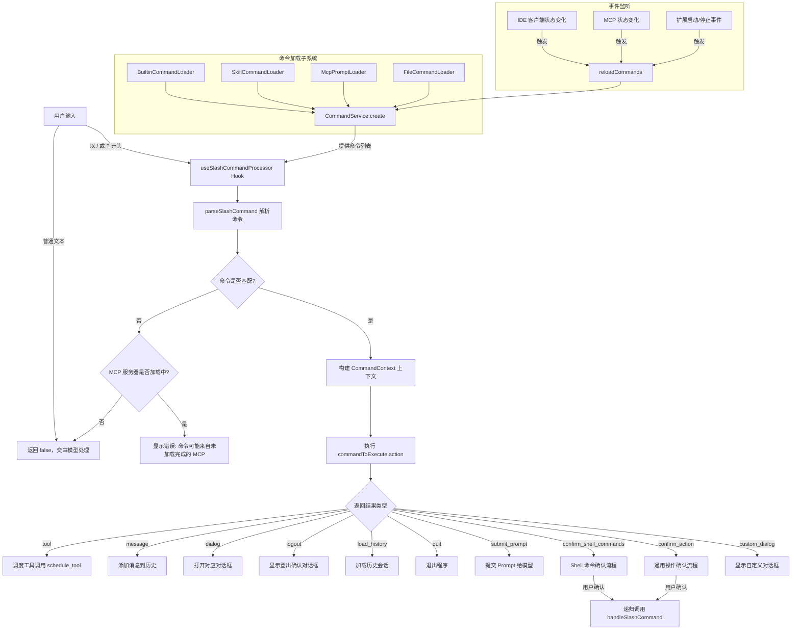

# slashCommandProcessor.ts

## 概述

`slashCommandProcessor.ts` 是 Gemini CLI 项目中用于处理斜杠命令（Slash Commands）的核心 React Hook 文件。它导出了 `useSlashCommandProcessor` 自定义 Hook，负责解析用户在 CLI 中输入的以 `/` 或 `?` 开头的命令，将其路由到对应的命令处理器执行，并管理命令执行过程中的 UI 状态更新、对话框弹出、历史记录管理、Shell 命令确认等一系列复杂交互流程。

该文件是 CLI 用户交互层的核心枢纽，连接了命令发现/加载、命令解析、命令执行、UI 响应等多个子系统。

## 架构图（Mermaid）

## 核心组件

### 1. `SlashCommandProcessorActions` 接口

定义了斜杠命令处理器所需的全部 UI 操作回调函数，包括：

| 方法名 | 说明 |
|--------|------|
| `openAuthDialog` | 打开认证对话框 |
| `openThemeDialog` | 打开主题设置对话框 |
| `openEditorDialog` | 打开编辑器选择对话框 |
| `openPrivacyNotice` | 打开隐私声明 |
| `openSettingsDialog` | 打开设置对话框 |
| `openSessionBrowser` | 打开会话浏览器 |
| `openModelDialog` | 打开模型选择对话框 |
| `openAgentConfigDialog` | 打开 Agent 配置对话框 |
| `openPermissionsDialog` | 打开权限管理对话框 |
| `quit` | 退出应用程序 |
| `setDebugMessage` | 设置调试消息 |
| `toggleCorgiMode` | 切换 Corgi 模式 |
| `toggleDebugProfiler` | 切换调试分析器 |
| `dispatchExtensionStateUpdate` | 分发扩展状态更新 |
| `addConfirmUpdateExtensionRequest` | 添加扩展更新确认请求 |
| `toggleBackgroundShell` | 切换后台 Shell |
| `toggleShortcutsHelp` | 切换快捷键帮助 |
| `setText` | 设置输入框文本 |

### 2. `useSlashCommandProcessor` Hook

这是文件的核心导出，接受大量参数并返回命令处理相关的状态和方法。

#### 参数列表

| 参数 | 类型 | 说明 |
|------|------|------|
| `config` | `Config \| null` | 应用配置对象 |
| `settings` | `LoadedSettings` | 已加载的设置 |
| `addItem` | `UseHistoryManagerReturn['addItem']` | 添加历史记录项的方法 |
| `clearItems` | `UseHistoryManagerReturn['clearItems']` | 清除历史记录的方法 |
| `loadHistory` | `UseHistoryManagerReturn['loadHistory']` | 加载历史记录的方法 |
| `refreshStatic` | `() => void` | 刷新静态内容 |
| `toggleVimEnabled` | `() => Promise<boolean>` | 切换 Vim 模式 |
| `setIsProcessing` | `(isProcessing: boolean) => void` | 设置处理中状态 |
| `actions` | `SlashCommandProcessorActions` | UI 操作回调集合 |
| `extensionsUpdateState` | `Map<string, ExtensionUpdateStatus>` | 扩展更新状态映射 |
| `isConfigInitialized` | `boolean` | 配置是否已初始化 |
| `setBannerVisible` | `(visible: boolean) => void` | 控制横幅可见性 |
| `setCustomDialog` | `(dialog: React.ReactNode \| null) => void` | 设置自定义对话框 |

#### 返回值

| 字段 | 类型 | 说明 |
|------|------|------|
| `handleSlashCommand` | `async function` | 核心命令处理函数 |
| `slashCommands` | `readonly SlashCommand[] \| undefined` | 已注册的命令列表 |
| `pendingHistoryItems` | `HistoryItemWithoutId[]` | 待处理的历史项（如确认弹框期间的工具显示） |
| `commandContext` | `CommandContext` | 命令执行上下文 |
| `confirmationRequest` | `object \| null` | 当前的确认请求状态 |

### 3. 内部状态管理

Hook 内部维护了多个状态：

- **`commands`**: 通过 `CommandService` 加载的所有可用斜杠命令列表
- **`reloadTrigger`**: 命令重新加载的触发计数器，值变化时重新创建 `CommandService`
- **`confirmationRequest`**: 当前激活的确认对话框请求
- **`sessionShellAllowlist`**: 本次会话中已被用户永久允许的 Shell 命令集合
- **`pendingItem`**: 等待用户确认的工具调用展示项

### 4. `handleSlashCommand` 函数

核心命令处理函数，处理流程如下：

1. **输入验证**: 检查输入是否为字符串且以 `/` 或 `?` 开头
2. **命令解析**: 调用 `parseSlashCommand` 解析出命令名和参数
3. **命令匹配失败处理**: 若未找到匹配命令，检查 MCP 是否仍在加载
4. **构建执行上下文**: 创建 `CommandContext`，含服务引用、UI 方法、会话信息
5. **执行命令**: 调用 `commandToExecute.action(fullCommandContext, args)`
6. **结果路由**: 根据返回结果类型分别处理（工具调用、消息显示、对话框、退出等）
7. **日志记录**: 在 `finally` 块中记录命令执行日志
8. **错误处理**: 捕获异常并显示错误消息

#### 结果类型路由表

| 结果类型 | 处理方式 |
|----------|----------|
| `tool` | 返回 `schedule_tool`，由调用方调度工具执行 |
| `message` | 根据 `messageType` 添加 INFO 或 ERROR 消息到历史 |
| `logout` | 创建 `LogoutConfirmationDialog` 组件，提供登录/退出选择 |
| `dialog` | 根据 `result.dialog` 值调用对应的 `actions.openXxxDialog()` |
| `load_history` | 设置 Gemini 客户端历史并恢复 UI 历史记录 |
| `quit` | 调用 `actions.quit()` 退出 |
| `submit_prompt` | 返回 `submit_prompt`，由调用方提交给模型 |
| `confirm_shell_commands` | 创建工具确认 UI，等待用户确认后递归调用自身 |
| `confirm_action` | 显示确认提示，等待用户确认后递归调用自身 |
| `custom_dialog` | 设置自定义对话框组件 |

### 5. 命令加载机制

通过 `useEffect` Hook 异步创建 `CommandService`，加载器包括：

- **`BuiltinCommandLoader`**: 加载内置命令（如 `/help`, `/clear`, `/quit`）
- **`SkillCommandLoader`**: 加载技能命令
- **`McpPromptLoader`**: 加载 MCP 协议的 Prompt 命令
- **`FileCommandLoader`**: 加载文件系统中的命令定义

使用 `AbortController` 在组件卸载或依赖变化时取消进行中的加载。

### 6. 事件监听与命令重载

另一个 `useEffect` Hook 负责监听以下事件以触发命令重载：

- **IDE 客户端状态变化**: 通过 `IdeClient.addStatusChangeListener`
- **MCP 服务器状态变化**: 通过 `addMCPStatusChangeListener`
- **扩展启动/停止**: 通过 `coreEvents.on('extensionsStarting'/'extensionsStopping')`

### 7. `commandContext` 构建

通过 `useMemo` 构建 `CommandContext` 对象，包含三大部分：

- **`services`**: 包含 `agentContext`(Config)、`settings`、`git`(GitService)、`logger`(Logger)
- **`ui`**: 包含所有 UI 操作方法（添加项、清除、加载历史、切换模式等）
- **`session`**: 包含会话统计信息和 Shell 白名单

### 8. `addMessage` 辅助函数

将 `Message` 对象转换为 `HistoryItemWithoutId` 并添加到历史记录。支持的消息类型包括：`ABOUT`、`HELP`、`STATS`、`MODEL_STATS`、`TOOL_STATS`、`QUIT`、`COMPRESSION` 以及通用文本消息。

## 依赖关系

### 内部依赖

| 模块路径 | 导入内容 | 用途 |
|----------|----------|------|
| `./useHistoryManager.js` | `UseHistoryManagerReturn` 类型 | 历史记录管理器返回值类型 |
| `../contexts/SessionContext.js` | `useSessionStats` | 获取会话统计信息 |
| `../types.js` | `Message`, `HistoryItemWithoutId`, `SlashCommandProcessorResult`, `HistoryItem`, `ConfirmationRequest`, `IndividualToolCallDisplay`, `MessageType` | UI 层核心类型定义 |
| `../../config/settings.js` | `LoadedSettings` 类型 | 设置配置类型 |
| `../commands/types.js` | `CommandContext`, `SlashCommand` 类型 | 命令系统类型 |
| `../../services/CommandService.js` | `CommandService` | 命令服务，负责聚合所有命令加载器 |
| `../../services/BuiltinCommandLoader.js` | `BuiltinCommandLoader` | 内置命令加载器 |
| `../../services/FileCommandLoader.js` | `FileCommandLoader` | 文件命令加载器 |
| `../../services/McpPromptLoader.js` | `McpPromptLoader` | MCP Prompt 加载器 |
| `../../services/SkillCommandLoader.js` | `SkillCommandLoader` | 技能命令加载器 |
| `../../utils/commands.js` | `parseSlashCommand` | 斜杠命令解析工具 |
| `../state/extensions.js` | `ExtensionUpdateAction`, `ExtensionUpdateStatus` 类型 | 扩展状态管理类型 |
| `../components/LogoutConfirmationDialog.js` | `LogoutConfirmationDialog`, `LogoutChoice` | 登出确认对话框组件 |
| `../../utils/cleanup.js` | `runExitCleanup` | 退出清理工具 |

### 外部依赖

| 包名 | 导入内容 | 用途 |
|------|----------|------|
| `react` | `useCallback`, `useMemo`, `useEffect`, `useState`, `createElement` | React Hook 和元素创建 |
| `@google/genai` | `PartListUnion` 类型 | Gemini AI SDK 类型定义 |
| `node:process` | `process` | Node.js 进程对象，用于退出和获取当前目录 |
| `@google/gemini-cli-core` | `Config`, `ExtensionsStartingEvent`, `ExtensionsStoppingEvent`, `ToolCallConfirmationDetails`, `AgentDefinition`, `GitService`, `Logger`, `logSlashCommand`, `makeSlashCommandEvent`, `SlashCommandStatus`, `ToolConfirmationOutcome`, `Storage`, `IdeClient`, `coreEvents`, `addMCPStatusChangeListener`, `removeMCPStatusChangeListener`, `MCPDiscoveryState`, `CoreToolCallStatus` | CLI 核心层服务和类型 |

## 关键实现细节

### 1. 递归命令执行模式

`handleSlashCommand` 在处理 `confirm_shell_commands` 和 `confirm_action` 结果类型时，会递归调用自身。这种设计允许命令在需要用户确认后重新执行，同时通过参数传递确认状态（如 `oneTimeShellAllowlist` 和 `overwriteConfirmed`）来避免二次确认。递归调用时传入 `addToHistory: false` 避免重复记录。

### 2. Shell 命令白名单的两层机制

- **一次性白名单**（`oneTimeShellAllowlist`）: 仅对当前命令执行有效，通过参数传递
- **会话级白名单**（`sessionShellAllowlist`）: 当用户选择 "ProceedAlways" 时，命令被加入会话白名单，后续同类命令不再需要确认

两层白名单在构建 `fullCommandContext` 时合并为一个 `Set`。

### 3. 命令加载的响应式机制

命令列表通过 `reloadTrigger` 状态控制重新加载。多个事件源（IDE 状态变化、MCP 状态变化、扩展事件）都调用 `reloadCommands()`，该函数仅递增 `reloadTrigger` 计数器。由于 `reloadTrigger` 是 `useEffect` 的依赖项，计数器变化会触发 `CommandService` 的重新创建和命令列表的刷新。

### 4. AbortController 防止内存泄漏

命令加载的 `useEffect` 使用 `AbortController` 确保在组件卸载或依赖变化时取消异步操作。如果在命令加载完成前 `controller.signal.aborted` 已为 `true`，则不会调用 `setCommands` 更新状态。

### 5. 日志记录的 try-finally 模式

命令执行使用 `try-catch-finally` 确保日志记录不会因异常而丢失。`catch` 块记录 ERROR 状态日志，`finally` 块在无错误时记录 SUCCESS 状态日志。日志通过 `logSlashCommand` 和 `makeSlashCommandEvent` 发送。

### 6. MCP 服务器加载状态感知

当用户输入的命令无法匹配时，系统会检查 MCP 服务器的发现状态（`MCPDiscoveryState.IN_PROGRESS`）。如果 MCP 正在加载中，会提示用户该命令可能来自尚未加载完成的 MCP 服务器，而非简单地将其作为普通文本发送给模型。

### 7. `pendingItem` 的确认流程交互

在 Shell 命令确认流程中，`pendingItem` 被设置为一个 `tool_group` 类型的历史项，其中包含状态为 `AwaitingApproval` 的工具调用显示信息。这使得 UI 能在确认等待期间展示一个工具卡片。确认完成后，`pendingItem` 被清除（设为 `null`）。

### 8. `addMessage` 的类型映射

`addMessage` 函数根据 `Message.type` 将消息转换为不同结构的 `HistoryItemWithoutId`。每种 `MessageType` 对应不同的字段集合（如 `ABOUT` 包含版本信息、操作系统信息等，而 `STATS` 仅包含持续时间）。这是 UI 层消息类型到持久化历史记录类型的适配层。
