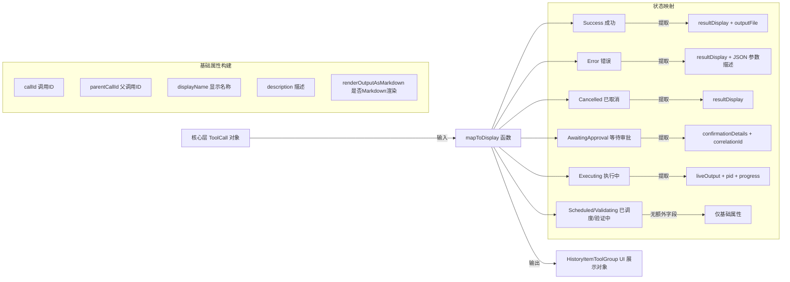

# toolMapping.ts

## 概述

`toolMapping.ts` 是 Gemini CLI 中的一个纯数据转换（映射）模块，负责将核心层的 `ToolCall` 对象转换为 UI 层可渲染的 `HistoryItemToolGroup` 对象。该文件仅导出一个函数 `mapToDisplay`，它充当核心层工具调用数据与 UI 展示层之间的投影层（Projection Layer），不涉及任何交互状态的追踪。

该模块的设计遵循了关注点分离原则：核心层关注工具调用的执行逻辑，而此模块负责将执行结果映射为 UI 所需的展示结构。

## 架构图（Mermaid）



## 核心组件

### 1. `mapToDisplay` 函数

**签名**:
```typescript
export function mapToDisplay(
  toolOrTools: ToolCall[] | ToolCall,
  options?: {
    borderTop?: boolean;
    borderBottom?: boolean;
    borderColor?: string;
    borderDimColor?: boolean;
  },
): HistoryItemToolGroup
```

**功能**: 将一个或多个 `ToolCall` 对象转换为 `HistoryItemToolGroup`，用于 UI 渲染。

**参数说明**:

| 参数 | 类型 | 说明 |
|------|------|------|
| `toolOrTools` | `ToolCall[] \| ToolCall` | 单个或多个工具调用对象，函数内部统一转换为数组处理 |
| `options.borderTop` | `boolean?` | 是否在工具组顶部显示边框 |
| `options.borderBottom` | `boolean?` | 是否在工具组底部显示边框 |
| `options.borderColor` | `string?` | 边框颜色 |
| `options.borderDimColor` | `boolean?` | 是否使用暗淡颜色的边框 |

**返回值**: `HistoryItemToolGroup` 对象，包含 `type: 'tool_group'`、`tools` 数组以及边框配置。

### 2. 基础属性构建逻辑

对于每个 `ToolCall`，函数首先构建基础展示属性 `baseDisplayProperties`：

- **`callId`**: 直接取自 `call.request.callId`
- **`parentCallId`**: 取自 `call.request.parentCallId`，用于表示子 Agent 工具调用的父级关系
- **`name`（显示名称）**: 优先使用 `call.tool?.displayName`，若不存在则回退到 `call.request.name`
- **`description`（描述）**:
  - 当工具调用状态为 `Error` 时：使用 `JSON.stringify(call.request.args)` 将参数序列化为描述
  - 其他状态：使用 `call.invocation.getDescription()` 获取调用描述
- **`renderOutputAsMarkdown`**: 当非错误状态时，取自 `call.tool.isOutputMarkdown`

### 3. 状态分支处理（switch-case）

函数根据 `call.status`（工具调用状态）提取不同的附加字段：

| 状态 | 枚举值 | 提取字段 | 说明 |
|------|--------|----------|------|
| 成功 | `CoreToolCallStatus.Success` | `resultDisplay`, `outputFile` | 完成的工具调用，包含结果展示和可选的输出文件路径 |
| 错误 | `CoreToolCallStatus.Error` | `resultDisplay` | 失败的工具调用，包含错误信息展示 |
| 已取消 | `CoreToolCallStatus.Cancelled` | `resultDisplay` | 被取消的工具调用 |
| 等待审批 | `CoreToolCallStatus.AwaitingApproval` | `correlationId`, `confirmationDetails` | 需要用户确认的工具调用，传递确认详情 |
| 执行中 | `CoreToolCallStatus.Executing` | `resultDisplay`(liveOutput), `ptyId`(pid), `progressMessage`, `progress`, `progressTotal` | 正在执行的工具，包含实时输出、进程ID和进度信息 |
| 已调度/验证中 | `CoreToolCallStatus.Scheduled` / `CoreToolCallStatus.Validating` | 无额外字段 | 尚未开始执行 |

### 4. `IndividualToolCallDisplay` 输出结构

最终每个工具调用被映射为 `IndividualToolCallDisplay` 对象：

```typescript
{
  callId: string;                    // 调用唯一标识
  parentCallId?: string;             // 父调用标识（子Agent场景）
  name: string;                      // 工具显示名称
  description: string;               // 工具调用描述
  renderOutputAsMarkdown: boolean;   // 输出是否按 Markdown 渲染
  status: CoreToolCallStatus;        // 工具调用状态
  isClientInitiated: boolean;        // 是否由客户端发起
  kind?: string;                     // 工具种类
  resultDisplay?: ToolResultDisplay; // 结果展示
  confirmationDetails?: SerializableConfirmationDetails; // 确认详情
  outputFile?: string;               // 输出文件路径
  ptyId?: number;                    // 伪终端进程ID
  correlationId?: string;            // 关联ID
  progressMessage?: string;          // 进度消息
  progress?: number;                 // 当前进度
  progressTotal?: number;            // 进度总量
  approvalMode?: unknown;            // 审批模式
  originalRequestName?: string;      // 原始请求名称
}
```

## 依赖关系

### 内部依赖

| 模块路径 | 导入内容 | 用途 |
|----------|----------|------|
| `../types.js` | `HistoryItemToolGroup`, `IndividualToolCallDisplay` 类型 | UI 层工具展示类型定义 |

### 外部依赖

| 包名 | 导入内容 | 用途 |
|------|----------|------|
| `@google/gemini-cli-core` | `ToolCall` 类型, `SerializableConfirmationDetails` 类型, `ToolResultDisplay` 类型, `debugLogger`, `CoreToolCallStatus` 枚举 | 核心层工具调用数据结构和状态枚举 |

## 关键实现细节

### 1. 输入参数的灵活性

`mapToDisplay` 函数的第一个参数支持传入单个 `ToolCall` 或 `ToolCall[]` 数组。函数内部通过 `Array.isArray` 检测后统一转为数组处理，这提供了 API 使用上的便利性——调用方无需在单个工具和多个工具之间切换不同的调用方式。

### 2. 穷举检查（Exhaustive Check）

`switch` 语句使用了 TypeScript 的 `never` 类型穷举检查模式。`default` 分支中将 `call` 赋值给 `const exhaustiveCheck: never`，确保当 `CoreToolCallStatus` 枚举新增成员时，TypeScript 编译器会在此处报错，提醒开发者处理新状态。同时通过 `debugLogger.warn` 在运行时记录未处理的状态，提供防御性编程保障。

### 3. 错误状态的特殊描述处理

当工具调用处于 `Error` 状态时，`call.tool` 可能不可用（因为工具可能未能成功加载或实例化），因此描述降级为使用 `JSON.stringify(call.request.args)` 序列化原始请求参数。这确保了即使在错误场景下，用户仍能看到有意义的调用信息。

### 4. 纯函数设计

`mapToDisplay` 是一个纯函数——相同输入始终产生相同输出，不依赖外部状态，不产生副作用。这使其易于测试、可预测，并且可以安全地在 React 渲染过程中调用而不会导致意外的副作用。

### 5. 边框配置的透传

`options` 参数中的 `borderTop`、`borderBottom`、`borderColor`、`borderDimColor` 被直接透传到返回的 `HistoryItemToolGroup` 对象中，用于控制工具组在 UI 中的视觉边框样式。这允许调用方根据上下文（如工具组在历史记录中的位置）自定义展示效果。

### 6. 执行中状态的丰富信息

对于 `Executing` 状态的工具调用，映射器提取了最为丰富的信息：
- `liveOutput`（实时输出）映射到 `resultDisplay`，用于流式展示工具执行过程
- `pid` 映射到 `ptyId`，标识关联的伪终端进程
- `progressMessage`、`progress`、`progressTotal` 提供进度指示信息

这些字段共同支撑了 CLI 中工具执行过程的实时进度展示功能。
