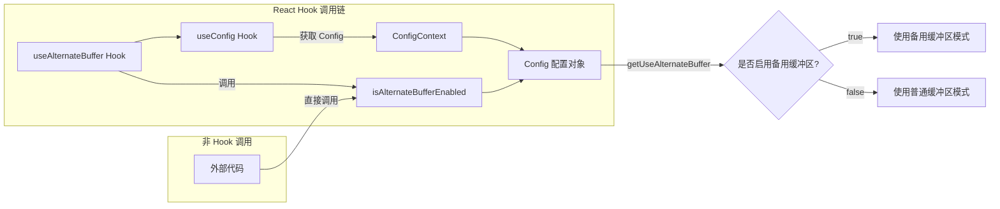

# useAlternateBuffer.ts

## 概述

`useAlternateBuffer.ts` 是一个轻量级的 React Hook 模块，用于判断当前应用会话是否启用了终端备用缓冲区（Alternate Buffer）。终端的备用缓冲区是一种标准终端特性，常用于全屏应用程序（如 vim、less 等），进入时会保存当前屏幕内容，退出时恢复，避免全屏应用污染用户的终端历史输出。

该文件导出两个内容：
1. `isAlternateBufferEnabled` -- 纯函数，接受 `Config` 对象并返回是否启用备用缓冲区
2. `useAlternateBuffer` -- React Hook，从 `ConfigContext` 获取配置并返回备用缓冲区启用状态

设计意图是确保 UI 层在整个应用会话期间读取的是同一个配置值，避免不一致。

## 架构图（Mermaid）



## 核心组件

### 1. `isAlternateBufferEnabled` 函数

**签名**:
```typescript
export const isAlternateBufferEnabled = (config: Config): boolean =>
  config.getUseAlternateBuffer();
```

**功能**: 一个纯函数，接受 `Config` 对象作为参数，调用其 `getUseAlternateBuffer()` 方法返回布尔值，指示是否应使用终端备用缓冲区。

**用途**: 提供给非 React 上下文中的代码使用（例如在 Hook 外部或初始化阶段），只需传入 `Config` 实例即可获取配置值。

### 2. `useAlternateBuffer` Hook

**签名**:
```typescript
export const useAlternateBuffer = (): boolean
```

**功能**: React 自定义 Hook，从 `ConfigContext` 中获取 `Config` 对象，然后委托给 `isAlternateBufferEnabled` 返回结果。

**用途**: 供 React 组件使用，自动从上下文获取配置，无需手动传递 `Config` 对象。

## 依赖关系

### 内部依赖

| 模块路径 | 导入内容 | 用途 |
|----------|----------|------|
| `../contexts/ConfigContext.js` | `useConfig` | React Hook，用于从 ConfigContext 获取当前的 Config 对象 |

### 外部依赖

| 包名 | 导入内容 | 用途 |
|------|----------|------|
| `@google/gemini-cli-core` | `Config` 类型 | 核心配置类型，提供 `getUseAlternateBuffer()` 方法 |

## 关键实现细节

### 1. 会话级一致性保证

源码注释明确指出："This is read from Config so that the UI reads the same value per application session"。`Config` 对象在应用初始化时创建，其 `getUseAlternateBuffer()` 方法的返回值在整个会话期间保持不变。这避免了在应用运行过程中因配置变化而导致的缓冲区模式切换，保证了终端行为的一致性。

### 2. 双导出策略

该模块同时提供了 Hook 版本（`useAlternateBuffer`）和纯函数版本（`isAlternateBufferEnabled`）：
- **Hook 版本**: 适用于 React 组件内部，自动从 Context 获取依赖
- **纯函数版本**: 适用于非 React 环境或需要显式传入 `Config` 的场景

这种设计模式在该代码库中提供了最大的灵活性，使得同一逻辑可以在不同的调用环境中复用。

### 3. 极简实现

整个文件仅有 17 行代码，是典型的"薄包装"模式。`useAlternateBuffer` Hook 本身不维护任何状态，只是对 `Config.getUseAlternateBuffer()` 的一个便捷访问封装。这种设计保持了代码的简洁性，同时为后续可能的扩展（如添加缓存、日志等）预留了扩展点。
