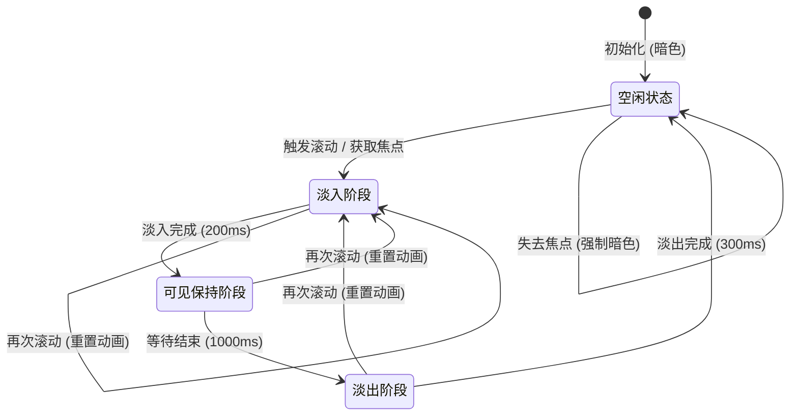
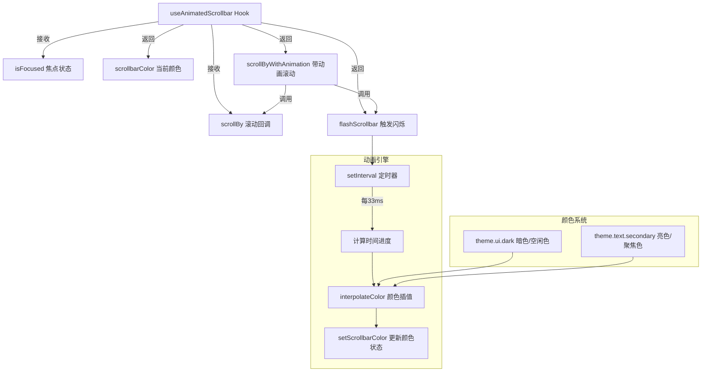

# useAnimatedScrollbar.ts

## 概述

`useAnimatedScrollbar.ts` 是一个 React 自定义 Hook，用于实现终端 UI 中滚动条的动画效果。当用户进行滚动操作或焦点状态发生变化时，滚动条会经历一个三阶段动画过程：**淡入 -> 保持可见 -> 淡出**。这种动画效果类似于 macOS 系统中滚动条的行为——平时隐藏或暗淡，滚动时短暂高亮显示。

该 Hook 通过 `setInterval` 实现逐帧颜色插值动画（约 30fps），使用主题颜色系统进行颜色过渡，并内置了测试环境适配（跳过动画直接设置最终颜色）。

## 架构图（Mermaid）





## 核心组件

### 1. `useAnimatedScrollbar` Hook

**签名**:
```typescript
export function useAnimatedScrollbar(
  isFocused: boolean,
  scrollBy: (delta: number) => void,
): {
  scrollbarColor: string;
  flashScrollbar: () => void;
  scrollByWithAnimation: (delta: number) => void;
}
```

**参数**:

| 参数 | 类型 | 说明 |
|------|------|------|
| `isFocused` | `boolean` | 当前组件是否拥有焦点 |
| `scrollBy` | `(delta: number) => void` | 实际执行滚动操作的回调函数 |

**返回值**:

| 字段 | 类型 | 说明 |
|------|------|------|
| `scrollbarColor` | `string` | 当前滚动条颜色值，供 UI 渲染使用 |
| `flashScrollbar` | `() => void` | 手动触发滚动条闪烁动画 |
| `scrollByWithAnimation` | `(delta: number) => void` | 包装后的滚动函数，滚动同时触发动画 |

### 2. 内部状态与引用

| 名称 | 类型 | 说明 |
|------|------|------|
| `scrollbarColor` | `useState<string>` | 当前滚动条颜色状态，初始值为 `theme.ui.dark` |
| `colorRef` | `useRef<string>` | 当前颜色的引用副本，供闭包内访问最新值 |
| `animationFrame` | `useRef<NodeJS.Timeout>` | `setInterval` 定时器引用，用于动画帧更新 |
| `timeout` | `useRef<NodeJS.Timeout>` | `setTimeout` 引用，用于可见保持阶段的延迟 |
| `isAnimatingRef` | `useRef<boolean>` | 是否正在执行动画的标志 |
| `wasFocused` | `useRef<boolean>` | 上一次的焦点状态，用于检测焦点变化方向 |

### 3. `cleanup` 函数

清理所有动画相关的定时器和状态：
- 如果正在执行动画，减少 `debugState.debugNumAnimatedComponents` 计数器
- 清除 `setInterval` 定时器
- 清除 `setTimeout` 延迟器
- 重置 `isAnimatingRef` 标志

### 4. `flashScrollbar` 函数

核心动画控制函数，执行三阶段动画：

**阶段 1 - 淡入（Fade In）**:
- 持续时间：200ms
- 从当前颜色（`startColor`）过渡到聚焦色（`theme.text.secondary`）
- 使用 `setInterval(animateFadeIn, 33)` 驱动动画，约 30fps

**阶段 2 - 可见保持（Wait）**:
- 持续时间：1000ms
- 使用 `setTimeout` 延迟进入下一阶段

**阶段 3 - 淡出（Fade Out）**:
- 持续时间：300ms
- 从聚焦色（`theme.text.secondary`）过渡到空闲色（`theme.ui.dark`）
- 使用 `setInterval(animateFadeOut, 33)` 驱动动画

### 5. 焦点变化监听（useEffect）

监听 `isFocused` 状态变化：
- **获取焦点**（`isFocused` 从 `false` 变为 `true`）：触发 `flashScrollbar()`
- **失去焦点**（`isFocused` 从 `true` 变为 `false`）：立即清理动画并重置为暗色
- 组件卸载时调用 `cleanup` 清理资源

### 6. `scrollByWithAnimation` 函数

包装原始 `scrollBy` 回调，在执行滚动的同时触发滚动条闪烁动画。这确保了每次滚动操作都伴随视觉反馈。

## 依赖关系

### 内部依赖

| 模块路径 | 导入内容 | 用途 |
|----------|----------|------|
| `../semantic-colors.js` | `theme` | 主题颜色系统，提供 `theme.ui.dark` 和 `theme.text.secondary` |
| `../themes/color-utils.js` | `interpolateColor` | 颜色插值函数，用于两种颜色之间的平滑过渡 |
| `../debug.js` | `debugState` | 调试状态，追踪当前活跃动画组件数量 |

### 外部依赖

| 包名 | 导入内容 | 用途 |
|------|----------|------|
| `react` | `useState`, `useEffect`, `useRef`, `useCallback` | React Hook 基础设施 |

## 关键实现细节

### 1. 基于定时器的帧动画

动画并未使用 `requestAnimationFrame`（因为是终端环境，没有浏览器的 RAF API），而是使用 `setInterval` 以约 33ms 间隔（约 30fps）驱动。每一帧计算经过时间与总时长的比率（progress），然后使用 `interpolateColor` 在两种颜色之间进行线性插值。

进度计算公式：
```
progress = clamp(elapsed / duration, 0, 1)
```

### 2. `colorRef` 解决闭包陈旧值问题

`scrollbarColor` 是 React 状态，在 `flashScrollbar` 闭包中可能捕获到旧值。通过 `colorRef.current = scrollbarColor` 保持一个始终指向最新颜色值的引用，`flashScrollbar` 内部读取 `colorRef.current` 作为动画起始颜色，确保从当前实际颜色开始过渡。

### 3. 动画重入安全

`flashScrollbar` 在开始新动画前先调用 `cleanup()`，清除所有先前的定时器。这意味着如果用户在动画进行中再次滚动，旧动画会被中断，新动画会从当前颜色重新开始淡入。这提供了流畅的用户体验——快速连续滚动不会导致动画卡顿或叠加。

### 4. 测试环境适配

函数检测 `process.env['NODE_ENV'] === 'test'`，在测试环境中将所有动画持续时间设为 0，并直接设置最终颜色后立即清理。这避免了测试中的异步定时器问题，确保测试的确定性和速度。

### 5. 调试计数器集成

通过 `debugState.debugNumAnimatedComponents` 追踪当前活跃的动画组件数量。动画开始时递增，清理时递减。这对于调试性能问题（如检测是否有动画组件泄漏未清理）非常有用。

### 6. 焦点状态的边沿检测

使用 `wasFocused` ref 记录上一次的焦点状态，与当前 `isFocused` 比较来检测"获取焦点"和"失去焦点"的边沿变化，而非仅响应焦点值本身。这避免了在焦点状态未变化时（如组件重渲染但焦点状态不变）不必要地触发动画。

### 7. 颜色安全检查

`flashScrollbar` 在执行动画前检查 `focusedColor` 和 `unfocusedColor` 是否存在（非空/非 undefined）。如果主题颜色未定义，函数会提前返回，防止 `interpolateColor` 接收到无效输入导致错误。
