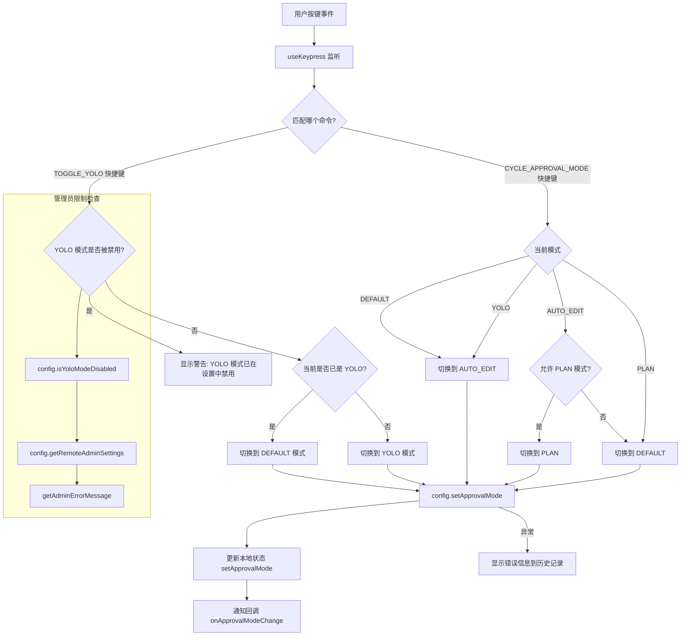

# useApprovalModeIndicator.ts

## 概述

`useApprovalModeIndicator.ts` 是一个 React 自定义 Hook，用于管理和指示当前的工具审批模式（Approval Mode）。在 Gemini CLI 中，审批模式决定了 AI 在执行工具调用（如文件编辑、Shell 命令）时是否需要用户确认。该 Hook 监听键盘快捷键事件，允许用户通过按键在不同审批模式之间切换，同时处理模式切换的权限校验和错误提示。

支持的审批模式包括：
- **DEFAULT（默认模式）**: 所有工具调用均需用户确认
- **AUTO_EDIT（自动编辑模式）**: 文件编辑操作自动执行，其他操作仍需确认
- **PLAN（计划模式）**: AI 仅生成计划，不实际执行任何工具调用
- **YOLO 模式**: 所有工具调用自动执行，无需确认（可被管理员禁用）

## 架构图（Mermaid）



```mermaid
stateDiagram-v2
    [*] --> DEFAULT: 初始化（从 Config 读取）

    DEFAULT --> AUTO_EDIT: CYCLE_APPROVAL_MODE
    AUTO_EDIT --> PLAN: CYCLE（当 allowPlanMode=true）
    AUTO_EDIT --> DEFAULT: CYCLE（当 allowPlanMode=false）
    PLAN --> DEFAULT: CYCLE_APPROVAL_MODE
    YOLO --> AUTO_EDIT: CYCLE_APPROVAL_MODE

    DEFAULT --> YOLO: TOGGLE_YOLO（未被禁用时）
    AUTO_EDIT --> YOLO: TOGGLE_YOLO（未被禁用时）
    PLAN --> YOLO: TOGGLE_YOLO（未被禁用时）
    YOLO --> DEFAULT: TOGGLE_YOLO
```

## 核心组件

### 1. `UseApprovalModeIndicatorArgs` 接口

Hook 的输入参数类型定义：

| 字段 | 类型 | 必填 | 默认值 | 说明 |
|------|------|------|--------|------|
| `config` | `Config` | 是 | - | 应用配置对象，提供审批模式的读写和权限检查 |
| `addItem` | `(item: HistoryItemWithoutId, timestamp: number) => void` | 否 | - | 向历史记录添加项的回调，用于显示警告和错误消息 |
| `onApprovalModeChange` | `(mode: ApprovalMode) => void` | 否 | - | 审批模式变更时的通知回调 |
| `isActive` | `boolean` | 否 | `true` | 是否激活键盘监听，为 `false` 时忽略按键 |
| `allowPlanMode` | `boolean` | 否 | `false` | 是否允许在循环中包含 PLAN 模式 |

### 2. `useApprovalModeIndicator` Hook

**签名**:
```typescript
export function useApprovalModeIndicator(
  args: UseApprovalModeIndicatorArgs,
): ApprovalMode
```

**返回值**: 当前的 `ApprovalMode` 枚举值。

### 3. 键盘快捷键处理逻辑

Hook 通过 `useKeypress` 监听两个命令：

#### `TOGGLE_YOLO` -- YOLO 模式切换

处理流程：
1. **权限检查**: 调用 `config.isYoloModeDisabled()` 检查 YOLO 模式是否被禁用
2. **管理员限制检查**: 如果存在远程管理员设置（`getRemoteAdminSettings()`）且 `strictModeDisabled` 为 `false`，使用 `getAdminErrorMessage` 生成管理员级错误提示
3. **切换逻辑**: 如果当前已是 YOLO 则切回 DEFAULT，否则切到 YOLO

#### `CYCLE_APPROVAL_MODE` -- 循环切换审批模式

切换循环路径取决于当前模式和 `allowPlanMode` 参数：

| 当前模式 | 下一模式（allowPlanMode=false） | 下一模式（allowPlanMode=true） |
|----------|-------------------------------|-------------------------------|
| DEFAULT | AUTO_EDIT | AUTO_EDIT |
| AUTO_EDIT | DEFAULT | PLAN |
| PLAN | DEFAULT | DEFAULT |
| YOLO | AUTO_EDIT | AUTO_EDIT |

### 4. 模式切换执行

确定 `nextApprovalMode` 后：
1. 调用 `config.setApprovalMode(nextApprovalMode)` 持久化到配置
2. 调用 `setApprovalMode(nextApprovalMode)` 立即更新本地 React 状态（确保 UI 响应性）
3. 调用 `onApprovalModeChange?.(nextApprovalMode)` 通知外部监听器
4. 如果 `config.setApprovalMode` 抛出异常（如权限不足），捕获错误并通过 `addItem` 显示错误信息

### 5. 配置同步（useEffect）

```typescript
useEffect(() => {
  setApprovalMode(currentConfigValue);
}, [currentConfigValue]);
```

当外部通过其他途径修改 `Config` 中的审批模式时（如通过设置对话框），该 `useEffect` 确保本地状态与配置保持同步。

## 依赖关系

### 内部依赖

| 模块路径 | 导入内容 | 用途 |
|----------|----------|------|
| `./useKeypress.js` | `useKeypress` | React Hook，监听终端键盘按键事件 |
| `../key/keyMatchers.js` | `Command` 枚举 | 定义键盘命令名称（`TOGGLE_YOLO`, `CYCLE_APPROVAL_MODE`） |
| `./useKeyMatchers.js` | `useKeyMatchers` | React Hook，获取按键匹配器映射表 |
| `../types.js` | `MessageType`, `HistoryItemWithoutId` 类型 | UI 类型定义 |

### 外部依赖

| 包名 | 导入内容 | 用途 |
|------|----------|------|
| `react` | `useState`, `useEffect` | React Hook 基础设施 |
| `@google/gemini-cli-core` | `ApprovalMode` 枚举, `Config` 类型, `getAdminErrorMessage` | 核心层审批模式定义、配置对象和管理员错误消息生成 |

## 关键实现细节

### 1. 双层状态管理

审批模式同时存在于两个位置：
- **`Config` 对象**: 持久化的配置层，通过 `config.getApprovalMode()` / `config.setApprovalMode()` 读写
- **React `useState`（`showApprovalMode`）**: 本地 UI 状态

切换时先更新 `Config`（持久层），再更新 React 状态（UI 层）。`useEffect` 用于反向同步——当 `Config` 被外部修改时，同步到本地状态。这种双向同步确保了无论模式变更来源是按键还是外部操作，UI 都能正确反映。

### 2. YOLO 模式的安全防护

YOLO 模式（所有操作自动执行）具有特殊的安全限制：
- **本地禁用**: `config.isYoloModeDisabled()` 检查用户设置中是否禁用了 YOLO
- **管理员禁用**: 通过 `config.getRemoteAdminSettings()` 检查组织级管理策略
- 当 YOLO 被禁用时，不仅拒绝切换，还会通过 `addItem` 向用户显示明确的警告消息
- 管理员禁用场景使用 `getAdminErrorMessage` 生成专业化的错误消息

### 3. `allowPlanMode` 的条件循环

`CYCLE_APPROVAL_MODE` 的循环路径根据 `allowPlanMode` 参数动态调整。当 `allowPlanMode=false` 时，PLAN 模式被跳过，循环仅在 DEFAULT 和 AUTO_EDIT 之间切换。这允许调用方根据上下文（如某些场景不适合使用 PLAN 模式）控制可用的模式集合。

### 4. 错误处理的优雅降级

`config.setApprovalMode()` 调用被 `try-catch` 包裹。如果设置失败（例如远程管理策略禁止某模式），异常会被捕获并转为 `MessageType.INFO` 消息显示，而非导致应用崩溃。注意 `addItem` 是可选参数，因此错误处理也会检查其是否存在。

### 5. 键盘监听的可控激活

通过 `useKeypress` 的 `{ isActive }` 选项控制键盘监听的激活状态。当 `isActive=false` 时（例如对话框弹出期间），快捷键被忽略，防止在不适当的时机切换审批模式。

### 6. 从 YOLO 退出时的模式选择

当用户按 `TOGGLE_YOLO` 从 YOLO 模式退出时，固定切回 `DEFAULT` 模式而非记忆之前的模式。而当用户按 `CYCLE_APPROVAL_MODE` 从 YOLO 模式循环时，会切到 `AUTO_EDIT`。这两个快捷键对 YOLO 的退出行为是不同的，提供了灵活的模式导航体验。
