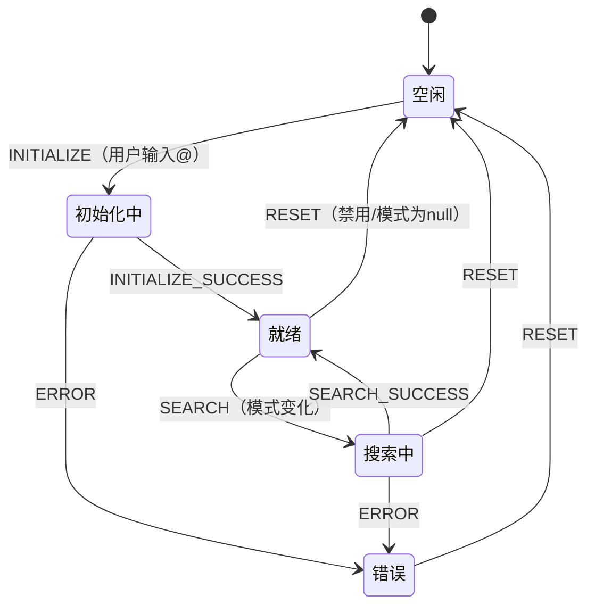
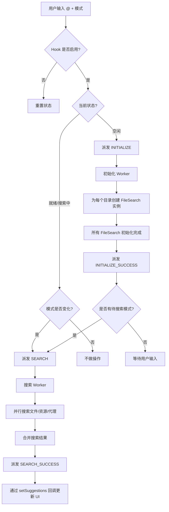
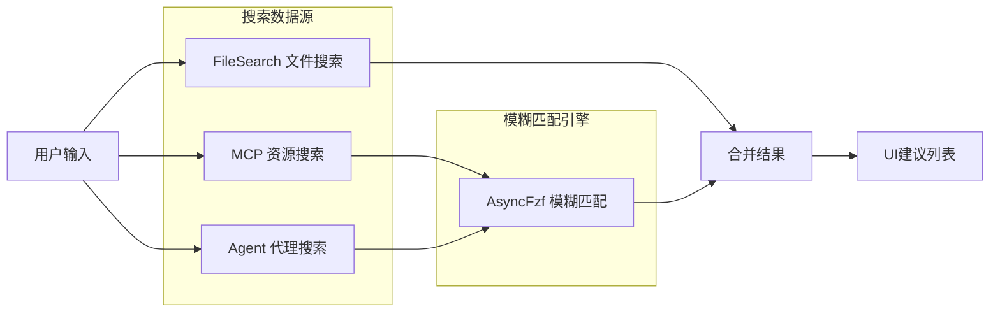

# useAtCompletion.ts

## 概述

`useAtCompletion` 是一个 React 自定义 Hook，用于实现 CLI 界面中 `@` 符号触发的自动补全功能。当用户在输入框中键入 `@` 后跟随模式字符串时，该 Hook 会搜索项目中的文件路径、MCP 资源以及代理（Agent）定义，并将匹配的建议返回给 UI 层展示。

该 Hook 内部采用 **状态机 + useReducer** 模式管理复杂的异步生命周期（空闲 -> 初始化 -> 就绪 -> 搜索中 -> 出错），并利用 `AbortController` 实现搜索取消和超时控制，确保不会因竞态条件产生陈旧结果。

## 架构图（Mermaid）







## 核心组件

### 1. `AtCompletionStatus` 枚举

定义了自动补全的五种状态：

| 状态 | 值 | 含义 |
|------|-----|------|
| `IDLE` | `'idle'` | 空闲状态，未激活 |
| `INITIALIZING` | `'initializing'` | 正在初始化文件搜索引擎 |
| `READY` | `'ready'` | 就绪，等待搜索或已完成搜索 |
| `SEARCHING` | `'searching'` | 正在执行搜索 |
| `ERROR` | `'error'` | 发生错误 |

### 2. `AtCompletionState` 接口

```typescript
interface AtCompletionState {
  status: AtCompletionStatus;  // 当前状态机状态
  suggestions: Suggestion[];   // 当前搜索建议列表
  isLoading: boolean;          // 是否显示加载指示器
  pattern: string | null;      // 当前搜索模式（小写）
}
```

### 3. `AtCompletionAction` 联合类型

支持的状态转移动作：

| Action 类型 | 载荷 | 说明 |
|-------------|------|------|
| `INITIALIZE` | 无 | 开始初始化文件搜索 |
| `INITIALIZE_SUCCESS` | 无 | 初始化成功 |
| `SEARCH` | `string`（搜索模式） | 启动搜索 |
| `SEARCH_SUCCESS` | `Suggestion[]` | 搜索完成，返回结果 |
| `SET_LOADING` | `boolean` | 设置加载状态（延迟 200ms 触发） |
| `ERROR` | 无 | 标记出错 |
| `RESET` | 无 | 重置为初始状态 |

### 4. `atCompletionReducer` 函数

纯函数状态机 reducer，负责根据 action 计算下一个状态。关键设计点：

- **SEARCH**: 保留旧的建议列表，不立即清空也不立即设置 loading，避免闪烁。
- **SET_LOADING**: 仅在仍处于 `SEARCHING` 状态时才生效（防止搜索已完成后误触 loading）。
- **RESET**: 回到完全的初始状态。

### 5. `useAtCompletion` Hook（主函数）

#### 参数（`UseAtCompletionProps`）

| 参数 | 类型 | 说明 |
|------|------|------|
| `enabled` | `boolean` | 是否启用 @ 补全 |
| `pattern` | `string` | 用户当前输入的搜索模式 |
| `config` | `Config \| undefined` | 应用配置对象 |
| `cwd` | `string` | 当前工作目录 |
| `setSuggestions` | `(suggestions: Suggestion[]) => void` | 回调：更新建议列表 |
| `setIsLoadingSuggestions` | `(isLoading: boolean) => void` | 回调：更新加载状态 |

#### 内部 Ref

| Ref | 类型 | 用途 |
|-----|------|------|
| `fileSearchMap` | `Map<string, FileSearch>` | 目录 -> FileSearch 实例的映射 |
| `initEpoch` | `number` | 初始化纪元计数器，用于防止过时的初始化覆盖新状态 |
| `searchAbortController` | `AbortController \| null` | 当前搜索的取消控制器 |
| `slowSearchTimer` | `NodeJS.Timeout \| null` | 延迟 200ms 显示 loading 的定时器 |

#### 核心 Effect 流程

1. **同步建议到外部** (`useEffect` on `state.suggestions`)：将内部 suggestions 同步到外部 `setSuggestions` 回调。
2. **同步 loading 到外部** (`useEffect` on `state.isLoading`)：将内部 isLoading 同步到外部 `setIsLoadingSuggestions` 回调。
3. **重置文件搜索状态** (`useEffect` on `cwd`, `config`)：当工作目录或配置变化时，清空所有 FileSearch 实例并重置状态。
4. **监听目录变化** (`useEffect` on `config`)：订阅 `workspaceContext.onDirectoriesChanged`，目录变化时重新初始化。
5. **响应用户输入** (`useEffect` on `enabled`, `pattern`, `state.status`, `state.pattern`)：根据当前状态和用户输入模式，决定派发 `INITIALIZE`、`SEARCH` 还是 `RESET`。
6. **Worker Effect** (`useEffect` on `state.status`, `state.pattern`, `config`, `cwd`)：根据状态机当前状态执行实际的异步操作（初始化或搜索）。

### 6. `buildResourceCandidates` 函数

从 `config` 中获取 MCP 资源注册表（`ResourceRegistry`），将每个资源转换为 `ResourceSuggestionCandidate`：

- 使用 `serverName:uri` 格式作为标签和值，用于区分不同 MCP 服务器的资源。
- `searchKey` 包含完整的 URI 和资源名称，便于搜索。

### 7. `buildAgentCandidates` 函数

从 `config` 中获取代理注册表（`AgentRegistry`），将每个代理定义转换为 `Suggestion`，附带 `CommandKind.AGENT` 标记。

### 8. `searchResourceCandidates` 函数

使用 `AsyncFzf` 对资源候选列表进行模糊搜索：

- 空模式时返回前 `MAX_SUGGESTIONS_TO_SHOW` 个候选。
- 非空模式时使用 fzf 引擎搜索，上限为 `MAX_SUGGESTIONS_TO_SHOW * 3`。

### 9. `searchAgentCandidates` 函数

使用 `AsyncFzf` 对代理候选列表进行模糊搜索：

- 空模式时返回前 `MAX_SUGGESTIONS_TO_SHOW` 个候选。
- 非空模式时使用 fzf 引擎搜索，上限为 `MAX_SUGGESTIONS_TO_SHOW`。

## 依赖关系

### 内部依赖

| 模块 | 导入内容 | 用途 |
|------|----------|------|
| `@google/gemini-cli-core` | `FileSearchFactory`, `escapePath`, `FileDiscoveryService`, `Config`, `FileSearch` | 文件搜索引擎和路径工具 |
| `../components/SuggestionsDisplay.js` | `MAX_SUGGESTIONS_TO_SHOW`, `Suggestion` | 建议列表的最大显示数量和类型定义 |
| `../commands/types.js` | `CommandKind` | 命令类型枚举（用于标记 Agent 建议） |

### 外部依赖

| 包 | 导入内容 | 用途 |
|----|----------|------|
| `react` | `useEffect`, `useReducer`, `useRef` | React Hook 基础设施 |
| `node:timers/promises` | `setTimeout` (as `setTimeoutPromise`) | 基于 Promise 的超时，用于搜索超时控制 |
| `node:path` | `path` | 路径拼接（跨目录搜索结果的路径处理） |
| `fzf` | `AsyncFzf` | 异步模糊搜索引擎 |

## 关键实现细节

### 1. 延迟 Loading 指示器（200ms）

搜索启动后不立即显示 loading，而是设置一个 200ms 的定时器。如果搜索在 200ms 内完成，用户不会看到闪烁的加载指示器。这通过 `slowSearchTimer` 实现：

```typescript
slowSearchTimer.current = setTimeout(() => {
  dispatch({ type: 'SET_LOADING', payload: true });
}, 200);
```

### 2. 搜索超时机制

使用 `AbortController` + `setTimeoutPromise` 实现搜索超时控制：

```typescript
const timeoutMs = config?.getFileFilteringOptions()?.searchTimeout ?? DEFAULT_SEARCH_TIMEOUT_MS; // 默认 5000ms
(async () => {
  await setTimeoutPromise(timeoutMs, undefined, { signal: controller.signal });
  controller.abort();
})();
```

如果搜索在超时时间内未完成，`controller.abort()` 会取消所有正在进行的搜索操作。

### 3. 竞态条件防护 - initEpoch

`initEpoch` 是一个自增计数器，每次 `resetFileSearchState()` 都会递增。初始化过程中会捕获当前 epoch 值，完成后对比：如果 epoch 已变化（说明期间发生了重置），则丢弃初始化结果。

```typescript
const currentEpoch = initEpoch.current;
// ... 异步初始化 ...
if (initEpoch.current !== currentEpoch) return; // epoch 已变，丢弃
```

### 4. 多目录支持

支持同时搜索多个工作目录（通过 `config.getWorkspaceContext().getDirectories()`）。每个目录有独立的 `FileSearch` 实例，存储在 `fileSearchMap` 中。搜索结果会根据目录拼接完整路径后合并。

### 5. 三源搜索合并策略

搜索结果来自三个数据源，按以下顺序合并（优先级从高到低）：

1. **Agent 建议** - 代理名称匹配
2. **文件建议** - 项目文件路径匹配
3. **MCP 资源建议** - MCP 服务器资源匹配

```typescript
const combinedSuggestions = [
  ...agentSuggestions,
  ...fileSuggestions,
  ...resourceSuggestions,
];
```

### 6. 保留旧建议避免闪烁

在 `SEARCH` action 中，reducer 不会清空 `suggestions`，而是保留旧的建议列表直到新结果到达。这确保了用户在搜索过程中仍能看到上一次的结果，而不是一个空白列表。

### 7. 路径转义

文件路径建议的 `value` 使用 `escapePath()` 进行转义处理，确保包含空格或特殊字符的路径能正确插入到用户输入中。

### 8. 自动订阅清理

多个 `useEffect` 都返回了清理函数：
- 搜索 effect 清理时取消正在进行的搜索（`searchAbortController.current?.abort()`）并清除定时器。
- 目录变化监听 effect 清理时取消订阅（`unsubscribe`）。
