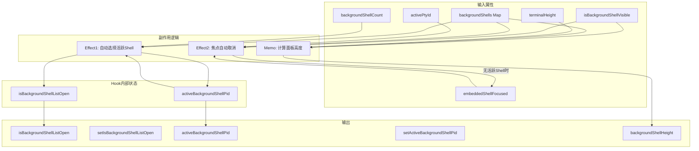
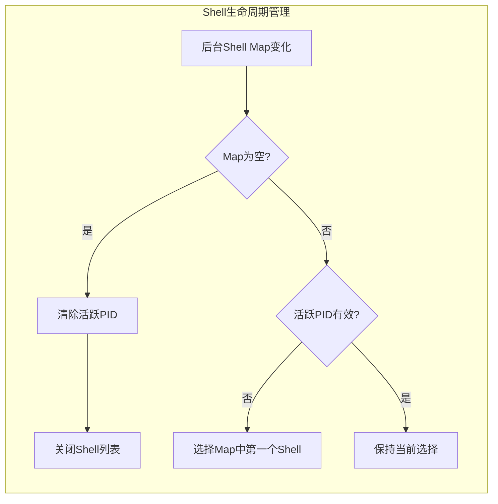

# useBackgroundShellManager.ts

## 概述

`useBackgroundShellManager` 是一个 React 自定义 Hook，用于管理 CLI 界面中后台 Shell 的显示和交互状态。当 Gemini CLI 执行命令时，可能会产生多个后台运行的 Shell 进程，该 Hook 负责：

- 跟踪当前活跃的后台 Shell PID
- 管理后台 Shell 列表的展开/收起状态
- 在 Shell 关闭或新增时自动选择合适的活跃 Shell
- 计算后台 Shell 面板的显示高度
- 在无活跃 Shell 时自动取消嵌入式 Shell 焦点

该 Hook 封装了后台 Shell 管理的复杂逻辑，使得上层 UI 组件只需关注渲染。

## 架构图（Mermaid）





## 核心组件

### 1. `BackgroundShellManagerProps` 接口

Hook 的输入属性定义：

| 属性 | 类型 | 说明 |
|------|------|------|
| `backgroundShells` | `Map<number, BackgroundShell>` | PID 到后台 Shell 实例的映射 |
| `backgroundShellCount` | `number` | 后台 Shell 数量（作为变化触发信号） |
| `isBackgroundShellVisible` | `boolean` | 后台 Shell 面板是否可见 |
| `activePtyId` | `number \| null \| undefined` | 当前前台活跃的 PTY ID |
| `embeddedShellFocused` | `boolean` | 嵌入式 Shell 是否获得焦点 |
| `setEmbeddedShellFocused` | `(focused: boolean) => void` | 设置嵌入式 Shell 焦点的回调 |
| `terminalHeight` | `number` | 终端高度（行数） |

### 2. 内部状态

| 状态 | 类型 | 初始值 | 说明 |
|------|------|--------|------|
| `isBackgroundShellListOpen` | `boolean` | `false` | 后台 Shell 列表是否展开 |
| `activeBackgroundShellPid` | `number \| null` | `null` | 当前选中的后台 Shell PID |

### 3. 返回值

| 返回值 | 类型 | 说明 |
|--------|------|------|
| `isBackgroundShellListOpen` | `boolean` | 后台 Shell 列表是否展开 |
| `setIsBackgroundShellListOpen` | `(open: boolean) => void` | 设置列表展开状态 |
| `activeBackgroundShellPid` | `number \| null` | 当前活跃后台 Shell 的 PID |
| `setActiveBackgroundShellPid` | `(pid: number \| null) => void` | 设置活跃 Shell PID |
| `backgroundShellHeight` | `number` | 后台 Shell 面板的高度（行数） |

### 4. Effect 1：自动选择活跃 Shell

监听 `backgroundShells`、`activeBackgroundShellPid`、`backgroundShellCount`、`isBackgroundShellListOpen` 的变化：

- **所有 Shell 已关闭**（`backgroundShells.size === 0`）：清除活跃 PID，关闭列表。
- **活跃 PID 无效**（为 `null` 或对应的 Shell 已不存在）：自动选择 Map 中的第一个 Shell。

这保证了用户始终能看到一个有效的活跃 Shell（如果还有 Shell 存在的话）。

### 5. Effect 2：焦点自动取消

监听嵌入式 Shell 焦点状态和前台/后台 Shell 可用性：

- 当 `embeddedShellFocused` 为 `true` 时，检查是否还有活跃的前台 Shell 或可见的后台 Shell。
- 如果两者都没有，自动调用 `setEmbeddedShellFocused(false)` 取消焦点，避免焦点停留在不存在的 Shell 上。

### 6. Memo：后台 Shell 面板高度计算

使用 `useMemo` 计算面板高度：

```typescript
isBackgroundShellVisible && backgroundShells.size > 0
  ? Math.max(Math.floor(terminalHeight * 0.3), 5)
  : 0
```

- **可见且有 Shell 存在**：取终端高度的 30%，最小值为 5 行。
- **不可见或无 Shell**：高度为 0（隐藏面板）。

## 依赖关系

### 内部依赖

| 模块 | 导入内容 | 用途 |
|------|----------|------|
| `./shellCommandProcessor.js` | `BackgroundShell`（类型） | 后台 Shell 实例的类型定义 |

### 外部依赖

| 包 | 导入内容 | 用途 |
|----|----------|------|
| `react` | `useState`, `useEffect`, `useMemo` | React Hook 基础设施 |

## 关键实现细节

### 1. 自动回退选择机制

当活跃的后台 Shell 被关闭时，Hook 不会让 `activeBackgroundShellPid` 停留在一个无效的 PID 上。它通过检查 `backgroundShells.has(activeBackgroundShellPid)` 来判断有效性，并自动回退到 Map 迭代顺序中的第一个 Shell：

```typescript
setActiveBackgroundShellPid(backgroundShells.keys().next().value ?? null);
```

### 2. 使用 backgroundShellCount 作为额外触发信号

虽然 `backgroundShells` Map 对象本身会在变化时触发 effect，但 `backgroundShellCount` 作为一个额外的数值依赖项，确保在 Map 内容变化但引用未变时也能正确触发重新计算。这是 React 中处理可变引用类型常见的模式。

### 3. 面板高度的最小值保护

`Math.max(Math.floor(terminalHeight * 0.3), 5)` 确保即使在非常小的终端窗口中，后台 Shell 面板也至少有 5 行高度，保证基本的可读性和可操作性。

### 4. 前台/后台 Shell 联动

焦点管理逻辑同时考虑了前台 Shell（`activePtyId`）和后台 Shell（`isBackgroundShellVisible && backgroundShells.size > 0`）。只有当两者都不可用时才取消焦点，这意味着用户可以在前台和后台 Shell 之间无缝切换而不会丢失焦点状态。
