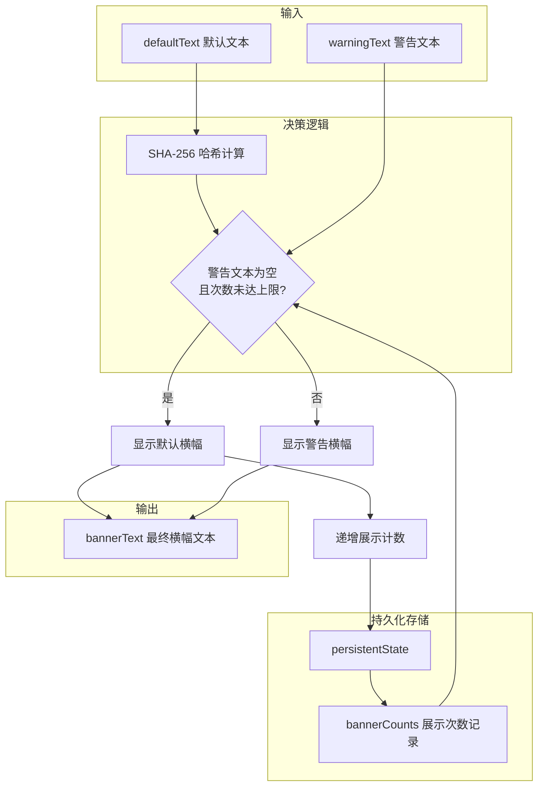
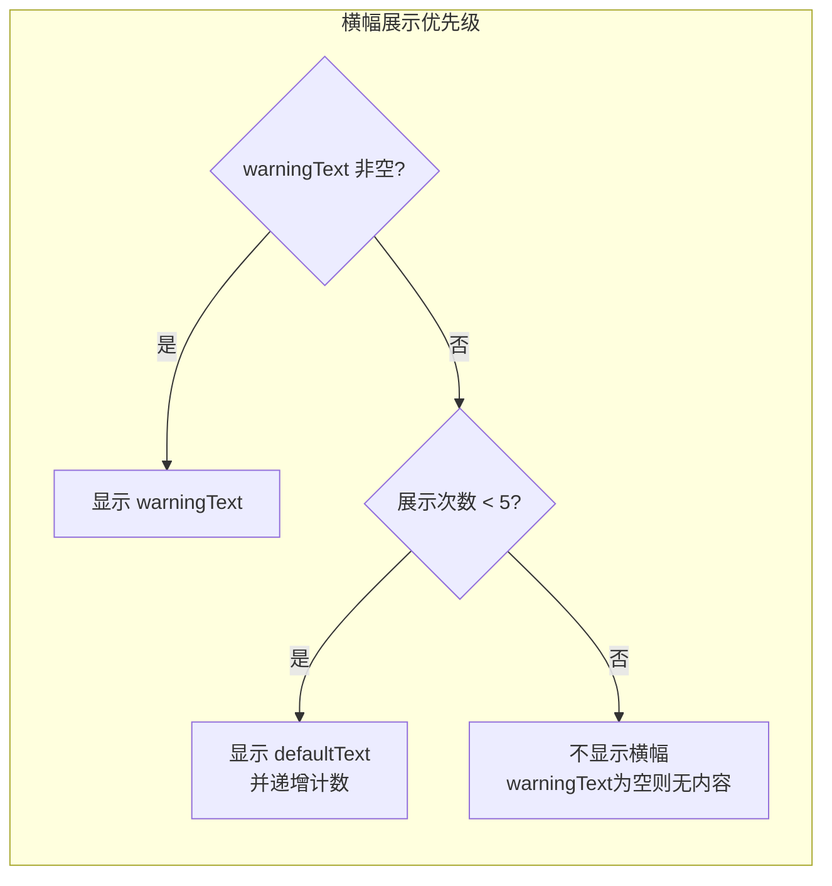

# useBanner.ts

## 概述

`useBanner` 是一个 React 自定义 Hook，用于管理 CLI 界面中横幅（Banner）消息的显示逻辑。该 Hook 实现了一套基于展示次数的横幅轮换机制：

- **默认横幅**（`defaultText`）：有展示次数上限（默认 5 次），超过上限后不再显示。
- **警告横幅**（`warningText`）：如果存在警告文本，则始终优先显示，不受次数限制。

展示次数通过持久化状态（`persistentState`）跨会话记录，使用 SHA-256 哈希作为键来唯一标识每条横幅文本。

## 架构图（Mermaid）





## 核心组件

### 1. `BannerData` 接口

```typescript
interface BannerData {
  defaultText: string;   // 默认横幅文本
  warningText: string;   // 警告横幅文本
}
```

### 2. 常量

| 常量 | 值 | 说明 |
|------|----|------|
| `DEFAULT_MAX_BANNER_SHOWN_COUNT` | `5` | 默认横幅的最大展示次数 |

### 3. `useBanner` Hook

#### 参数

| 参数 | 类型 | 说明 |
|------|------|------|
| `bannerData` | `BannerData` | 包含默认文本和警告文本 |

#### 返回值

| 返回值 | 类型 | 说明 |
|--------|------|------|
| `bannerText` | `string` | 最终要显示的横幅文本（已处理换行符） |

#### 内部逻辑流程

1. **读取持久化计数**：从 `persistentState` 读取 `defaultBannerShownCount`（一个键值对对象，键为文本哈希，值为展示次数）。
2. **计算文本哈希**：对 `defaultText` 计算 SHA-256 哈希，作为唯一标识。
3. **判断是否显示默认横幅**：`warningText === '' && currentBannerCount < DEFAULT_MAX_BANNER_SHOWN_COUNT`。
4. **选择横幅文本**：满足条件显示默认横幅，否则显示警告横幅。
5. **处理换行符**：将字面量 `\\n` 替换为实际换行符 `\n`。
6. **递增计数（Effect）**：如果显示了默认横幅，通过 `useEffect` 将展示计数 +1 并持久化保存。

#### 防重复递增机制

使用 `lastIncrementedKey` Ref 记录上次递增的文本，只有当文本发生变化时才递增计数：

```typescript
if (lastIncrementedKey.current !== defaultText) {
  lastIncrementedKey.current = defaultText;
  // ... 递增并持久化
}
```

这防止了 React 严格模式或重渲染导致的计数重复递增。

## 依赖关系

### 内部依赖

| 模块 | 导入内容 | 用途 |
|------|----------|------|
| `../../utils/persistentState.js` | `persistentState` | 跨会话持久化状态存储（读写横幅展示次数） |

### 外部依赖

| 包 | 导入内容 | 用途 |
|----|----------|------|
| `react` | `useState`, `useEffect`, `useRef` | React Hook 基础设施 |
| `node:crypto` | `crypto` | SHA-256 哈希计算，生成横幅文本的唯一标识 |

## 关键实现细节

### 1. SHA-256 哈希作为标识键

使用 SHA-256 哈希而非原始文本作为持久化存储的键，有以下好处：

- **固定长度**：无论文本多长，哈希值长度固定（64 个十六进制字符），不会造成存储膨胀。
- **唯一性**：不同文本产生不同哈希，可准确区分不同横幅。
- **隐私性**：不在持久化存储中保存原始横幅文本内容。

```typescript
const hashedText = crypto
  .createHash('sha256')
  .update(defaultText)
  .digest('hex');
```

### 2. 警告文本优先级

警告文本（`warningText`）始终优先于默认文本。只有当 `warningText === ''`（严格等于空字符串）时，才会考虑显示默认文本。这确保了重要的警告信息不会被常规横幅覆盖。

### 3. 延迟初始化状态

`bannerCounts` 使用 `useState` 的函数形式初始化，确保只在首次渲染时从 `persistentState` 读取：

```typescript
const [bannerCounts] = useState(
  () => persistentState.get('defaultBannerShownCount') || {},
);
```

注意只解构了状态值，没有解构 setter——因为该状态在组件生命周期内不需要更新（计数递增直接写入 `persistentState`，不更新 React 状态）。

### 4. 换行符处理

横幅文本中的字面量 `\\n` 被替换为实际的换行符 `\n`，支持在配置中使用转义字符定义多行横幅：

```typescript
const bannerText = rawBannerText.replace(/\\n/g, '\n');
```

### 5. 幂等的计数递增

Effect 中的递增操作是幂等的：对于同一个 `defaultText`，无论 effect 执行多少次，计数只会递增一次。这是通过 `lastIncrementedKey` Ref 实现的，该 Ref 在 React 重渲染间保持稳定。
