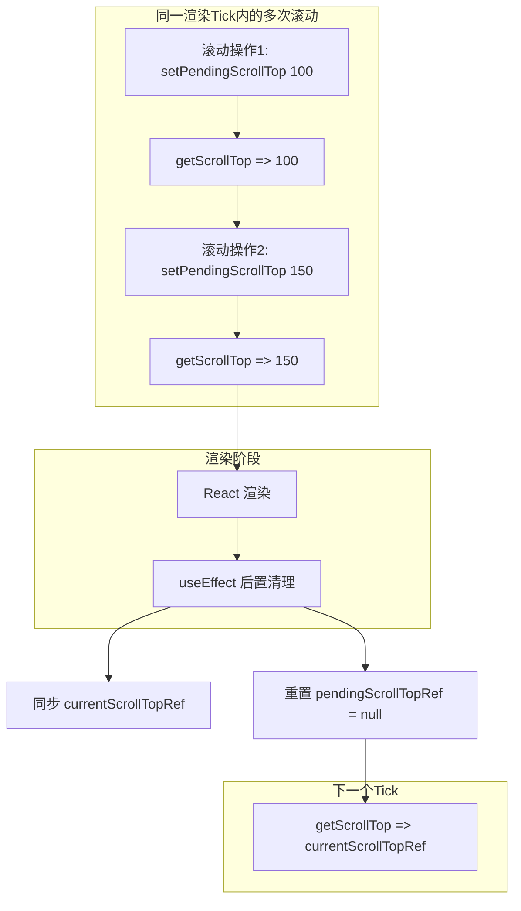
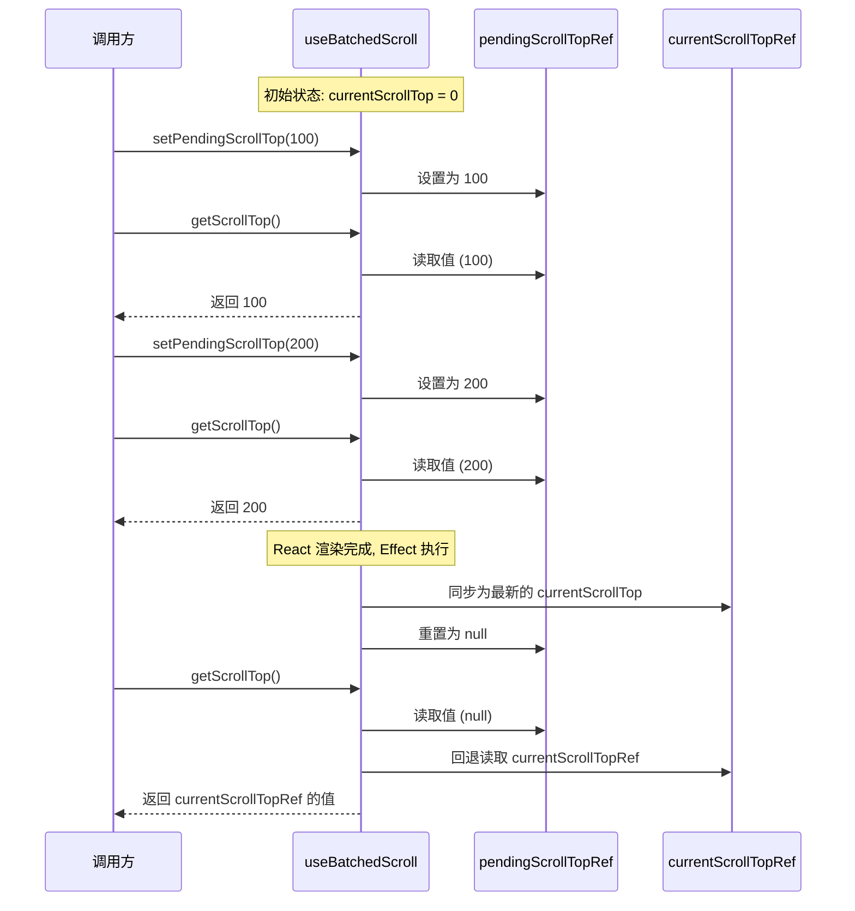

# useBatchedScroll.ts

## 概述

`useBatchedScroll` 是一个 React 自定义 Hook，用于管理批量滚动状态更新。在同一个渲染 tick 内，可能会触发多次滚动操作。如果每次滚动都直接读取 React 状态中的 `scrollTop`，由于 React 的批量更新机制，后续操作读取到的值可能仍是旧值，导致滚动计算错误。

该 Hook 通过引入一个 "pending"（待处理）滚动位置的 Ref 来解决这个问题。多次滚动操作可以在同一 tick 内累积到 pending 值上，每次读取时优先返回 pending 值，确保同一 tick 内的多次操作能正确级联。渲染完成后，pending 值自动重置为 `null`。

## 架构图（Mermaid）





## 核心组件

### 1. `useBatchedScroll` Hook

#### 参数

| 参数 | 类型 | 说明 |
|------|------|------|
| `currentScrollTop` | `number` | 当前 React 状态中的滚动位置 |

#### 返回值

| 返回值 | 类型 | 说明 |
|--------|------|------|
| `getScrollTop` | `() => number` | 获取当前最新的滚动位置（优先返回 pending 值） |
| `setPendingScrollTop` | `(newScrollTop: number) => void` | 设置待处理的滚动位置 |

#### 内部 Ref

| Ref | 类型 | 初始值 | 说明 |
|-----|------|--------|------|
| `pendingScrollTopRef` | `number \| null` | `null` | 待处理的滚动位置，同一 tick 内累积使用 |
| `currentScrollTopRef` | `number` | `currentScrollTop` | 当前滚动位置的 Ref 镜像，使 `getScrollTop` 保持引用稳定 |

### 2. `getScrollTop` 函数

使用 `useCallback` 包装的稳定函数，依赖数组为空（`[]`），永远不会重新创建。读取逻辑：

```typescript
() => pendingScrollTopRef.current ?? currentScrollTopRef.current
```

- 如果 `pendingScrollTopRef` 有值（非 null），返回 pending 值。
- 否则回退到 `currentScrollTopRef` 的值。

### 3. `setPendingScrollTop` 函数

使用 `useCallback` 包装的稳定函数，依赖数组为空（`[]`）。直接将新值写入 `pendingScrollTopRef.current`。

### 4. 渲染后清理 Effect

```typescript
useEffect(() => {
  currentScrollTopRef.current = currentScrollTop;
  pendingScrollTopRef.current = null;
});
```

注意：该 `useEffect` **没有依赖数组**，即每次渲染后都会执行。它执行两个操作：

1. 将 `currentScrollTopRef` 同步为最新的 `currentScrollTop` 值。
2. 将 `pendingScrollTopRef` 重置为 `null`，因为渲染已完成，pending 值已经被消费。

## 依赖关系

### 内部依赖

无。该 Hook 是完全独立的，不依赖项目内的其他模块。

### 外部依赖

| 包 | 导入内容 | 用途 |
|----|----------|------|
| `react` | `useRef`, `useEffect`, `useCallback` | React Hook 基础设施 |

## 关键实现细节

### 1. 解决 React 批量更新下的滚动级联问题

React 的 `useState` 在同一事件处理器或 tick 内会批量更新。如果有两次连续的滚动操作：

```
setScrollTop(scrollTop + 100);  // 操作1
setScrollTop(scrollTop + 50);   // 操作2，此时 scrollTop 仍为旧值
```

操作2 读取到的 `scrollTop` 仍是更新前的值，导致操作1 的效果被覆盖。

`useBatchedScroll` 通过 Ref（同步更新，不受 React 批量机制影响）解决这个问题：

```
setPendingScrollTop(getScrollTop() + 100);  // pending = oldValue + 100
setPendingScrollTop(getScrollTop() + 50);   // pending = (oldValue + 100) + 50
```

### 2. `getScrollTop` 的引用稳定性

`getScrollTop` 通过 `useCallback([], ...)` 创建，依赖数组为空，因此引用永远不变。它通过 Ref 间接读取值而非闭包捕获，避免了因 `currentScrollTop` 变化导致函数重建，从而可以安全地作为其他 Hook 或回调的依赖项。

### 3. 无依赖数组的 useEffect

```typescript
useEffect(() => {
  currentScrollTopRef.current = currentScrollTop;
  pendingScrollTopRef.current = null;
});
```

这是一个有意的设计选择。没有依赖数组意味着每次渲染后都执行，确保：
- `currentScrollTopRef` 始终与最新的 props 同步。
- `pendingScrollTopRef` 在每次渲染后重置，为下一个 tick 的操作做准备。

这个 effect 本质上充当了"渲染后回调"的角色。

### 4. 极简设计

整个 Hook 只有约 20 行代码，但精确地解决了一个特定的问题：在 React 渲染模型下安全地累积同一 tick 内的多次滚动偏移。它没有引入任何额外的状态或副作用，只使用 Ref 进行同步数据传递。
