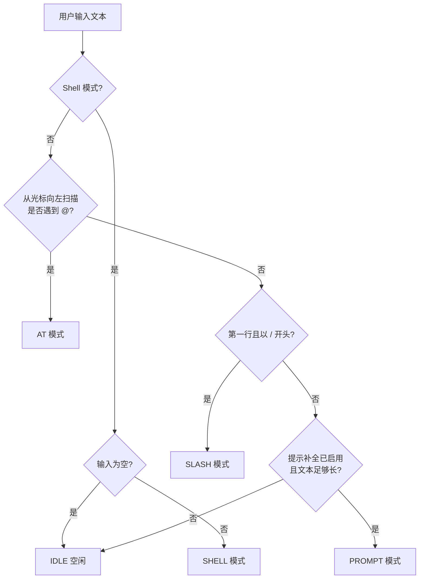
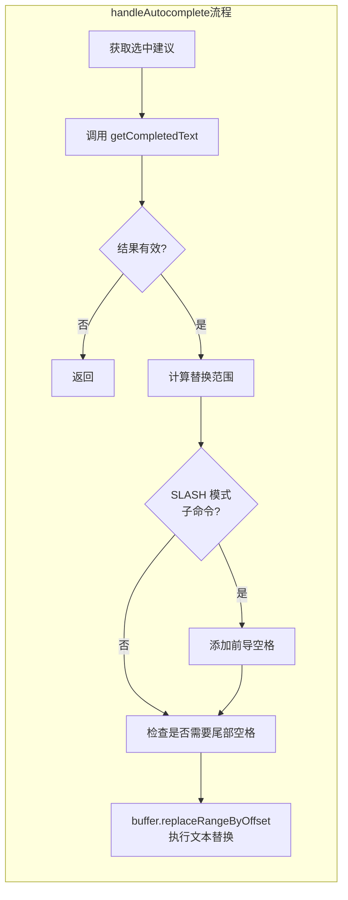

# useCommandCompletion.tsx

## 概述

`useCommandCompletion` 是一个 React 自定义 Hook，作为 CLI 输入补全系统的**顶层编排器（Orchestrator）**。它统一管理四种不同的补全模式：

1. **AT 补全（`@`）**：输入 `@` 后触发文件路径、MCP 资源和 Agent 的自动补全。
2. **SLASH 补全（`/`）**：输入 `/` 后触发斜杠命令的自动补全。
3. **SHELL 补全**：在 Shell 模式下触发 Shell 命令/参数的自动补全。
4. **PROMPT 补全**：基于用户输入的提示文本进行补全（当前已禁用）。

该 Hook 根据用户当前的输入内容和光标位置，自动判断应激活哪种补全模式，并将实际的搜索逻辑委托给对应的子 Hook（`useAtCompletion`、`useSlashCompletion`、`useShellCompletion`、`usePromptCompletion`）。它还管理建议列表的导航（上下选择）、自动补全的文本替换操作，以及各种 UI 状态。

## 架构图（Mermaid）

```mermaid
flowchart TD
    subgraph 用户输入
        BUF[TextBuffer 文本缓冲区]
        CUR[光标位置]
    end

    subgraph 模式检测
        MD[completionMode 计算 useMemo]
    end

    subgraph 补全子Hook
        AT[useAtCompletion<br/>@ 文件/资源补全]
        SLASH[useSlashCompletion<br/>/ 斜杠命令补全]
        SHELL[useShellCompletion<br/>Shell 命令补全]
        PROMPT[usePromptCompletion<br/>提示补全]
    end

    subgraph 共享状态 useCompletion
        SUGG[suggestions 建议列表]
        IDX[activeSuggestionIndex 活跃索引]
        VIS[visibleStartIndex 可见起始索引]
        LOAD[isLoadingSuggestions 加载中]
        PM[isPerfectMatch 完美匹配]
    end

    subgraph 输出操作
        NAV[navigateUp / navigateDown]
        AUTO[handleAutocomplete 自动补全]
        SHOW[showSuggestions 是否显示建议]
        GTXT[getCompletedText 获取补全文本]
    end

    BUF --> MD
    CUR --> MD

    MD -->|AT 模式| AT
    MD -->|SLASH 模式| SLASH
    MD -->|SHELL 模式| SHELL
    MD -->|PROMPT 模式| PROMPT

    AT --> SUGG
    SLASH --> SUGG
    SHELL --> SUGG
    PROMPT --> SUGG

    SUGG --> NAV
    SUGG --> AUTO
    SUGG --> SHOW
    SUGG --> GTXT
```





## 核心组件

### 1. `CompletionMode` 枚举

定义五种补全模式：

| 模式 | 值 | 说明 |
|------|----|------|
| `IDLE` | `'IDLE'` | 空闲，不进行补全 |
| `AT` | `'AT'` | `@` 文件/资源/Agent 补全 |
| `SLASH` | `'SLASH'` | `/` 斜杠命令补全 |
| `PROMPT` | `'PROMPT'` | 提示文本补全（当前禁用） |
| `SHELL` | `'SHELL'` | Shell 命令/参数补全 |

### 2. `UseCommandCompletionOptions` 接口（输入参数）

| 属性 | 类型 | 说明 |
|------|------|------|
| `buffer` | `TextBuffer` | 文本缓冲区，包含当前输入文本和光标位置 |
| `cwd` | `string` | 当前工作目录 |
| `slashCommands` | `readonly SlashCommand[]` | 可用的斜杠命令列表 |
| `commandContext` | `CommandContext` | 命令上下文 |
| `reverseSearchActive` | `boolean` | 反向搜索是否激活（默认 `false`） |
| `shellModeActive` | `boolean` | Shell 模式是否激活 |
| `config` | `Config \| undefined` | 应用配置 |
| `active` | `boolean` | 补全系统是否激活 |

### 3. `UseCommandCompletionReturn` 接口（返回值）

| 属性 | 类型 | 说明 |
|------|------|------|
| `suggestions` | `Suggestion[]` | 当前建议列表 |
| `activeSuggestionIndex` | `number` | 当前选中的建议索引 |
| `visibleStartIndex` | `number` | 建议列表滚动的可见起始索引 |
| `showSuggestions` | `boolean` | 是否应显示建议列表 |
| `isLoadingSuggestions` | `boolean` | 是否正在加载建议 |
| `isPerfectMatch` | `boolean` | 第一个建议是否与查询完全匹配 |
| `forceShowShellSuggestions` | `boolean` | 是否强制显示 Shell 建议 |
| `setForceShowShellSuggestions` | `(value: boolean) => void` | 设置强制显示 Shell 建议 |
| `isShellSuggestionsVisible` | `boolean` | Shell 建议是否可见 |
| `setActiveSuggestionIndex` | `React.Dispatch<...>` | 设置活跃建议索引 |
| `resetCompletionState` | `() => void` | 重置所有补全状态 |
| `navigateUp` | `() => void` | 向上导航建议列表 |
| `navigateDown` | `() => void` | 向下导航建议列表 |
| `handleAutocomplete` | `(indexToUse: number) => void` | 执行自动补全（接受指定索引的建议） |
| `promptCompletion` | `PromptCompletion` | 提示补全对象 |
| `getCommandFromSuggestion` | `(suggestion: Suggestion) => SlashCommand \| undefined` | 从建议获取对应的命令 |
| `slashCompletionRange` | 对象 | 斜杠补全的范围和元信息 |
| `getCompletedText` | `(suggestion: Suggestion) => string \| null` | 获取应用建议后的完整文本 |
| `completionMode` | `CompletionMode` | 当前补全模式 |

### 4. 补全模式检测逻辑（`useMemo`）

这是 Hook 的核心决策引擎，根据输入文本和光标位置判断补全模式。检测优先级从高到低：

1. **Shell 模式**：如果 `shellModeActive` 为 `true`，且输入非空，返回 `SHELL` 模式。
2. **AT 模式**：从光标位置向左扫描，如果遇到 `@` 字符（且其前面的空格不是转义的），返回 `AT` 模式。提取 `@` 后面的路径作为查询字符串。
3. **SLASH 模式**：如果光标在第一行且输入以 `/` 开头（由 `isSlashCommand` 判断），返回 `SLASH` 模式。
4. **PROMPT 模式**：如果文本长度达到 `PROMPT_COMPLETION_MIN_LENGTH` 且不是斜杠命令且不包含 `@`（当前 `isPromptCompletionEnabled = false`，实际不会触发）。
5. **IDLE**：以上条件均不满足时。

#### AT 模式的路径解析细节

- 从光标位置向左扫描到 `@` 字符。
- 处理转义空格（`\ ` 不作为分隔符）：通过计算连续反斜杠数量判断空格是否被转义。
- 向右扫描到非转义空格作为补全范围的结束位置。

### 5. Shell 模式的 Prompt 补全覆盖

当处于 Shell 模式且只有一个建议时，Hook 会将该建议转换为内联的 prompt completion（类似于 Shell 中的 Tab 补全预览）：

```typescript
const promptCompletion = useMemo(() => {
  if (completionMode === CompletionMode.SHELL && suggestions.length === 1 ...) {
    // 构建内联预览文本
    return { text: newText, isActive: true, accept: () => { ... } };
  }
  return basePromptCompletion;
}, [...]);
```

这使得 Shell 模式下唯一匹配的建议可以像传统 Shell 一样以灰色文本预览在光标后方。

### 6. `getCompletedText` 函数

核心文本替换逻辑，根据当前补全模式确定替换范围，将建议值插入到文本中：

- 根据 `completionMode` 选择正确的 `completionStart` 和 `completionEnd`。
- 对于 SLASH 模式的子命令，如果补全位置紧接在父命令后面且无空格，自动添加前导空格。
- 返回替换后的完整文本，或 `null`（范围无效时）。

### 7. `handleAutocomplete` 函数

执行实际的文本替换操作，在 `getCompletedText` 基础上增加了：

- **尾部空格处理**：如果建议值后面的字符不是空格，且建议值不以 `/` 或 `\` 结尾，自动追加空格。
- **SLASH 模式特殊处理**：对于可执行且不需要更多参数的命令，不添加尾部空格。
- 最终调用 `buffer.replaceRangeByOffset()` 完成文本替换。

### 8. 状态重置与建议同步

- **重置 Effect**：当 `active` 为 `false`、模式为 `IDLE` 或反向搜索激活时，自动调用 `resetCompletionState()` 清空所有补全状态。
- **建议同步 Effect**：当 `suggestions` 变化时，重置 `activeSuggestionIndex` 为 0（或 -1，如果无建议），重置 `visibleStartIndex` 为 0，并检测完美匹配。

## 依赖关系

### 内部依赖

| 模块 | 导入内容 | 用途 |
|------|----------|------|
| `../components/SuggestionsDisplay.js` | `Suggestion`（类型） | 建议项类型定义 |
| `../commands/types.js` | `CommandContext`, `SlashCommand`（类型） | 命令上下文和斜杠命令类型 |
| `../components/shared/text-buffer.js` | `TextBuffer`（类型）, `logicalPosToOffset` | 文本缓冲区类型和位置转换 |
| `../utils/textUtils.js` | `toCodePoints` | 将字符串转换为 Unicode 码点数组 |
| `../utils/commandUtils.js` | `isSlashCommand` | 判断文本是否为斜杠命令 |
| `./useAtCompletion.js` | `useAtCompletion` | @ 补全子 Hook |
| `./useSlashCompletion.js` | `useSlashCompletion` | / 斜杠命令补全子 Hook |
| `./useShellCompletion.js` | `useShellCompletion` | Shell 命令补全子 Hook |
| `./usePromptCompletion.js` | `usePromptCompletion`, `PROMPT_COMPLETION_MIN_LENGTH`, `PromptCompletion` | 提示补全子 Hook |
| `./useCompletion.js` | `useCompletion` | 共享补全状态管理 Hook |
| `@google/gemini-cli-core` | `Config`（类型） | 应用配置类型 |

### 外部依赖

| 包 | 导入内容 | 用途 |
|----|----------|------|
| `react` | `useCallback`, `useMemo`, `useEffect`, `useState` | React Hook 基础设施 |

## 关键实现细节

### 1. AT 补全优先于 SLASH 补全

模式检测中，AT 补全的检查在 SLASH 补全之前。这意味着 `/cmd @file` 这样的输入会触发 AT 文件补全而非 SLASH 命令补全，这是符合用户直觉的行为——用户在命令参数中使用 `@` 引用文件。

```typescript
// FIRST: Check for @ completion (scan backwards from cursor)
// This must happen before slash command check so that `/cmd @file`
// triggers file completion, not just slash command completion.
```

### 2. Unicode 码点级别的文本处理

使用 `toCodePoints()` 将文本转换为 Unicode 码点数组进行字符级操作，正确处理了多字节字符（如 emoji、CJK 字符等）在补全替换中的位置计算。

### 3. 转义空格的正确处理

在 AT 模式的路径解析中，通过计算连续反斜杠数量来判断空格是否被转义：

```typescript
let backslashCount = 0;
for (let j = i - 1; j >= 0 && codePoints[j] === '\\'; j--) {
  backslashCount++;
}
if (backslashCount % 2 === 0) {
  break; // 偶数个反斜杠 = 空格未被转义，作为分隔符
}
```

偶数个反斜杠意味着反斜杠自身被转义了，空格本身未被转义。

### 4. Shell 建议的可见性控制

Shell 模式下建议列表默认不显示（需要 `forceShowShellSuggestions` 为 `true`），这类似于传统终端中 Tab 补全只在按 Tab 时才显示候选列表。通过 `isShellSuggestionsVisible` 控制：

```typescript
const isShellSuggestionsVisible =
  completionMode !== CompletionMode.SHELL || forceShowShellSuggestions;
```

### 5. SLASH 模式的智能空格添加

对于斜杠命令补全，空格添加逻辑考虑了命令的特性：

- 如果命令可执行（`command.action` 存在）且不需要额外参数（`command.completion` 不存在），则不添加尾部空格——因为用户可以直接回车执行。
- 如果命令需要参数，添加尾部空格以方便用户继续输入。

### 6. PROMPT 补全当前已禁用

代码中 `isPromptCompletionEnabled` 被硬编码为 `false`，PROMPT 模式实际上永远不会被激活。这可能是一个实验性功能，暂时被关闭。

### 7. 委托模式的架构设计

该 Hook 采用了**委托模式**：它本身不执行任何搜索逻辑，而是将搜索工作委托给四个专门的子 Hook。每个子 Hook 通过 `enabled` 属性控制激活状态，通过共享的 `setSuggestions` 等回调写入统一的状态。这种设计使得每种补全模式可以独立演进和测试。

### 8. `useCompletion` 提供共享状态

所有补全模式共享一套状态（`suggestions`、`activeSuggestionIndex` 等），由 `useCompletion` Hook 统一管理。这避免了每种模式维护独立状态导致的状态同步问题。
