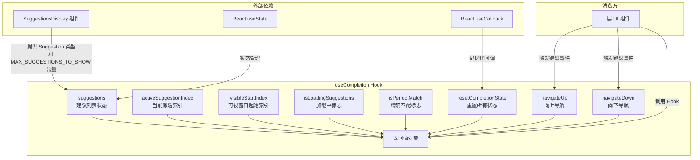

# useCompletion.ts

## 概述

`useCompletion` 是一个 React 自定义 Hook，用于管理命令行界面（CLI）中**自动补全/建议列表**的完整状态与交互逻辑。它封装了建议列表数据、当前激活项索引、可视窗口滚动偏移、加载状态、精确匹配标志，以及上下导航和状态重置等核心行为。

该 Hook 被设计为纯状态管理层，不直接与 UI 渲染耦合，而是通过返回状态值和 setter 函数供上层组件消费。

**文件路径**: `packages/cli/src/ui/hooks/useCompletion.ts`

## 架构图（Mermaid）



## 核心组件

### 1. `UseCompletionReturn` 接口

导出的返回值类型接口，定义了 Hook 暴露的全部 API：

| 字段 | 类型 | 说明 |
|------|------|------|
| `suggestions` | `Suggestion[]` | 当前建议列表 |
| `activeSuggestionIndex` | `number` | 当前高亮/激活的建议项索引，`-1` 表示无激活项 |
| `visibleStartIndex` | `number` | 可视窗口的起始索引（用于虚拟滚动） |
| `isLoadingSuggestions` | `boolean` | 是否正在加载建议 |
| `isPerfectMatch` | `boolean` | 当前输入是否与某个建议精确匹配 |
| `setSuggestions` | `React.Dispatch<SetStateAction<Suggestion[]>>` | 设置建议列表 |
| `setActiveSuggestionIndex` | `React.Dispatch<SetStateAction<number>>` | 设置激活索引 |
| `setVisibleStartIndex` | `React.Dispatch<SetStateAction<number>>` | 设置可视窗口起始索引 |
| `setIsLoadingSuggestions` | `React.Dispatch<SetStateAction<boolean>>` | 设置加载状态 |
| `setIsPerfectMatch` | `React.Dispatch<SetStateAction<boolean>>` | 设置精确匹配标志 |
| `resetCompletionState` | `() => void` | 将所有状态重置为初始值 |
| `navigateUp` | `() => void` | 向上导航（支持循环滚动） |
| `navigateDown` | `() => void` | 向下导航（支持循环滚动） |

### 2. `Suggestion` 类型（来自 `SuggestionsDisplay.tsx`）

```typescript
interface Suggestion {
  label: string;      // 显示标签
  value: string;      // 建议的实际值
  insertValue?: string; // 可选的插入值（不同于显示值）
  // ... 其他可能的字段
}
```

### 3. `MAX_SUGGESTIONS_TO_SHOW` 常量

值为 `8`，定义了可视窗口中同时显示的最大建议数量。当建议列表超过 8 项时，将启用虚拟滚动机制。

### 4. 状态初始值

| 状态 | 初始值 | 说明 |
|------|--------|------|
| `suggestions` | `[]` | 空数组 |
| `activeSuggestionIndex` | `-1` | 无激活项 |
| `visibleStartIndex` | `0` | 从头开始显示 |
| `isLoadingSuggestions` | `false` | 非加载状态 |
| `isPerfectMatch` | `false` | 非精确匹配 |

### 5. `resetCompletionState` 函数

使用 `useCallback` 记忆化，无依赖项（`[]`），将所有 5 个状态恢复为初始值。典型使用场景：用户关闭建议面板、清空输入、或切换上下文时调用。

### 6. `navigateUp` 函数

向上导航逻辑，使用 `useCallback` 记忆化，依赖 `suggestions.length`：

- **空列表保护**: 如果 `suggestions` 为空，直接返回
- **循环导航**: 当索引 `<= 0` 时，跳转到列表最后一项（`suggestions.length - 1`）
- **滚动窗口调整**（三种情况）:
  - **情况 1 - 循环到末尾**: 当回绕到最后一项且列表长度超过 `MAX_SUGGESTIONS_TO_SHOW` 时，将可视窗口设置为显示最后 8 项
  - **情况 2 - 超出上边界**: 当新索引小于当前可视窗口起始索引时，可视窗口跟随上移
  - **默认**: 保持当前滚动位置不变

### 7. `navigateDown` 函数

向下导航逻辑，使用 `useCallback` 记忆化，依赖 `suggestions.length`：

- **空列表保护**: 如果 `suggestions` 为空，直接返回
- **循环导航**: 当索引 `>= suggestions.length - 1` 时，跳转到列表第一项（`0`）
- **滚动窗口调整**（三种情况）:
  - **情况 1 - 循环到开头**: 当回绕到第一项且列表长度超过 `MAX_SUGGESTIONS_TO_SHOW` 时，将可视窗口重置到 `0`
  - **情况 2 - 超出下边界**: 当新索引超过可视窗口末端（`prevVisibleStart + MAX_SUGGESTIONS_TO_SHOW`）时，滚动窗口下移使新索引成为可视窗口的最后一项
  - **默认**: 保持当前滚动位置不变

## 依赖关系

### 内部依赖

| 依赖 | 来源路径 | 导入内容 |
|------|----------|----------|
| `SuggestionsDisplay` | `../components/SuggestionsDisplay.js` | `MAX_SUGGESTIONS_TO_SHOW` 常量、`Suggestion` 类型 |

### 外部依赖

| 依赖 | 版本 | 导入内容 |
|------|------|----------|
| `react` | - | `useState`、`useCallback` |

## 关键实现细节

1. **虚拟滚动机制**: 通过 `visibleStartIndex` 配合 `MAX_SUGGESTIONS_TO_SHOW`（值为 8）实现了一个简易的虚拟滚动窗口。不需要渲染全部建议项，只渲染可视区域内的 8 项，从而提高长列表的渲染性能。

2. **循环导航（Wrap-around）**: `navigateUp` 和 `navigateDown` 均支持循环导航。在列表顶部按上键会跳到底部，在底部按下键会跳到顶部，提供流畅的键盘交互体验。

3. **嵌套 setState 更新**: 导航函数内部使用了嵌套的 `setState` 回调模式 —— 在 `setActiveSuggestionIndex` 的回调中调用 `setVisibleStartIndex`。这确保了两个状态的更新基于最新的值进行计算，避免了闭包中过期值的问题。

4. **状态与行为分离**: Hook 同时暴露了底层 setter（如 `setSuggestions`）和高层行为函数（如 `navigateUp`），给消费方提供了灵活的控制粒度。消费方既可以使用高层 API 进行标准交互，也可以通过底层 setter 实现自定义行为。

5. **useCallback 依赖优化**: `navigateUp` 和 `navigateDown` 的依赖项仅为 `suggestions.length`（而非整个 `suggestions` 数组），这意味着只要列表长度不变（即使列表内容变化），回调函数引用就不会改变，减少不必要的重渲染。

6. **初始索引为 -1**: `activeSuggestionIndex` 初始值为 `-1`，表示"无选中项"状态。这是一个常见的 UI 模式，允许建议列表存在但没有任何项被高亮，用户需要按方向键才开始选择。
