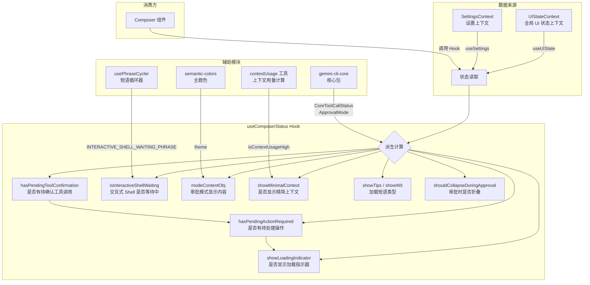

# useComposerStatus.ts

## 概述

`useComposerStatus` 是一个 React 自定义 Hook，负责为 **Composer（输入组合器）组件** 计算和聚合各种 UI 状态指示器。它从全局 UI 状态上下文和设置上下文中读取数据，通过一系列派生计算，输出 Composer 组件所需的各种显示控制标志。

该 Hook 的核心职责包括：
- 检测是否有待处理的工具调用确认请求
- 判断是否显示加载指示器
- 确定当前审批模式的显示内容（YOLO / plan / auto edit）
- 判断上下文使用量是否过高
- 控制加载短语类型（提示/俏皮话）
- 控制审批期间是否折叠抽屉

**文件路径**: `packages/cli/src/ui/hooks/useComposerStatus.ts`

## 架构图（Mermaid）



## 核心组件

### 1. `hasPendingToolConfirmation`（useMemo 计算）

通过 `useMemo` 记忆化计算，遍历 `uiState.pendingHistoryItems`，筛选出类型为 `tool_group` 的历史项，检查其中是否有任何工具调用的状态为 `CoreToolCallStatus.AwaitingApproval`。

**依赖项**: `uiState.pendingHistoryItems`

**计算逻辑**:
```
pendingHistoryItems
  -> 筛选 type === 'tool_group' 的项
  -> 检查每个 tool_group 中的 tools 数组
  -> 是否存在 status === AwaitingApproval 的工具
```

### 2. `hasPendingActionRequired`（布尔派生值）

聚合多种"需要用户操作"的信号，只要任一条件为真则整体为真：

| 条件 | 说明 |
|------|------|
| `hasPendingToolConfirmation` | 有工具调用等待用户审批 |
| `uiState.commandConfirmationRequest` | 有命令确认请求 |
| `uiState.authConsentRequest` | 有认证授权请求 |
| `uiState.confirmUpdateExtensionRequests?.length > 0` | 有扩展更新确认请求 |
| `uiState.loopDetectionConfirmationRequest` | 有循环检测确认请求 |
| `uiState.quota.proQuotaRequest` | 有 Pro 配额请求 |
| `uiState.quota.validationRequest` | 有配额验证请求 |
| `uiState.customDialog` | 有自定义对话框 |

### 3. `isInteractiveShellWaiting`（布尔值）

检查当前加载短语是否包含 `INTERACTIVE_SHELL_WAITING_PHRASE`（值为 `"! Shell awaiting input (Tab to focus)"`），用于判断嵌入式交互 Shell 是否正在等待用户输入。

### 4. `showLoadingIndicator`（布尔派生值）

控制是否显示加载指示器，需要同时满足以下条件：
- 嵌入式 Shell **未获焦** 或后台 Shell 可见
- 当前流式状态为 `StreamingState.Responding`（正在响应中）
- **没有** 待处理的用户操作请求

### 5. `modeContentObj`（useMemo 计算）

根据当前审批模式返回一个包含 `text` 和 `color` 的对象，用于在 Composer 中显示当前模式标识：

| 审批模式 | 显示文本 | 颜色 |
|----------|----------|------|
| `ApprovalMode.YOLO` | `"YOLO"` | `theme.status.error`（红色） |
| `ApprovalMode.PLAN` | `"plan"` | `theme.status.success`（绿色） |
| `ApprovalMode.AUTO_EDIT` | `"auto edit"` | `theme.status.warning`（黄色） |
| `ApprovalMode.DEFAULT` | 不显示 | `null` |

**特殊逻辑**: 当处于"精简 UI"模式（`cleanUiDetailsVisible` 为 `false`）且正在加载或有活跃 Hook 时，返回 `null` 以隐藏模式提示，避免界面杂乱。

**依赖项**: `uiState.cleanUiDetailsVisible`、`showLoadingIndicator`、`uiState.activeHooks.length`、`showApprovalModeIndicator`

### 6. `showMinimalContext`（布尔值）

调用 `isContextUsageHigh` 工具函数判断当前上下文使用量是否过高。该函数比较当前 prompt 的 token 数与模型上下文窗口的比值，超过阈值（默认 60%，可通过 `settings.merged.model.compressionThreshold` 配置）时返回 `true`。

### 7. `showTips` 和 `showWit`（布尔值）

根据 `settings.merged.ui.loadingPhrases` 配置决定加载时显示的短语类型：

| 配置值 | `showTips` | `showWit` |
|--------|------------|-----------|
| `'tips'` | `true` | `false` |
| `'witty'` | `false` | `true` |
| `'all'` | `true` | `true` |
| 其他 | `false` | `false` |

### 8. `shouldCollapseDuringApproval`（布尔值）

控制在工具审批期间是否折叠 Composer 的抽屉部分。读取 `settings.merged.ui.collapseDrawerDuringApproval` 配置，仅当显式设为 `false` 时才不折叠，默认行为为折叠（`true`）。

## 依赖关系

### 内部依赖

| 依赖 | 来源路径 | 导入内容 |
|------|----------|----------|
| `UIStateContext` | `../contexts/UIStateContext.js` | `useUIState` Hook |
| `SettingsContext` | `../contexts/SettingsContext.js` | `useSettings` Hook |
| `types` | `../types.js` | `HistoryItemToolGroup` 类型、`StreamingState` 枚举 |
| `usePhraseCycler` | `./usePhraseCycler.js` | `INTERACTIVE_SHELL_WAITING_PHRASE` 常量 |
| `contextUsage` | `../utils/contextUsage.js` | `isContextUsageHigh` 函数 |
| `semantic-colors` | `../semantic-colors.js` | `theme` 主题对象 |

### 外部依赖

| 依赖 | 导入内容 |
|------|----------|
| `react` | `useMemo` |
| `@google/gemini-cli-core` | `CoreToolCallStatus` 枚举、`ApprovalMode` 枚举 |

## 关键实现细节

1. **纯派生逻辑 Hook**: 该 Hook 不持有自己的 `useState`，所有返回值都是从全局上下文中派生计算出来的。这使其成为一个纯粹的"状态选择器/转换器"角色，将复杂的条件判断逻辑从 Composer 组件中抽离出来。

2. **多信号聚合的 `hasPendingActionRequired`**: 将 8 种不同类型的"需要用户操作"信号聚合为一个布尔值，使 Composer 组件不需要关心每种具体的请求类型，只需检查这一个标志即可决定 UI 行为。

3. **精简 UI 模式下的模式指示器隐藏**: `modeContentObj` 中的 `hideMinimalModeHintWhileBusy` 逻辑体现了 UX 细节考量 --- 在精简模式下，当 AI 正在响应或有后台任务运行时，隐藏审批模式标签以减少视觉噪音。

4. **上下文压缩预警**: `showMinimalContext` 通过 token 计数与模型上下文窗口的比率来判断是否接近上下文极限，支持可配置的压缩阈值，为用户提供上下文即将耗尽的视觉提示。

5. **配置驱动的加载短语**: 通过 `loadingPhrases` 设置，用户可以自定义加载等待时看到的内容类型（实用提示、俏皮话或两者都有），体现了 CLI 工具的个性化配置能力。

6. **防御性编程**: 代码中大量使用 `??`（空值合并）和 `Boolean()` 包装，确保面对 `undefined` 或 `null` 值时不会崩溃，增强了健壮性。
