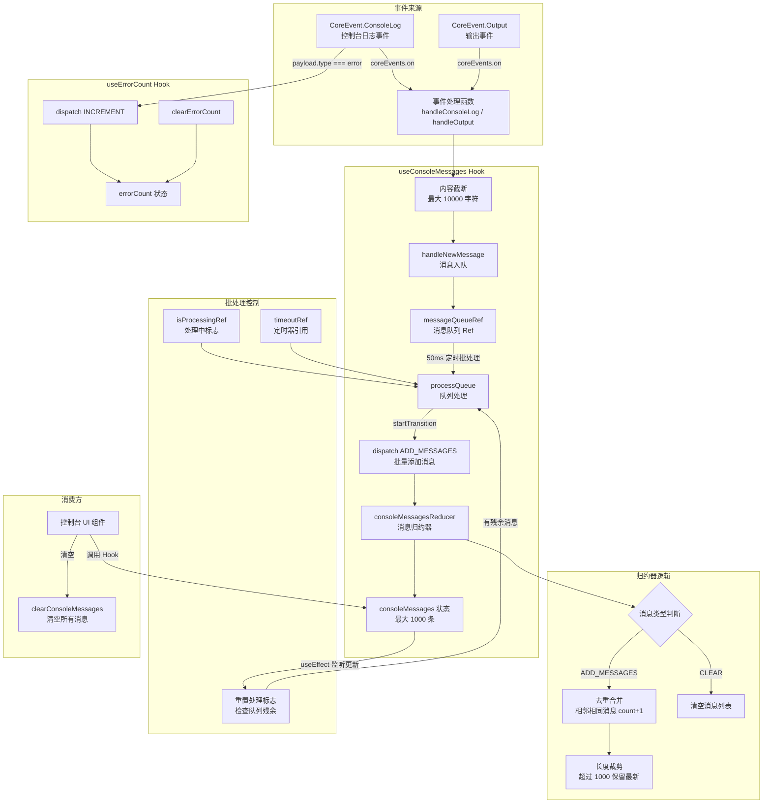

# useConsoleMessages.ts

## 概述

`useConsoleMessages` 是一个 React 自定义 Hook，负责**收集、缓冲、去重和管理来自核心引擎的控制台日志消息**。它监听 `gemini-cli-core` 发出的 `ConsoleLog` 和 `Output` 事件，通过消息队列和定时批处理机制将高频消息合并后再更新 React 状态，有效防止了快速连续日志导致的渲染风暴。

该文件还导出了一个辅助 Hook `useErrorCount`，用于独立追踪错误消息的数量。

**文件路径**: `packages/cli/src/ui/hooks/useConsoleMessages.ts`

## 架构图（Mermaid）



## 核心组件

### 1. `ConsoleMessageItem` 类型（来自 `types.ts`）

```typescript
interface ConsoleMessageItem {
  type: 'log' | 'warn' | 'error' | 'debug' | 'info';  // 日志级别
  content: string;                                        // 日志内容
  count: number;                                          // 连续重复次数
}
```

### 2. `UseConsoleMessagesReturn` 接口

| 字段 | 类型 | 说明 |
|------|------|------|
| `consoleMessages` | `ConsoleMessageItem[]` | 当前所有控制台消息列表 |
| `clearConsoleMessages` | `() => void` | 清空所有消息（包括队列中未处理的） |

### 3. `Action` 联合类型

Reducer 的 action 类型：

| Action 类型 | Payload | 说明 |
|-------------|---------|------|
| `ADD_MESSAGES` | `ConsoleMessageItem[]` | 批量添加消息 |
| `CLEAR` | 无 | 清空所有消息 |

### 4. `consoleMessagesReducer` 归约器

核心状态管理函数，处理两种 action：

**`ADD_MESSAGES` 处理逻辑**:
1. 复制当前状态数组
2. 遍历 payload 中的每条消息：
   - 如果与列表最后一条消息的 `type` 和 `content` 完全相同，则将最后一条消息的 `count` 加 1（**去重合并**）
   - 否则，将新消息追加到列表末尾，`count` 设为 1
3. 如果总消息数超过 `MAX_CONSOLE_MESSAGES`（1000），截取最新的 1000 条（**内存保护**）

**`CLEAR` 处理逻辑**: 返回空数组

**不可变更新**: 去重时创建新对象（`{ ...lastMessage, count: lastMessage.count + 1 }`），确保 React 能检测到状态变化。

### 5. `useConsoleMessages` Hook 主体

#### Ref 状态

| Ref | 类型 | 用途 |
|-----|------|------|
| `messageQueueRef` | `ConsoleMessageItem[]` | 消息缓冲队列，异步积累消息 |
| `timeoutRef` | `NodeJS.Timeout \| null` | 批处理定时器引用 |
| `isProcessingRef` | `boolean` | 标记当前是否正在处理队列，防止并发更新 |

#### `processQueue` 函数

从队列中取出所有消息，通过 `startTransition` 包裹 dispatch 调用，批量提交到 reducer。处理后清空队列并重置定时器引用。

#### `handleNewMessage` 函数

消息入队函数：
1. 将消息推入 `messageQueueRef.current`
2. 如果当前没有正在处理的批次（`isProcessingRef` 为 false）且没有待触发的定时器，设置 50ms 延迟的定时器调用 `processQueue`

**50ms 延迟的设计考量**: 在消息密集到达时，50ms 窗口内的所有消息会被合并为一次 dispatch，避免频繁的 React 状态更新导致性能问题。

#### 消息提交后的队列检查（useEffect）

监听 `consoleMessages` 状态变化（即 reducer 更新已提交到屏幕后）：
1. 重置 `isProcessingRef` 为 false
2. 检查队列中是否还有残余消息
3. 如果有残余且没有活跃定时器，启动新的 50ms 定时器继续处理

**关键设计**: 这个 `useEffect` 完全消除了重叠的并发更新问题。在 `processQueue` 执行期间新到达的消息会被安全地暂存在队列中，等当前批次渲染完成后再处理。

#### 事件监听（useEffect）

监听两种核心事件：

**`CoreEvent.ConsoleLog`**:
- 接收 `ConsoleLogPayload`（含 `type` 和 `content`）
- 对超过 `MAX_CONSOLE_MSG_LENGTH`（10000）字符的内容进行截断
- 截断时附加 `"... [Truncated N characters]"` 提示
- 调用 `handleNewMessage` 入队

**`CoreEvent.Output`**:
- 接收 `{ isStderr: boolean; chunk: Uint8Array | string }` 类型的 payload
- 将 `Uint8Array` 通过 `TextDecoder` 解码为字符串
- 对超过 `MAX_OUTPUT_CHUNK_LENGTH`（10000）字符的内容进行截断
- 统一以 `type: 'log'` 入队（注释说明：虽然 `isStderr` 可用于区分 warn，但由于应用启动前的非警告信息也会输出到 stderr，因此统一为 log 以避免误导）

**清理函数**: 组件卸载时取消事件监听。

#### `clearConsoleMessages` 函数

清空操作：
1. 清除活跃的定时器
2. 清空消息队列
3. 设置 `isProcessingRef` 为 true（防止清空期间有新消息触发处理）
4. 通过 `startTransition` dispatch `CLEAR` action

#### 卸载清理（useEffect）

组件卸载时清除定时器，防止内存泄漏。

### 6. `useErrorCount` Hook

独立的错误计数 Hook：

**`UseErrorCountReturn` 接口**:

| 字段 | 类型 | 说明 |
|------|------|------|
| `errorCount` | `number` | 当前错误总数 |
| `clearErrorCount` | `() => void` | 重置错误计数为 0 |

**实现**:
- 使用 `useReducer` 管理数字状态，支持 `'INCREMENT'` 和 `'CLEAR'` 两种 action
- 监听 `CoreEvent.ConsoleLog` 事件，当 `payload.type === 'error'` 时递增计数
- 所有 dispatch 均包裹在 `startTransition` 中

## 依赖关系

### 内部依赖

| 依赖 | 来源路径 | 导入内容 |
|------|----------|----------|
| `types` | `../types.js` | `ConsoleMessageItem` 类型 |

### 外部依赖

| 依赖 | 导入内容 |
|------|----------|
| `react` | `useCallback`、`useEffect`、`useReducer`、`useRef`、`startTransition` |
| `@google/gemini-cli-core` | `coreEvents` 事件总线、`CoreEvent` 枚举、`ConsoleLogPayload` 类型 |

## 关键实现细节

1. **消息批处理防抖机制**: 采用"队列 + 定时器 + 处理中标志"三层机制实现消息批处理。50ms 的定时器窗口确保高频消息不会导致 React 渲染风暴，而 `isProcessingRef` 标志确保同一时间只有一个批次在处理中，避免 React 并发更新冲突。

2. **startTransition 低优先级更新**: 所有 dispatch 调用都包裹在 `startTransition` 中，将控制台消息更新标记为非紧急（low-priority）更新。这意味着用户交互（如输入）不会被控制台消息更新阻塞，保证了 UI 的响应性。

3. **连续重复消息合并**: Reducer 中的去重逻辑会将相邻的相同消息（type 和 content 都相同）合并为一条带 `count` 的消息。这在命令产生大量重复输出时非常有用，既节省内存又使 UI 更清晰。

4. **双层内容截断保护**:
   - 单条消息级别：超过 10000 字符的内容被截断
   - 消息列表级别：超过 1000 条消息时丢弃最旧的
   这种双层保护确保了即使在极端情况下也不会耗尽内存。

5. **渲染完成后的队列续处理**: `useEffect(() => { ... }, [consoleMessages])` 这个副作用确保了"处理 -> 渲染 -> 检查残余 -> 继续处理"的完整闭环。当 `processQueue` 执行时新消息到达，这些消息不会丢失，而是在当前批次渲染完成后继续处理。

6. **Output 事件的类型统一**: 虽然 `Output` 事件区分了 `isStderr`，但代码有意将其统一为 `log` 类型。注释解释了原因：应用启动阶段会将非警告信息输出到 stderr，如果据此标记为 `warn` 会造成误导。

7. **清空操作的完整性**: `clearConsoleMessages` 不仅清空状态，还清空队列和定时器，确保不会出现"清空后又有旧消息冒出来"的情况。设置 `isProcessingRef = true` 进一步阻止了清空期间新消息的自动处理。

8. **useErrorCount 的独立性**: 错误计数作为独立 Hook 而非 `useConsoleMessages` 的一部分，体现了关注点分离。消费方可能只需要错误计数而不需要完整的消息列表，独立 Hook 避免了不必要的重渲染。
