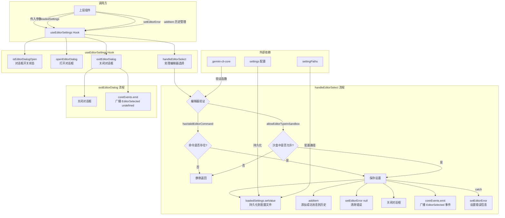

# useEditorSettings.ts

## 概述

`useEditorSettings` 是一个 React 自定义 Hook，负责管理**外部编辑器偏好设置对话框**的完整生命周期。它封装了编辑器选择对话框的开关状态、编辑器选择时的验证与持久化逻辑、以及对话框关闭时的事件通知。

该 Hook 支持用户在 CLI 中通过 `/editor` 命令选择首选的外部代码编辑器（如 VS Code、Vim、Neovim 等），将偏好保存到指定的设置作用域（系统/用户/工作区），并向核心引擎广播编辑器选择事件。

**文件路径**: `packages/cli/src/ui/hooks/useEditorSettings.ts`

## 架构图（Mermaid）

## 核心组件

### 1. `UseEditorSettingsReturn` 接口

Hook 返回的 API 接口：

| 字段 | 类型 | 说明 |
|------|------|------|
| `isEditorDialogOpen` | `boolean` | 编辑器选择对话框是否处于打开状态 |
| `openEditorDialog` | `() => void` | 打开编辑器选择对话框 |
| `handleEditorSelect` | `(editorType: EditorType \| undefined, scope: LoadableSettingScope) => void` | 处理用户的编辑器选择 |
| `exitEditorDialog` | `() => void` | 关闭对话框（不保存，取消选择） |

### 2. Hook 参数

| 参数 | 类型 | 说明 |
|------|------|------|
| `loadedSettings` | `LoadedSettings` | 已加载的设置管理对象，用于读写配置 |
| `setEditorError` | `(error: string \| null) => void` | 设置/清除错误信息的回调 |
| `addItem` | `UseHistoryManagerReturn['addItem']` | 向历史记录中添加消息的函数 |

### 3. `EditorType` 类型（来自 `@google/gemini-cli-core`）

支持的编辑器类型，为字面量联合类型：

**GUI 编辑器**: `'vscode'` | `'vscodium'` | `'windsurf'` | `'cursor'` | `'zed'` | `'idea'`

**终端编辑器**: `'vim'` | `'neovim'` | `'emacs'` | `'hx'`

每种编辑器都有对应的显示名称映射（如 `'vscode'` -> `'VS Code'`，`'hx'` -> `'Helix'`）。

### 4. `LoadableSettingScope` 类型

设置保存的作用域，为 `SettingScope.User | SettingScope.Workspace | SettingScope.System` 的联合类型，决定编辑器偏好保存在哪个层级的配置文件中。

### 5. `openEditorDialog` 函数

简单的状态切换，使用 `useCallback` 记忆化（无依赖项），将 `isEditorDialogOpen` 设为 `true`。

### 6. `handleEditorSelect` 函数

编辑器选择的核心逻辑，使用 `useCallback` 记忆化，依赖 `[loadedSettings, setEditorError, addItem]`。

**执行流程**:

1. **验证阶段**（仅当 `editorType` 不为 `undefined` 时）:
   - `hasValidEditorCommand(editorType)`: 检查该编辑器的命令行工具是否存在于系统 PATH 中
   - `allowEditorTypeInSandbox(editorType)`: 在沙盒环境中检查是否允许使用该编辑器（GUI 编辑器在沙盒中被禁止）
   - 任一验证失败则静默返回（不报错、不关闭对话框）

2. **保存阶段**（try-catch 包裹）:
   - 调用 `loadedSettings.setValue(scope, SettingPaths.General.PreferredEditor, editorType)` 将偏好写入配置文件
   - 通过 `addItem` 向历史记录添加一条 INFO 类型消息：
     - 设置编辑器时：`Editor preference set to "VS Code" in user settings.`
     - 清除编辑器时：`Editor preference cleared in user settings.`
   - 清除之前的错误状态
   - 关闭对话框
   - 通过 `coreEvents.emit(CoreEvent.EditorSelected, { editor: editorType })` 广播编辑器选择事件

3. **错误处理**: 如果保存失败，通过 `setEditorError` 设置错误信息 `"Failed to set editor preference: ..."`

### 7. `exitEditorDialog` 函数

取消/关闭对话框，使用 `useCallback` 记忆化（无依赖项）：
1. 将 `isEditorDialogOpen` 设为 `false`
2. 广播 `CoreEvent.EditorSelected` 事件，`editor` 为 `undefined`（通知核心引擎用户取消了选择）

## 依赖关系

### 内部依赖

| 依赖 | 来源路径 | 导入内容 |
|------|----------|----------|
| `settings` | `../../config/settings.js` | `LoadableSettingScope` 类型、`LoadedSettings` 类型 |
| `settingPaths` | `../../config/settingPaths.js` | `SettingPaths.General.PreferredEditor` 配置路径 |
| `types` | `../types.js` | `MessageType.INFO` 枚举值 |
| `useHistoryManager` | `./useHistoryManager.js` | `UseHistoryManagerReturn` 类型（仅类型导入） |

### 外部依赖

| 依赖 | 导入内容 |
|------|----------|
| `react` | `useState`、`useCallback` |
| `@google/gemini-cli-core` | `EditorType` 类型、`allowEditorTypeInSandbox` 函数、`hasValidEditorCommand` 函数、`getEditorDisplayName` 函数、`coreEvents` 事件总线、`CoreEvent` 枚举 |

## 关键实现细节

1. **双重验证机制**: `handleEditorSelect` 在保存前进行两项验证 --- 命令存在性检查和沙盒兼容性检查。`hasValidEditorCommand` 通过 `commandExists` 检查编辑器的可执行文件是否在系统 PATH 中；`allowEditorTypeInSandbox` 在沙盒环境下禁止 GUI 编辑器（因为 GUI 编辑器无法在沙盒中正常工作）。验证失败时静默返回，不会报错，这是因为在编辑器选择列表中已经通过 UI 方式标记了不可用的编辑器。

2. **支持清除编辑器偏好**: `editorType` 参数允许为 `undefined`，此时跳过验证直接保存，效果是清除已有的编辑器偏好（恢复默认行为）。消息显示也区分了"设置"和"清除"两种场景。

3. **事件驱动通知**: 无论是正常选择还是取消选择，都会通过 `coreEvents.emit(CoreEvent.EditorSelected, ...)` 广播事件。这使得核心引擎和其他关注编辑器变更的模块能够及时响应。`exitEditorDialog` 中发送 `editor: undefined` 确保监听方知道用户取消了选择。

4. **多层配置作用域**: 通过 `scope` 参数支持将编辑器偏好保存到不同层级（系统、用户、工作区），实现了配置的层级覆盖机制。例如用户可以在全局设置中使用 VS Code，但在某个特定工作区中使用 Vim。

5. **依赖注入模式**: Hook 通过参数接收 `loadedSettings`、`setEditorError` 和 `addItem`，而非直接从上下文中获取。这种依赖注入方式提高了 Hook 的可测试性和灵活性，允许不同的调用方提供不同的实现。

6. **错误隔离**: 使用 try-catch 包裹配置写入操作，将文件 I/O 错误优雅地转化为 UI 错误提示，避免了未捕获异常导致整个应用崩溃。

7. **状态最小化**: Hook 仅维护一个布尔状态 `isEditorDialogOpen`，所有其他需要的数据（设置对象、错误回调、历史管理器）都通过参数传入。这遵循了"最小状态"原则，减少了不必要的状态同步复杂度。
