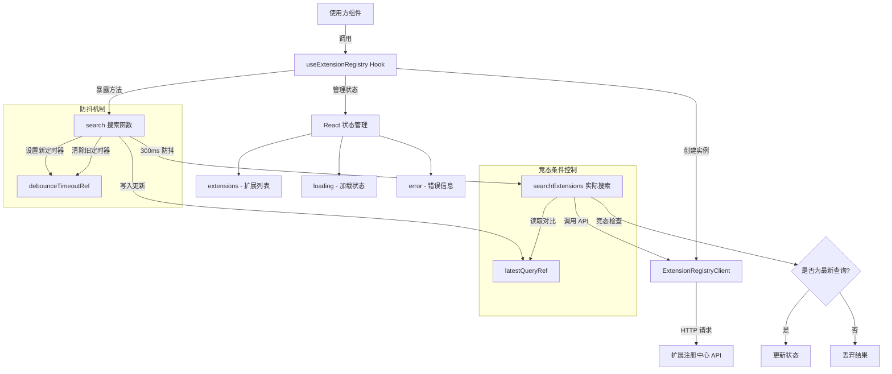

# useExtensionRegistry.ts

## 概述

`useExtensionRegistry` 是一个 React 自定义 Hook，用于与 Gemini CLI 扩展注册中心进行交互。它封装了扩展搜索的完整逻辑，包括异步数据获取、防抖搜索、竞态条件处理以及加载/错误状态管理。该 Hook 返回扩展列表、加载状态、错误信息以及一个可供外部调用的搜索函数。

## 架构图（Mermaid）



## 核心组件

### 1. `UseExtensionRegistryResult` 接口

Hook 返回值的类型定义：

| 字段 | 类型 | 说明 |
|------|------|------|
| `extensions` | `RegistryExtension[]` | 当前搜索结果的扩展列表 |
| `loading` | `boolean` | 是否正在加载中 |
| `error` | `string \| null` | 错误信息，无错误时为 `null` |
| `search` | `(query: string) => void` | 带防抖的搜索触发函数 |

### 2. `useExtensionRegistry` 函数

**函数签名：**
```typescript
function useExtensionRegistry(
  initialQuery?: string,    // 初始搜索关键字，默认为空字符串
  registryURI?: string,     // 自定义注册中心 URI（可选）
): UseExtensionRegistryResult
```

**内部状态：**

| 状态/Ref | 类型 | 用途 |
|----------|------|------|
| `extensions` | `useState<RegistryExtension[]>` | 存储搜索到的扩展列表 |
| `loading` | `useState<boolean>` | 标记是否正在请求中 |
| `error` | `useState<string \| null>` | 存储错误信息 |
| `latestQueryRef` | `useRef<string>` | 追踪最新的搜索查询，用于竞态条件控制 |
| `debounceTimeoutRef` | `useRef<NodeJS.Timeout>` | 防抖定时器引用 |

### 3. `searchExtensions` 回调（内部）

实际执行搜索的异步函数，使用 `useCallback` 包裹以保持引用稳定。

**关键行为：**
- 调用 `client.searchExtensions(query)` 发起搜索请求
- 通过 `latestQueryRef.current` 检查竞态条件，只有当查询仍为最新时才更新状态
- 使用函数式 `setExtensions` 更新，通过逐项对比 `id` 判断结果是否变化，避免不必要的重渲染
- 异常时清空扩展列表并设置错误信息

### 4. `search` 回调（对外暴露）

带防抖功能的搜索入口函数。

**关键行为：**
- 立即更新 `latestQueryRef.current` 为最新查询
- 清除上一次尚未执行的定时器
- 设置 300ms 延迟后执行 `searchExtensions`

### 5. 初始加载 Effect

通过 `useEffect` 在组件挂载时执行初始搜索，并在卸载时清理防抖定时器。

## 依赖关系

### 内部依赖

| 模块 | 导入内容 | 说明 |
|------|----------|------|
| `../../config/extensionRegistryClient.js` | `ExtensionRegistryClient`, `RegistryExtension` | 扩展注册中心的客户端类和扩展数据类型。客户端负责向远程注册中心（默认 `https://geminicli.com/extensions.json`）发起 HTTP 请求并返回扩展列表 |

### 外部依赖

| 包名 | 导入内容 | 说明 |
|------|----------|------|
| `react` | `useState`, `useEffect`, `useMemo`, `useCallback`, `useRef` | React 核心 Hooks，用于状态管理、副作用处理、性能优化和可变引用 |

## 关键实现细节

### 1. 防抖机制（Debounce）

搜索函数使用 300ms 防抖，防止用户快速输入时频繁发起请求。实现方式是通过 `debounceTimeoutRef` 持有 `setTimeout` 的返回值，每次新的搜索调用会先清除上一个定时器，再设置新的定时器。

```typescript
debounceTimeoutRef.current = setTimeout(() => {
  void searchExtensions(query);
}, 300);
```

### 2. 竞态条件处理（Race Condition Prevention）

使用 `latestQueryRef` 追踪最新查询字符串。当异步请求返回时，将请求对应的 `query` 与 `latestQueryRef.current` 进行比较，只有两者一致时才更新状态。这确保了当用户快速连续搜索时，早期请求的结果不会覆盖后续请求的结果。

```typescript
if (query === latestQueryRef.current) {
  setExtensions(...);
  setError(null);
  setLoading(false);
}
```

### 3. 智能状态更新（避免不必要重渲染）

`setExtensions` 使用函数式更新，通过对比前后扩展列表的长度和每项的 `id` 来判断数据是否真正发生了变化。如果数据未变，返回原引用 `prev`，避免触发不必要的组件重渲染。

```typescript
setExtensions((prev) => {
  if (
    prev.length === results.length &&
    prev.every((ext, i) => ext.id === results[i].id)
  ) {
    return prev; // 引用不变，不触发重渲染
  }
  return results;
});
```

### 4. 客户端实例缓存

通过 `useMemo` 缓存 `ExtensionRegistryClient` 实例，只有当 `registryURI` 变化时才会重新创建，避免每次渲染都创建新的客户端对象。

### 5. 清理逻辑

`useEffect` 的清理函数会在组件卸载时清除残留的防抖定时器，防止内存泄漏和对已卸载组件的状态更新。
