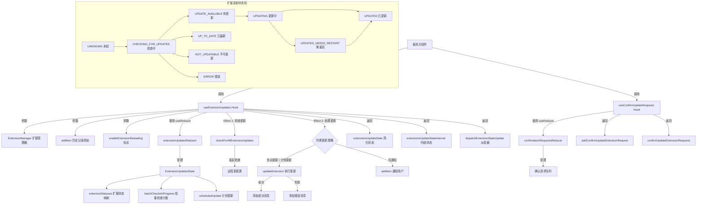

# useExtensionUpdates.ts

## 概述

`useExtensionUpdates.ts` 包含两个 React 自定义 Hook，共同管理 Gemini CLI 扩展的更新生命周期：

1. **`useConfirmUpdateRequests`** -- 管理扩展更新时的用户确认请求队列。将确认请求包装为可自动移除的包装器，当用户确认或拒绝后自动从队列中清除。
2. **`useExtensionUpdates`** -- 核心 Hook，负责检测扩展更新、执行自动/手动更新、通知用户更新状态，以及处理计划更新（scheduled updates）的完整流程。

该文件还包含一个本地 reducer 函数 `confirmationRequestsReducer`，用于管理确认请求列表的增删操作。

## 架构图（Mermaid）

## 核心组件

### 1. `ConfirmationRequestWrapper` 类型

内部确认请求的包装类型：

| 字段 | 类型 | 说明 |
|------|------|------|
| `prompt` | `React.ReactNode` | 确认提示内容，可为任意 React 节点 |
| `onConfirm` | `(confirmed: boolean) => void` | 用户确认/拒绝的回调函数 |

### 2. `confirmationRequestsReducer` 函数

管理确认请求队列的 reducer，支持两种操作：

| Action Type | 行为 |
|-------------|------|
| `add` | 将新请求追加到队列末尾 |
| `remove` | 通过引用相等 (`!==`) 从队列中过滤移除指定请求 |

使用 `checkExhaustive` 确保 switch 语句穷尽所有 action 类型。

### 3. `useConfirmUpdateRequests` Hook

管理扩展更新确认请求的队列。

**返回值：**

| 字段 | 类型 | 说明 |
|------|------|------|
| `addConfirmUpdateExtensionRequest` | `(original: ConfirmationRequest) => void` | 添加一个确认请求（会自动包装） |
| `confirmUpdateExtensionRequests` | `ConfirmationRequestWrapper[]` | 当前待处理的确认请求列表 |
| `dispatchConfirmUpdateExtensionRequests` | `Dispatch<ConfirmationRequestAction>` | 底层 dispatch 函数 |

**关键行为：**
- 接收原始 `ConfirmationRequest`，包装为 `ConfirmationRequestWrapper`
- 包装后的 `onConfirm` 回调在被调用时会自动执行两步操作：(1) 从队列中移除自身；(2) 调用原始的 `onConfirm` 回调

### 4. `useExtensionUpdates` Hook

核心扩展更新管理 Hook。

**参数：**

| 参数 | 类型 | 说明 |
|------|------|------|
| `extensionManager` | `ExtensionManager` | 扩展管理器实例，提供扩展列表 |
| `addItem` | `UseHistoryManagerReturn['addItem']` | 向历史记录中添加消息的函数 |
| `enableExtensionReloading` | `boolean` | 是否启用扩展热重载 |

**返回值：**

| 字段 | 类型 | 说明 |
|------|------|------|
| `extensionsUpdateState` | `Map<string, ExtensionUpdateState>` | 简化的扩展更新状态映射（仅状态枚举值） |
| `extensionsUpdateStateInternal` | `Map<string, ExtensionUpdateStatus>` | 内部完整状态映射（包含 `notified` 标志） |
| `dispatchExtensionStateUpdate` | `Dispatch<ExtensionUpdateAction>` | 更新状态的 dispatch 函数 |

### 5. `ExtensionUpdateState` 枚举（来自依赖）

扩展更新的完整状态枚举：

| 枚举值 | 含义 |
|--------|------|
| `UNKNOWN` | 未知状态（初始状态） |
| `CHECKING_FOR_UPDATES` | 正在检查更新 |
| `UPDATE_AVAILABLE` | 有可用更新 |
| `UP_TO_DATE` | 已是最新版本 |
| `NOT_UPDATABLE` | 不可更新 |
| `ERROR` | 检查/更新出错 |
| `UPDATING` | 正在更新中 |
| `UPDATED` | 更新完成 |
| `UPDATED_NEEDS_RESTART` | 更新完成但需要重启 |

## 依赖关系

### 内部依赖

| 模块 | 导入内容 | 说明 |
|------|----------|------|
| `../state/extensions.js` | `ExtensionUpdateState`, `extensionUpdatesReducer`, `initialExtensionUpdatesState` | 扩展更新状态的 reducer、初始状态和状态枚举 |
| `./useHistoryManager.js` | `UseHistoryManagerReturn` (type) | 历史管理器的返回类型，用于 `addItem` 参数的类型声明 |
| `../types.js` | `MessageType`, `ConfirmationRequest` (type) | 消息类型枚举和确认请求类型 |
| `../../config/extensions/update.js` | `checkForAllExtensionUpdates`, `updateExtension` | 检查所有扩展更新和执行单个扩展更新的核心函数 |
| `../../config/extension.js` | `ExtensionUpdateInfo` (type) | 扩展更新信息类型 |
| `../../config/extension-manager.js` | `ExtensionManager` (type) | 扩展管理器类型 |

### 外部依赖

| 包名 | 导入内容 | 说明 |
|------|----------|------|
| `react` | `useCallback`, `useEffect`, `useMemo`, `useReducer` | React 核心 Hooks |
| `@google/gemini-cli-core` | `debugLogger`, `checkExhaustive`, `getErrorMessage`, `GeminiCLIExtension` (type) | 核心工具库：调试日志、穷尽检查、错误信息提取、扩展类型 |

## 关键实现细节

### 1. Effect 1：更新检查（第 94-116 行）

首次渲染及扩展列表变化时，自动检查尚未检查过的扩展：

- 过滤出状态为 `undefined` 或 `UNKNOWN` 的扩展
- 若无需检查的扩展则直接返回
- 调用 `checkForAllExtensionUpdates` 批量检查，并通过 `dispatchExtensionStateUpdate` 更新每个扩展的状态
- 错误通过 `debugLogger.warn` 静默记录，不影响用户体验

### 2. Effect 2：更新执行与通知（第 118-230 行）

当批量检查完成后（`batchChecksInProgress === 0`），处理所有 `UPDATE_AVAILABLE` 状态的扩展：

**更新策略判断 `shouldDoUpdate`：**
- 如果存在 `scheduledUpdate` 且 `all === true`，则所有扩展都更新
- 如果 `scheduledUpdate` 指定了 `names`，则只更新名称匹配的扩展
- 如果没有 `scheduledUpdate`，则检查扩展的 `installMetadata.autoUpdate` 配置

**执行流程：**
1. 对于**不需要自动更新**的扩展：标记为已通知 (`SET_NOTIFIED`)，收集扩展名后统一通知用户可用更新
2. 对于**需要更新**的扩展：调用 `updateExtension` 执行更新，成功后通过 `addItem` 添加成功消息（包含版本变更信息），失败则添加错误消息
3. 如果是**计划更新**：等待所有更新 Promise 完成后，调用 `onCompleteCallbacks` 回调

### 3. 计划更新的合并机制

当存在预先计划的更新时（通过 `SCHEDULE_UPDATE` action），reducer 会合并多个计划：
- `all` 标志使用 OR 逻辑合并
- `names` 列表拼接合并
- `onCompleteCallbacks` 列表拼接合并

### 4. 状态简化计算（`extensionsUpdateStateComputed`）

通过 `useMemo` 将内部完整状态 `Map<string, ExtensionUpdateStatus>` 简化为 `Map<string, ExtensionUpdateState>`，仅暴露状态枚举值，隐藏 `notified` 等内部实现细节，提供更简洁的外部 API。

### 5. 确认请求的自清理机制

`useConfirmUpdateRequests` 中的包装器设计精巧：包装后的 `onConfirm` 通过闭包引用 `wrappedRequest` 自身，在被调用时先通过 `dispatch({ type: 'remove', request: wrappedRequest })` 移除自身，再调用原始回调。由于使用引用相等 (`!==`) 过滤，确保了精确移除。
