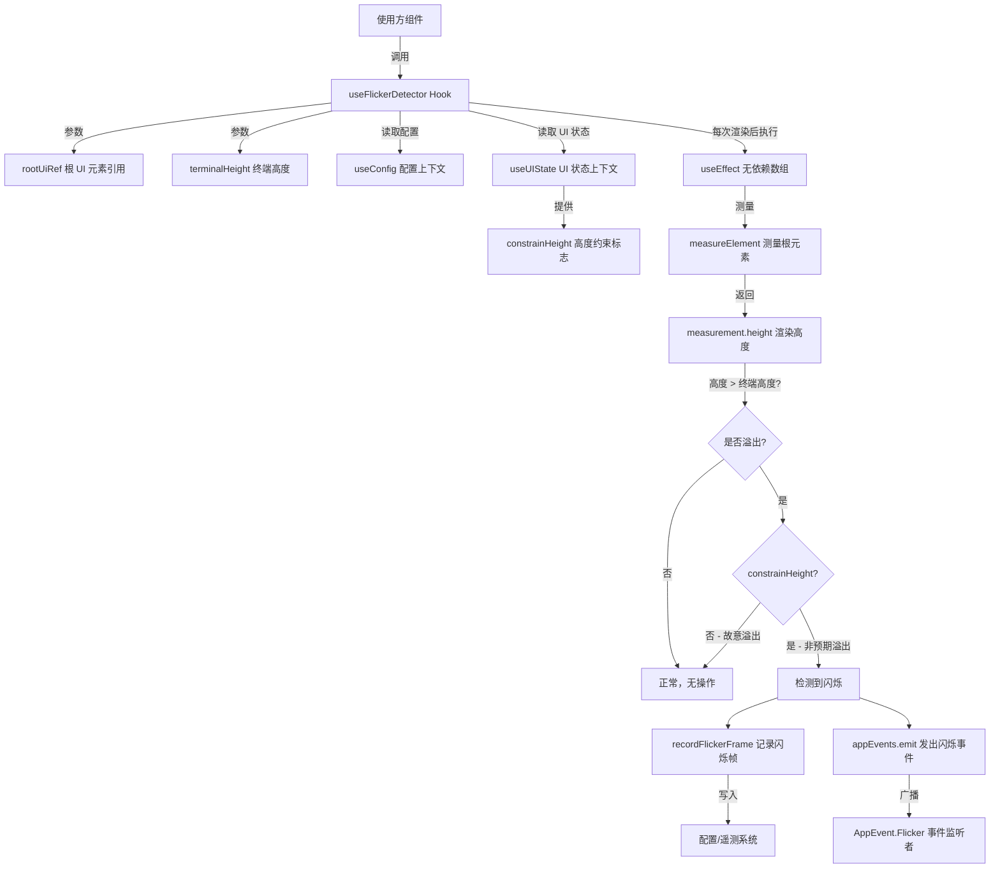

# useFlickerDetector.ts

## 概述

`useFlickerDetector` 是一个 React 自定义 Hook，用于检测 UI 闪烁（flicker）问题。它在每次渲染后测量根 UI 元素的高度，如果渲染结果超过了终端的可用高度，则判定为发生了一次闪烁帧。闪烁通常意味着存在渲染 bug ------ 内容溢出了终端可视区域，导致终端画面抖动。

该 Hook 是一个诊断工具，用于开发阶段或运行时监控 UI 渲染质量。检测到闪烁后会记录到配置中（用于遥测或调试），并通过事件系统广播闪烁事件。

## 架构图（Mermaid）



## 核心组件

### 1. `useFlickerDetector` 函数

**函数签名：**
```typescript
function useFlickerDetector(
  rootUiRef: React.RefObject<DOMElement | null>,  // Ink 根 UI 元素的 Ref
  terminalHeight: number,                          // 终端窗口高度（行数）
): void
```

**参数说明：**

| 参数 | 类型 | 说明 |
|------|------|------|
| `rootUiRef` | `React.RefObject<DOMElement \| null>` | 指向 Ink 框架根 DOM 元素的 Ref，用于测量渲染后的实际高度 |
| `terminalHeight` | `number` | 当前终端的可用高度（行数），作为判断溢出的阈值 |

**无返回值** -- 该 Hook 纯粹是一个副作用 Hook，不返回任何值。

### 2. 闪烁检测逻辑

检测逻辑在 `useEffect` 中执行，**没有依赖数组**，这意味着每次组件重渲染后都会执行检测。这是有意为之的设计，因为闪烁可能在任何一次渲染中发生。

检测流程：
1. 检查 `rootUiRef.current` 是否存在（元素是否已挂载）
2. 使用 Ink 的 `measureElement` API 测量根元素的实际渲染高度
3. 判断 `measurement.height > terminalHeight` 是否成立
4. 如果 `constrainHeight` 为 `false`，说明是故意让内容溢出屏幕（如全屏模式），则跳过
5. 否则调用 `recordFlickerFrame` 记录闪烁帧，并发出 `AppEvent.Flicker` 事件

## 依赖关系

### 内部依赖

| 模块 | 导入内容 | 说明 |
|------|----------|------|
| `../contexts/ConfigContext.js` | `useConfig` | 获取应用配置上下文，传递给 `recordFlickerFrame` 用于记录 |
| `../contexts/UIStateContext.js` | `useUIState` | 获取 UI 状态上下文，提取 `constrainHeight` 标志 |
| `../../utils/events.js` | `appEvents`, `AppEvent` | 应用事件总线和事件枚举，用于广播闪烁事件 |

### 外部依赖

| 包名 | 导入内容 | 说明 |
|------|----------|------|
| `ink` | `DOMElement` (type), `measureElement` | Ink 终端 UI 框架：DOM 元素类型和元素测量函数 |
| `react` | `useEffect` | React 副作用 Hook |
| `@google/gemini-cli-core` | `recordFlickerFrame` | 核心库中的闪烁帧记录函数，用于遥测/调试统计 |

## 关键实现细节

### 1. 无依赖数组的 useEffect

```typescript
useEffect(() => {
  // 检测逻辑
});  // 注意：没有依赖数组
```

这是该 Hook 最关键的设计决策。没有依赖数组意味着 Effect 在**每次渲染后**都会执行。这确保了不会遗漏任何一次可能导致闪烁的渲染。虽然这会带来轻微的性能开销（每次渲染都要测量元素），但对于诊断工具来说，完整的检测覆盖率比性能更重要。

### 2. constrainHeight 豁免机制

当 `constrainHeight` 为 `false` 时，即使渲染高度超过终端高度也不会触发闪烁检测。这是因为某些 UI 模式（如滚动视图或全屏编辑模式）会故意让内容超出终端可视区域，这属于正常行为而非 bug。

### 3. 双重响应机制

检测到闪烁后执行两个独立的响应操作：

1. **`recordFlickerFrame(config)`** -- 持久化记录闪烁事件，可能用于遥测数据收集、调试日志或统计报告
2. **`appEvents.emit(AppEvent.Flicker)`** -- 通过事件总线实时广播，允许其他组件或模块响应闪烁事件（如显示警告、调整布局等）

### 4. Ink 框架的 measureElement

`measureElement` 是 Ink（React 终端 UI 框架）提供的 API，能够测量已渲染的 DOM 元素的尺寸（宽度和高度，以终端字符单元为单位）。该函数只能在元素已挂载并渲染后调用，因此放在 `useEffect` 中是正确的时机。
