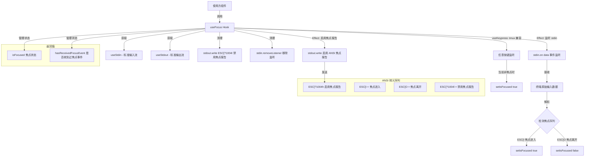

# useFocus.ts

## 概述

`useFocus` 是一个 React 自定义 Hook，用于检测终端窗口的焦点状态（即用户是否正在当前终端窗口中操作）。它利用终端的 **ANSI 焦点报告** 功能（Focus Reporting, DEC Private Mode 1004）来接收焦点进入/离开事件，并将其转化为 React 状态。

该 Hook 对于 Gemini CLI 的 UI 行为优化至关重要 ------ 例如，当终端失去焦点时可以暂停某些实时更新或动画，当重新获得焦点时恢复。它还包含一个针对 tmux 等终端复用器的兼容性处理：如果用户按下了任意键，则假定终端一定处于焦点状态。

## 架构图（Mermaid）



## 核心组件

### 1. ANSI 转义码常量

| 常量 | 值 | 说明 |
|------|-----|------|
| `ENABLE_FOCUS_REPORTING` | `\x1b[?1004h` | 启用终端焦点事件报告。发送后终端会在焦点变化时自动发送焦点事件序列 |
| `DISABLE_FOCUS_REPORTING` | `\x1b[?1004l` | 禁用终端焦点事件报告。清理时使用，恢复终端默认行为 |
| `FOCUS_IN` | `\x1b[I` | 终端焦点进入事件序列 |
| `FOCUS_OUT` | `\x1b[O` | 终端焦点离开事件序列 |

这些常量均已导出 (`export`)，可供测试或其他模块使用。

### 2. `useFocus` Hook

**返回值：**

| 字段 | 类型 | 说明 |
|------|------|------|
| `isFocused` | `boolean` | 当前终端是否处于焦点状态。初始值为 `true`（假设启动时终端有焦点） |
| `hasReceivedFocusEvent` | `boolean` | 是否曾收到过至少一次焦点事件。初始值为 `false`。可用于区分"从未收到焦点事件"和"确认处于焦点状态"两种情况 |

**内部状态：**

| 状态 | 初始值 | 用途 |
|------|--------|------|
| `isFocused` | `true` | 追踪当前焦点状态 |
| `hasReceivedFocusEvent` | `false` | 标记是否曾收到过焦点事件 |

### 3. 焦点报告 Effect

在 `useEffect` 中完成以下操作：

**挂载时：**
1. 向 `stdout` 写入 `ENABLE_FOCUS_REPORTING` 启用焦点报告
2. 在 `stdin` 上注册 `data` 事件监听器

**数据处理（`handleData`）：**
1. 将 Buffer 转换为字符串
2. 查找字符串中最后一个 `FOCUS_IN` 和 `FOCUS_OUT` 序列的位置
3. 通过比较两者的位置索引判断最终焦点状态（谁的索引更大，说明谁更晚发生）

**卸载时：**
1. 向 `stdout` 写入 `DISABLE_FOCUS_REPORTING` 禁用焦点报告
2. 从 `stdin` 移除 `data` 事件监听器

### 4. 按键兼容性处理

通过 `useKeypress` Hook 监听任意按键事件。如果当前 `isFocused` 为 `false` 但用户按下了键，则将 `isFocused` 设为 `true`。这是因为用户能够按键说明终端一定处于焦点状态。

## 依赖关系

### 内部依赖

| 模块 | 导入内容 | 说明 |
|------|----------|------|
| `./useKeypress.js` | `useKeypress` | 按键监听 Hook，用于 tmux 兼容性处理 |

### 外部依赖

| 包名 | 导入内容 | 说明 |
|------|----------|------|
| `ink` | `useStdin`, `useStdout` | Ink 框架提供的标准输入/输出流 Hook |
| `react` | `useEffect`, `useState` | React 核心 Hooks |

## 关键实现细节

### 1. 初始状态假设

`isFocused` 的初始值为 `true`。这是一个合理的假设，因为当 CLI 应用启动时，用户很可能正在终端窗口中操作。这样避免了在焦点报告尚未生效前出现错误的"失焦"状态。

### 2. 基于位置索引的焦点判定

```typescript
const lastFocusIn = sequence.lastIndexOf(FOCUS_IN);
const lastFocusOut = sequence.lastIndexOf(FOCUS_OUT);

if (lastFocusIn > lastFocusOut) {
  setIsFocused(true);
} else if (lastFocusOut > lastFocusIn) {
  setIsFocused(false);
}
```

使用 `lastIndexOf` 而非 `indexOf` 是关键设计。一次 `data` 事件的 Buffer 可能包含多个焦点序列（例如快速切换窗口时），通过比较**最后一次**出现的位置，可以准确判断最终的焦点状态。如果两者都未找到（均为 `-1`），则不做任何状态变更。

### 3. tmux 兼容性处理

某些终端复用器（如 tmux）可能不完全支持 DEC Private Mode 1004 焦点报告，或者焦点事件的传递可能不及时。`useKeypress` 作为一个备用检测机制：如果用户正在输入，那么终端必然处于焦点状态。这个处理有以下特点：

- 只在 `isFocused === false` 时才触发状态更新，避免不必要的重渲染
- 注释明确说明这是一个 workaround，正式的 `FOCUS_IN` 事件仍然是首选的检测方式（因为它能更早地更新焦点状态）

### 4. 清理逻辑的完整性

`useEffect` 的清理函数确保：
- 禁用终端焦点报告，恢复终端默认行为
- 移除 `stdin` 上的事件监听器，防止内存泄漏

使用可选链 `?.` 访问 `stdout` 和 `stdin`，确保在流不可用时不会抛出异常。

### 5. `hasReceivedFocusEvent` 的用途

该标志允许使用方区分以下两种场景：
- `isFocused: true, hasReceivedFocusEvent: false` -- 假设有焦点（初始状态），但终端可能不支持焦点报告
- `isFocused: true, hasReceivedFocusEvent: true` -- 确认有焦点（收到了终端的焦点事件）

这在需要依赖焦点状态做出关键决策时非常有用。
