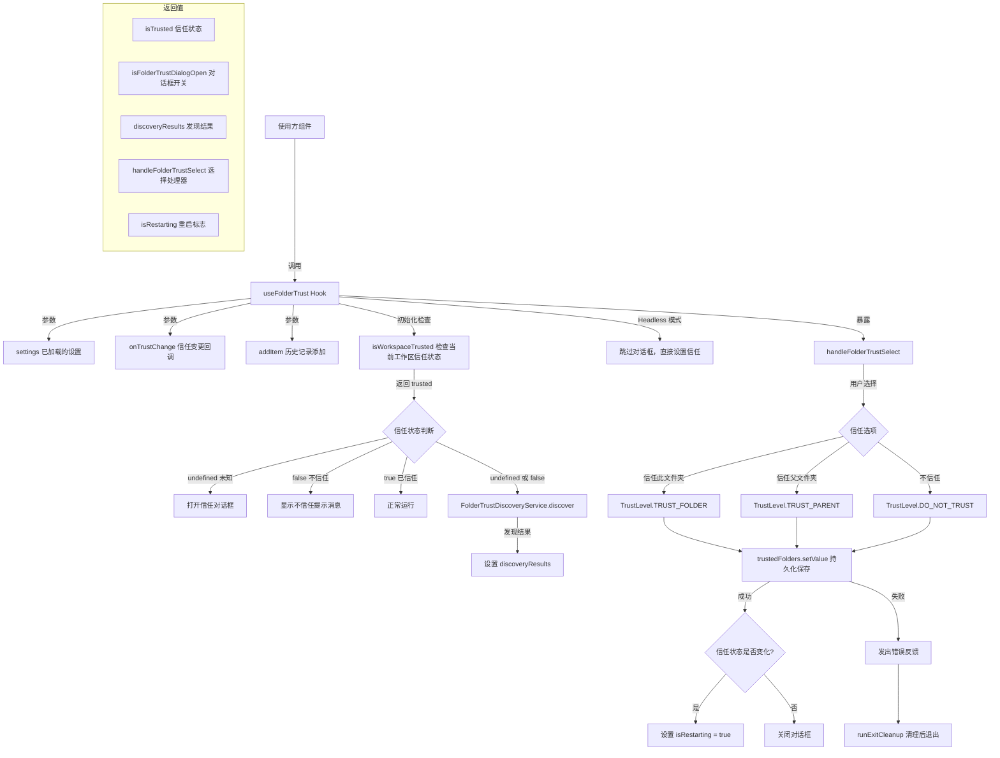

# useFolderTrust.ts

## 概述

`useFolderTrust` 是一个 React 自定义 Hook，负责管理 Gemini CLI 的**文件夹信任机制**。文件夹信任是一项安全功能 ------ 当用户在一个未被信任的文件夹中运行 Gemini CLI 时，该文件夹的项目设置、Hooks、MCP 服务器和 GEMINI.md 文件都不会被加载，以防止恶意配置的执行。

该 Hook 封装了信任状态的检测、信任对话框的控制、文件夹发现（discovery）、用户信任选择的处理，以及信任变更后的重启逻辑。它同时兼容交互式模式和无头（headless）模式。

## 架构图（Mermaid）



## 核心组件

### 1. `useFolderTrust` Hook

**函数签名：**
```typescript
function useFolderTrust(
  settings: LoadedSettings,
  onTrustChange: (isTrusted: boolean | undefined) => void,
  addItem: (item: HistoryItemWithoutId, timestamp: number) => number,
): {
  isTrusted: boolean | undefined;
  isFolderTrustDialogOpen: boolean;
  discoveryResults: FolderDiscoveryResults | null;
  handleFolderTrustSelect: (choice: FolderTrustChoice) => Promise<void>;
  isRestarting: boolean;
}
```

**参数说明：**

| 参数 | 类型 | 说明 |
|------|------|------|
| `settings` | `LoadedSettings` | 已加载的应用设置，包含安全配置中的文件夹信任开关 |
| `onTrustChange` | `(isTrusted: boolean \| undefined) => void` | 信任状态变更时的回调，通知父组件 |
| `addItem` | `(item: HistoryItemWithoutId, timestamp: number) => number` | 向历史记录中添加消息的函数 |

**返回值：**

| 字段 | 类型 | 说明 |
|------|------|------|
| `isTrusted` | `boolean \| undefined` | 当前文件夹的信任状态。`undefined` 表示尚未确定（首次访问），`true` 表示已信任，`false` 表示不信任 |
| `isFolderTrustDialogOpen` | `boolean` | 文件夹信任对话框是否打开 |
| `discoveryResults` | `FolderDiscoveryResults \| null` | 文件夹发现服务的结果，包含在当前目录中发现的配置文件等信息 |
| `handleFolderTrustSelect` | `(choice: FolderTrustChoice) => Promise<void>` | 用户在信任对话框中做出选择后的处理函数 |
| `isRestarting` | `boolean` | 是否正在重启（信任状态变更后需要重启以重新加载配置） |

**内部状态：**

| 状态/Ref | 类型 | 初始值 | 用途 |
|----------|------|--------|------|
| `isTrusted` | `boolean \| undefined` | `undefined` | 追踪文件夹信任状态 |
| `isFolderTrustDialogOpen` | `boolean` | `false` | 控制信任对话框的显示 |
| `discoveryResults` | `FolderDiscoveryResults \| null` | `null` | 存储文件夹发现结果 |
| `isRestarting` | `boolean` | `false` | 标记是否正在重启 |
| `startupMessageSent` | `useRef<boolean>` | `false` | 防止不信任提示消息重复发送 |

### 2. 信任选项枚举

**`FolderTrustChoice`（来自 `FolderTrustDialog.tsx`）：**

| 枚举值 | 说明 |
|--------|------|
| `TRUST_FOLDER` | 信任当前文件夹 |
| `TRUST_PARENT` | 信任父文件夹（递归信任所有子文件夹） |
| `DO_NOT_TRUST` | 不信任此文件夹 |

**`TrustLevel`（来自 `trustedFolders.ts`）：**

| 枚举值 | 说明 |
|--------|------|
| `TRUST_FOLDER` | 文件夹级信任 |
| `TRUST_PARENT` | 父文件夹级信任 |
| `DO_NOT_TRUST` | 明确不信任 |

### 3. 初始化 Effect

在组件挂载时执行的核心初始化逻辑：

1. 调用 `isWorkspaceTrusted(settings.merged)` 检查当前工作区的信任状态
2. 如果信任状态为 `undefined` 或 `false`，启动 `FolderTrustDiscoveryService.discover` 异步发现当前目录的配置文件
3. 根据运行模式（headless 或交互式）分别处理：
   - **Headless 模式**：跳过对话框，直接设置信任状态并通知
   - **交互式模式**：如果信任状态为 `undefined`，打开信任对话框让用户选择

### 4. `handleFolderTrustSelect` 回调

用户在信任对话框中做出选择后的处理逻辑：

1. 将 `FolderTrustChoice` 映射为 `TrustLevel`
2. 通过 `loadTrustedFolders().setValue()` 将信任设置持久化保存
3. 如果保存失败：发出错误反馈，执行清理操作后以 `FATAL_CONFIG_ERROR` 退出
4. 如果保存成功：更新信任状态，通知父组件
5. 如果信任状态发生了变化（从信任到不信任或反之），设置 `isRestarting = true` 并保持对话框打开（用于显示重启提示）

## 依赖关系

### 内部依赖

| 模块 | 导入内容 | 说明 |
|------|----------|------|
| `../../config/settings.js` | `LoadedSettings` (type) | 已加载设置的类型定义 |
| `../components/FolderTrustDialog.js` | `FolderTrustChoice` | 文件夹信任选择枚举 |
| `../../config/trustedFolders.js` | `loadTrustedFolders`, `TrustLevel`, `isWorkspaceTrusted` | 信任文件夹的加载、信任级别枚举、工作区信任检查函数 |
| `../types.js` | `HistoryItemWithoutId` (type), `MessageType` | 历史记录项类型和消息类型枚举 |
| `../../utils/cleanup.js` | `runExitCleanup` | 退出清理函数，用于致命错误时的优雅退出 |

### 外部依赖

| 包名 | 导入内容 | 说明 |
|------|----------|------|
| `react` | `useState`, `useCallback`, `useEffect`, `useRef` | React 核心 Hooks |
| `node:process` | `process` (整体导入) | Node.js 进程模块，用于获取 `cwd()` 和调用 `process.exit()` |
| `@google/gemini-cli-core` | `coreEvents`, `ExitCodes`, `isHeadlessMode`, `FolderTrustDiscoveryService`, `FolderDiscoveryResults` (type) | 核心库：事件系统、退出码、无头模式检测、文件夹发现服务 |

## 关键实现细节

### 1. 三态信任模型

信任状态使用 `boolean | undefined` 类型，形成三态模型：

- **`undefined`**：首次访问此文件夹，用户尚未做出信任决策，需要弹出对话框询问
- **`true`**：文件夹已被信任，完整加载项目配置
- **`false`**：文件夹明确不被信任，跳过项目设置、Hooks、MCP 和 GEMINI.md 文件

### 2. Headless 模式兼容

```typescript
if (isHeadlessMode()) {
  setIsTrusted(trusted);
  setIsFolderTrustDialogOpen(false);  // 不显示对话框
  onTrustChange(true);                // 始终通知为信任
  showUntrustedMessage();
}
```

在无头（headless）模式下，无法显示交互式对话框，因此：
- 对话框始终保持关闭
- 通过 `onTrustChange(true)` 通知父组件为信任状态（即使实际不信任），确保 CLI 可以正常运行
- 但仍然会显示不信任提示消息，让用户知道安全风险

### 3. 文件夹发现服务

当信任状态为 `undefined` 或 `false` 时，异步调用 `FolderTrustDiscoveryService.discover(process.cwd())` 扫描当前工作目录，发现其中的配置文件和扩展。发现结果存储在 `discoveryResults` 中，可供信任对话框展示给用户，帮助用户做出信任决策（例如"此文件夹包含 3 个 MCP 配置和 1 个 Hooks 文件"）。

发现错误被静默忽略，因为错误已在服务内部处理并记录在 `results.discoveryErrors` 中。

### 4. 持久化保存与错误处理

```typescript
try {
  await trustedFolders.setValue(cwd, trustLevel);
} catch (_e) {
  coreEvents.emitFeedback('error', 'Failed to save trust settings. Exiting Gemini CLI.');
  setTimeout(async () => {
    await runExitCleanup();
    process.exit(ExitCodes.FATAL_CONFIG_ERROR);
  }, 100);
  return;
}
```

保存信任设置失败被视为**致命错误**，因为不一致的信任状态可能导致安全风险。处理方式是：
1. 通过 `coreEvents` 发出错误反馈
2. 延迟 100ms 后执行清理并退出（延迟确保反馈消息能被渲染显示）
3. 使用 `FATAL_CONFIG_ERROR` 退出码

### 5. 信任变更后的重启机制

```typescript
if (wasTrusted !== currentIsTrusted) {
  setIsRestarting(true);
  setIsFolderTrustDialogOpen(true);
}
```

当信任状态发生实质性变化时（从信任变为不信任，或反之），需要重启应用以重新加载或卸载项目配置。此时：
- 设置 `isRestarting = true` 标志
- 保持对话框打开（用于向用户显示重启提示）
- 使用方组件根据 `isRestarting` 标志执行实际的重启逻辑

### 6. 防重复消息机制

使用 `startupMessageSent` Ref 确保不信任提示消息只发送一次，即使 Effect 因依赖变化而重新执行。

### 7. Effect 卸载安全

通过 `isMounted` 标志确保组件卸载后不会进行状态更新：

```typescript
let isMounted = true;
// ... 异步操作中检查 if (isMounted) ...
return () => { isMounted = false; };
```

这防止了在组件卸载后的异步回调中调用 `setState`，避免 React 的 "Can't perform a React state update on an unmounted component" 警告。
