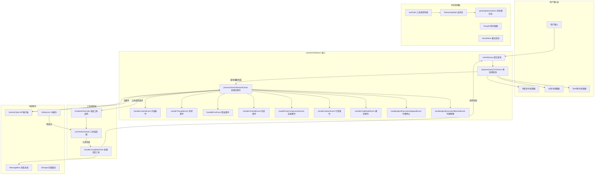

# useGeminiStream.ts

## 概述

`useGeminiStream` 是 Gemini CLI 中最核心、最复杂的 React Hook，负责管理与 Gemini API 之间的完整流式交互生命周期。它协调用户输入处理、命令分发（斜杠命令、@命令、Shell命令）、API 流式通信、工具调用的调度与执行、历史记录管理、错误处理、取消操作、循环检测等多个子系统。

该文件约 2035 行，是整个 CLI UI 层的"中枢控制器"。

## 架构图（Mermaid）

## 核心组件

### 1. 类型定义

| 类型名 | 说明 |
|--------|------|
| `ToolResponseWithParts` | 带 LLM 内容的工具响应扩展类型 |
| `BackgroundedToolInfo` | 后台工具信息（PID、命令、初始输出） |
| `StreamProcessingStatus` | 流处理状态枚举：`Completed`、`UserCancelled`、`Error` |

### 2. 辅助函数

#### `getBackgroundedToolInfo(toolCall)`
从已完成或已取消的工具调用中提取后台执行信息（PID、命令名、初始输出）。用于判断某个工具是否以后台进程方式运行。

#### `isBackgroundableExecutingToolCall(toolCall)`
类型守卫函数，判断工具调用是否处于"正在执行且具有 PID"的状态，即可以被后台化。

#### `showCitations(settings)`
根据用户设置判断是否显示引用信息，默认返回 `true`。

#### `calculateStreamingState(isResponding, toolCalls)`
根据当前的响应状态和工具调用列表计算整体流状态：
- 有工具等待审批 -> `WaitingForConfirmation`
- 有活跃工具或正在响应 -> `Responding`
- 否则 -> `Idle`

### 3. 主 Hook 函数 `useGeminiStream`

#### 输入参数（共 19 个）

| 参数名 | 类型 | 说明 |
|--------|------|------|
| `geminiClient` | `GeminiClient` | Gemini API 客户端 |
| `history` | `HistoryItem[]` | 对话历史 |
| `addItem` | `UseHistoryManagerReturn['addItem']` | 添加历史条目 |
| `config` | `Config` | 全局配置 |
| `settings` | `LoadedSettings` | 加载的用户设置 |
| `onDebugMessage` | 回调函数 | 调试消息处理器 |
| `handleSlashCommand` | 回调函数 | 斜杠命令处理器 |
| `shellModeActive` | `boolean` | 是否处于 Shell 模式 |
| `getPreferredEditor` | 回调函数 | 获取首选编辑器 |
| `onAuthError` | 回调函数 | 认证错误处理器 |
| `performMemoryRefresh` | 回调函数 | 内存刷新处理器 |
| `modelSwitchedFromQuotaError` | `boolean` | 是否因配额错误切换了模型 |
| `setModelSwitchedFromQuotaError` | setter | 设置模型切换标志 |
| `onCancelSubmit` | 回调函数 | 取消提交处理器 |
| `setShellInputFocused` | setter | 设置 Shell 输入焦点 |
| `terminalWidth` | `number` | 终端宽度 |
| `terminalHeight` | `number` | 终端高度 |
| `isShellFocused` | `boolean` (可选) | Shell 是否获得焦点 |
| `consumeUserHint` | 回调函数 (可选) | 消费用户提示 |

#### 返回值

| 字段名 | 类型 | 说明 |
|--------|------|------|
| `streamingState` | `StreamingState` | 当前流状态（Idle/Responding/WaitingForConfirmation） |
| `submitQuery` | 函数 | 提交查询的主入口函数 |
| `initError` | `string \| null` | 初始化错误 |
| `pendingHistoryItems` | `HistoryItemWithoutId[]` | 待渲染的历史条目 |
| `thought` | `ThoughtSummary \| null` | 当前思考摘要 |
| `cancelOngoingRequest` | 函数 | 取消当前请求 |
| `pendingToolCalls` | `TrackedToolCall[]` | 待处理的工具调用 |
| `handleApprovalModeChange` | 函数 | 审批模式变更处理 |
| `activePtyId` | `number \| undefined` | 活跃的 PTY ID |
| `loopDetectionConfirmationRequest` | 对象或 null | 循环检测确认请求 |
| `lastOutputTime` | `number` | 最后输出时间戳 |
| `backgroundShellCount` | `number` | 后台 Shell 数量 |
| `isBackgroundShellVisible` | `boolean` | 后台 Shell 是否可见 |
| `toggleBackgroundShell` | 函数 | 切换后台 Shell 可见性 |
| `backgroundCurrentShell` | 函数 | 将当前 Shell 后台化 |
| `backgroundShells` | 数组 | 后台 Shell 列表 |
| `dismissBackgroundShell` | 函数 | 关闭后台 Shell |
| `retryStatus` | `RetryAttemptPayload \| null` | 重试状态 |

### 4. 关键内部处理流程

#### 查询预处理 (`prepareQueryForGemini`)
1. 空查询检查
2. 记录用户消息到日志
3. **斜杠命令分发**：检测并处理 `/` 开头的命令，支持三种结果类型：
   - `schedule_tool`：调度工具执行
   - `submit_prompt`：转换为提交给 Gemini 的 prompt
   - `handled`：UI 层已完全处理
4. **Shell 命令处理**：在 Shell 模式下直接执行命令
5. **@命令处理**：处理 `@` 开头的文件/上下文引用命令
6. 普通查询：直接发送给 Gemini

#### 流事件处理 (`processGeminiStreamEvents`)
遍历异步流中的事件，根据事件类型分发处理：

| 事件类型 | 处理方式 |
|----------|----------|
| `Thought` | 更新思考摘要，可选内联显示 |
| `Content` | 累积文本缓冲区，智能分割大消息以优化渲染性能 |
| `ToolCallRequest` | 收集工具调用请求，流结束后批量调度 |
| `UserCancelled` | 取消处理 |
| `Error` | 格式化并显示错误 |
| `AgentExecutionStopped` | 代理执行中断 |
| `AgentExecutionBlocked` | 代理执行被阻止 |
| `ChatCompressed` | 显示上下文压缩信息 |
| `Finished` | 处理各种完成原因（安全、Token限制等） |
| `Citation` | 显示引用信息 |
| `ModelInfo` | 显示模型信息 |
| `LoopDetected` | 设置循环检测标志 |
| `MaxSessionTurns` | 达到最大会话轮次限制 |
| `ContextWindowWillOverflow` | 上下文窗口即将溢出警告 |

#### 工具调用完成处理 (`handleCompletedTools`)
1. 筛选已完成且可提交的工具
2. **客户端工具处理**：处理客户端发起的工具（如 `activate_skill`），手动添加到聊天历史
3. **内存保存检测**：如果有 `save_memory` 工具成功执行，触发内存刷新
4. **后台化检测**：如果工具产生了后台进程，注册到后台 Shell 管理器
5. **低错误详细度处理**：在低详细度模式下统计被抑制的工具错误
6. **停止执行检测**：如果某工具请求停止执行，立即终止
7. **全部取消检测**：如果所有工具都被取消，通知模型并停止
8. **用户提示注入**：如果有用户提示（steering hint），附加到响应中
9. **续传查询**：将工具结果作为续传查询提交回 Gemini

#### 取消操作 (`cancelOngoingRequest`)
1. 中止 AbortController 信号
2. 取消所有排队中的工具调用
3. 处理 pending 的历史条目（特别处理 Shell 命令的取消状态）
4. 如果是完全取消（无任何工具结果），显示取消消息

#### 审批模式变更处理 (`handleApprovalModeChange`)
1. 从 Plan 模式退出时，向模型添加退出消息到历史
2. 切换到 YOLO 或 AUTO_EDIT 模式时，自动审批所有等待中的工具调用
3. AUTO_EDIT 模式仅自动审批编辑类工具

### 5. 检查点保存机制

通过 `useEffect` 监听工具调用变化，对于等待审批的编辑工具：
1. 检查是否启用了检查点功能
2. 使用 GitService 创建文件快照
3. 将检查点写入临时目录

### 6. 消息分割优化

`handleContentEvent` 使用 `findLastSafeSplitPoint` 智能分割大型 Markdown 消息，将已渲染部分移入 `<Static>` 组件以避免流式传输时的闪烁问题。

## 依赖关系

### 内部依赖

| 模块 | 用途 |
|------|------|
| `../types.js` | 历史条目类型、流状态枚举、消息类型、工具调用状态 |
| `../utils/commandUtils.js` | `isAtCommand`、`isSlashCommand` 命令检测工具 |
| `./shellCommandProcessor.js` | Shell 命令处理器 Hook |
| `./atCommandProcessor.js` | @命令处理器 |
| `../utils/markdownUtilities.js` | `findLastSafeSplitPoint` Markdown 安全分割点 |
| `../utils/inlineThinkingMode.js` | 获取内联思考模式设置 |
| `./useStateAndRef.js` | 同步 state 与 ref 的 Hook |
| `./useHistoryManager.js` | 历史管理器类型 |
| `./useLogger.js` | 日志 Hook |
| `../constants.js` | `SHELL_COMMAND_NAME` 常量 |
| `./toolMapping.js` | 工具调用的显示映射 |
| `./useToolScheduler.js` | 工具调度器 Hook 及相关类型 |
| `../semantic-colors.js` | 主题颜色定义 |
| `../utils/borderStyles.js` | 工具组边框样式 |
| `../contexts/SessionContext.js` | 会话统计上下文 |
| `./useKeypress.js` | 按键监听 Hook |
| `../../config/settings.js` | 加载的设置类型 |

### 外部依赖

| 包名 | 用途 |
|------|------|
| `react` | `useState`、`useRef`、`useCallback`、`useEffect`、`useMemo` |
| `@google/gemini-cli-core` | 核心库：事件类型、错误处理、消息发送、Git 服务、日志记录、审批模式、Token限制、调试日志、工具处理等 |
| `@google/genai` | `Part`、`PartListUnion`、`FinishReason` 类型 |
| `node:fs` | 文件系统操作（检查点写入） |
| `node:path` | 路径操作 |

## 关键实现细节

1. **双重状态跟踪**：`isResponding` 同时维护 React state 和 ref，确保在异步回调中能获取最新值，避免闭包陷阱。

2. **增量历史推送**：工具调用完成后不是一次性推送所有结果，而是逐步推送已完成的工具到历史记录（通过 `pushedToolCallIds` 追踪），保持 UI 的实时响应性。

3. **代理工具的批量等待**：对于 Agent 类型的工具，使用前瞻逻辑确保连续的 Agent 工具全部完成后再一起推送到历史，避免视觉上的撕裂效果。

4. **循环检测与用户交互**：当检测到可能的循环时，不是简单终止而是弹出确认对话框，让用户选择禁用循环检测并重试或保持中断。

5. **低错误详细度模式**：当设置为低错误详细度时，工具执行错误会被静默计数，仅在最终出错时显示汇总提示，减少用户的信息过载。

6. **Escape 键取消**：通过 `useKeypress` Hook 监听 Escape 键，在流式响应或等待确认状态下可以取消当前请求。

7. **AbortController 生命周期**：每次提交查询都会创建新的 `AbortController`，取消操作通过 `abort()` 信号传播到所有异步操作（API 调用、工具执行等）。

8. **Plan 模式退出同步**：从 Plan 模式切换到其他模式时，会向模型历史中注入退出消息，确保模型理解上下文变化。

9. **内存热刷新**：当 `save_memory` 工具成功执行后，自动触发内存刷新，使新保存的记忆立即可用于后续对话。

10. **工具响应中的用户提示注入**：在工具完成后向 Gemini 发送响应时，可以附带用户的引导提示（steering hint），实现对模型行为的细粒度控制。
