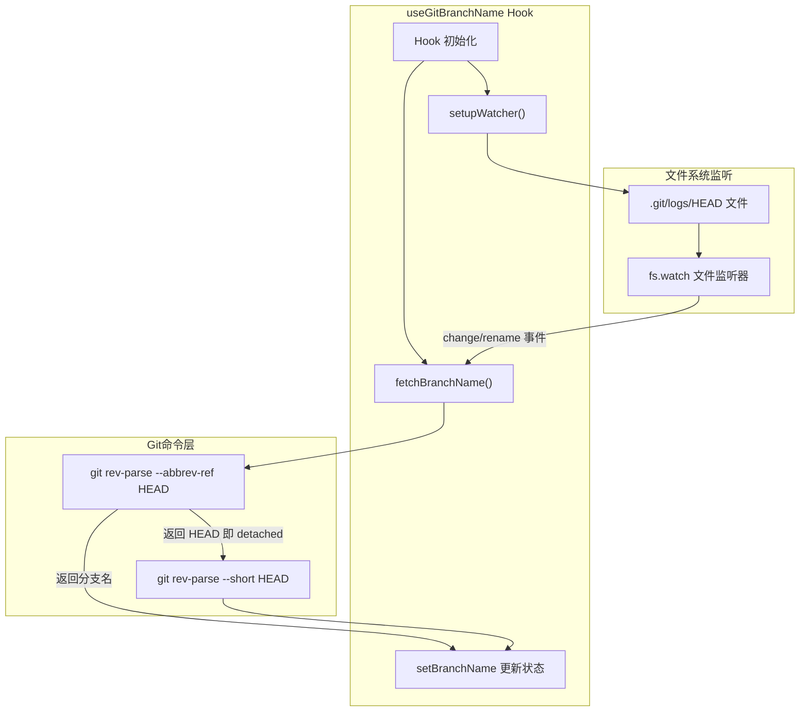

# useGitBranchName.ts

## 概述

`useGitBranchName` 是一个轻量级 React Hook，用于获取当前工作目录下 Git 仓库的分支名称，并在分支切换时自动更新。它通过调用 `git rev-parse` 命令获取分支名，并通过监听 `.git/logs/HEAD` 文件变化实现实时响应分支切换。

该 Hook 主要用于 CLI 的提示符（prompt）中显示当前 Git 分支名称，提升用户的工作上下文感知。

## 架构图（Mermaid）



## 核心组件

### Hook 签名

```typescript
export function useGitBranchName(cwd: string): string | undefined
```

- **参数**：`cwd` - 当前工作目录路径
- **返回值**：当前 Git 分支名称，未获取到时为 `undefined`

### 内部状态

| 状态 | 类型 | 说明 |
|------|------|------|
| `branchName` | `string \| undefined` | 当前分支名称 |

### 核心函数

#### `fetchBranchName()`

异步获取当前 Git 分支名称的回调函数（`useCallback`），执行逻辑如下：

1. 运行 `git rev-parse --abbrev-ref HEAD` 获取当前分支的简写名称
2. 如果返回结果有效且不为 `HEAD`（表明不是 detached HEAD 状态），则直接设置为分支名
3. 如果返回 `HEAD`（detached HEAD 状态），则退而运行 `git rev-parse --short HEAD` 获取短提交哈希作为显示名
4. 如果任何 Git 命令执行失败（如不在 Git 仓库中），将分支名设为 `undefined`

#### `setupWatcher()`

设置文件系统监听器，实现分支名的自动刷新：

1. 检查 `.git/logs/HEAD` 文件是否存在（通过 `fsPromises.access`）
2. 如果存在，使用 `fs.watch` 监听该文件
3. 当检测到 `change`（内容追加）或 `rename`（文件重建）事件时，重新调用 `fetchBranchName()`
4. 监听失败时静默忽略（如权限问题或文件不存在）

### 生命周期管理

`useEffect` 中执行：
1. **初始获取**：组件挂载时立即调用 `fetchBranchName()`
2. **设置监听**：异步设置文件系统 watcher
3. **清理函数**：组件卸载时设置 `cancelled = true` 并关闭 watcher

`cancelled` 标志用于防止在异步 `setupWatcher` 完成前组件已卸载的情况下继续设置 watcher（竞态条件防护）。

## 依赖关系

### 内部依赖

| 模块 | 用途 |
|------|------|
| `@google/gemini-cli-core` | `spawnAsync` 异步子进程执行工具 |

### 外部依赖

| 包名 | 用途 |
|------|------|
| `react` | `useState`、`useEffect`、`useCallback` |
| `node:fs` | `fs.watch` 文件监听、`fs.constants.F_OK` 文件存在检查 |
| `node:fs/promises` | `fsPromises.access` 异步文件访问检查 |
| `node:path` | `path.join` 路径拼接 |

## 关键实现细节

1. **Detached HEAD 兼容**：当仓库处于 detached HEAD 状态时（例如 checkout 了某个具体的 commit），`git rev-parse --abbrev-ref HEAD` 会返回字面量 `HEAD`。此时 Hook 会退而获取短哈希值（如 `a1b2c3d`）作为显示名称，确保用户始终能看到有意义的标识。

2. **基于 `.git/logs/HEAD` 的变更检测**：选择监听 `.git/logs/HEAD` 而非 `.git/HEAD` 是因为 reflog 文件在每次 HEAD 变更（包括 checkout、commit、merge、rebase 等）时都会追加记录，是检测分支切换的可靠信号源。

3. **静默错误处理**：所有 Git 命令和文件系统操作的错误都被静默处理，这是因为分支名显示是纯装饰性功能，不应因为 Git 不可用或权限问题而影响 CLI 的核心功能。

4. **竞态条件防护**：通过 `cancelled` 变量防止在组件卸载后仍然设置 watcher，避免内存泄漏和潜在的状态更新异常。

5. **依赖精准**：`fetchBranchName` 使用 `useCallback` 且依赖 `[cwd, setBranchName]`，`useEffect` 依赖 `[cwd, fetchBranchName]`，确保仅在工作目录变更时重新初始化。
