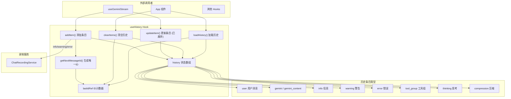

# useHistoryManager.ts

## 概述

`useHistoryManager`（导出函数名为 `useHistory`）是一个 React Hook，用于管理 Gemini CLI 的聊天历史状态。它封装了历史记录数组的增删改查操作、消息 ID 的自动生成、重复消息去重以及与聊天录制服务的集成。

该 Hook 是 UI 层历史管理的核心，被 `useGeminiStream` 和上层 App 组件广泛使用。

## 架构图（Mermaid）



## 核心组件

### 接口定义

#### `UseHistoryManagerReturn`

Hook 的返回类型接口：

```typescript
export interface UseHistoryManagerReturn {
  history: HistoryItem[];
  addItem: (itemData: Omit<HistoryItem, 'id'>, baseTimestamp?: number, isResuming?: boolean) => number;
  updateItem: (id: number, updates: Partial<Omit<HistoryItem, 'id'>> | HistoryItemUpdater) => void;
  clearItems: () => void;
  loadHistory: (newHistory: HistoryItem[]) => void;
}
```

#### `HistoryItemUpdater`

更新器函数类型，接收旧条目返回部分更新：

```typescript
type HistoryItemUpdater = (prevItem: HistoryItem) => Partial<Omit<HistoryItem, 'id'>>;
```

### Hook 签名

```typescript
export function useHistory({
  chatRecordingService,
  initialItems = [],
}: {
  chatRecordingService?: ChatRecordingService | null;
  initialItems?: HistoryItem[];
} = {}): UseHistoryManagerReturn
```

#### 参数

| 参数名 | 类型 | 默认值 | 说明 |
|--------|------|--------|------|
| `chatRecordingService` | `ChatRecordingService \| null` | `undefined` | 聊天录制服务（可选） |
| `initialItems` | `HistoryItem[]` | `[]` | 初始历史条目（用于恢复会话） |

### 内部状态

| 状态/引用 | 类型 | 说明 |
|-----------|------|------|
| `history` | `HistoryItem[]` | 聊天历史数组（React state） |
| `lastIdRef` | `Ref<number>` | 最后分配的消息 ID（用 ref 保证跨渲染持久性） |

### 核心方法

#### `getNextMessageId(baseTimestamp: number): number`

生成唯一的消息 ID。取 `baseTimestamp` 与 `lastIdRef.current + 1` 中的较大值，确保 ID 严格递增且基于时间戳。这种设计保证了：
- ID 始终唯一且递增
- 同一毫秒内的多条消息也不会冲突
- 可用于基于时间的排序

#### `addItem(itemData, baseTimestamp?, isResuming?): number`

添加新的历史条目，返回生成的 ID。

**关键行为**：
1. 生成唯一 ID 并附加到条目数据
2. **去重逻辑**：如果最后一条消息和新消息都是 `user` 类型且文本相同，则跳过添加
3. **聊天录制**：非恢复模式下，将 `info`、`warning`、`error` 类型消息记录到 `ChatRecordingService`
4. `user`、`gemini`、`gemini_content` 类型由核心层的 `GeminiChat` 负责录制，此处不重复

#### `updateItem(id, updates): void`

**已废弃**。通过 ID 查找并更新历史条目。

支持两种更新方式：
- 对象更新：直接合并 `{...item, ...updates}`
- 函数更新：`updates(prevItem)` 返回部分更新

**废弃原因**：当前所有历史条目都在 `<Static />` 组件中渲染以提升性能，直接更新已提交到 Static 的条目不会触发重新渲染，因此建议仅在绝对必要时使用。

#### `clearItems(): void`

清空整个历史记录并重置 ID 计数器为 0。

#### `loadHistory(newHistory: HistoryItem[]): void`

加载一组新的历史记录（用于会话恢复）。更新 `lastIdRef` 以确保后续 ID 不与已加载的条目冲突。

### 返回值优化

使用 `useMemo` 包裹返回对象，仅在依赖项变化时创建新引用，减少不必要的子组件重渲染。

## 依赖关系

### 内部依赖

| 模块 | 用途 |
|------|------|
| `../types.js` | `HistoryItem` 历史条目类型 |
| `@google/gemini-cli-core/src/services/chatRecordingService.js` | `ChatRecordingService` 聊天录制服务类型 |

### 外部依赖

| 包名 | 用途 |
|------|------|
| `react` | `useState`、`useRef`、`useCallback`、`useMemo` |

## 关键实现细节

1. **基于时间戳的 ID 生成策略**：消息 ID 基于 `Date.now()` 时间戳，但通过 `Math.max(baseTimestamp, lastIdRef.current + 1)` 确保严格递增。这意味着即使两条消息在同一毫秒内添加，ID 也不会冲突（后者会自动 +1）。

2. **连续重复用户消息去重**：`addItem` 在添加前检查最后一条消息是否与新消息为相同的用户消息。这是一种防御性措施，防止因网络重试或 UI 双击等情况导致的消息重复。

3. **录制服务的选择性记录**：只有 `info`、`warning`、`error` 类型由此 Hook 录制，核心对话内容（`user`、`gemini`）的录制由 `GeminiChat` 在核心层处理，避免重复记录。

4. **`isResuming` 标志**：当从持久化存储恢复会话时，传入 `isResuming = true` 以跳过录制，避免将恢复的历史重新写入录制服务。

5. **`updateItem` 的废弃与 `<Static />` 的关系**：Ink 框架的 `<Static>` 组件用于将已渲染内容移出动态渲染循环以提升性能。一旦条目被提交到 Static，更新该条目不会在界面上产生效果。因此 `updateItem` 被标记为废弃，当前架构倾向于通过添加新条目而非修改旧条目来更新 UI。

6. **`lastIdRef` 使用 ref 而非 state**：ID 计数器使用 `useRef` 而非 `useState`，因为 ID 生成不需要触发重渲染，且需要在同步代码中立即读取最新值。
