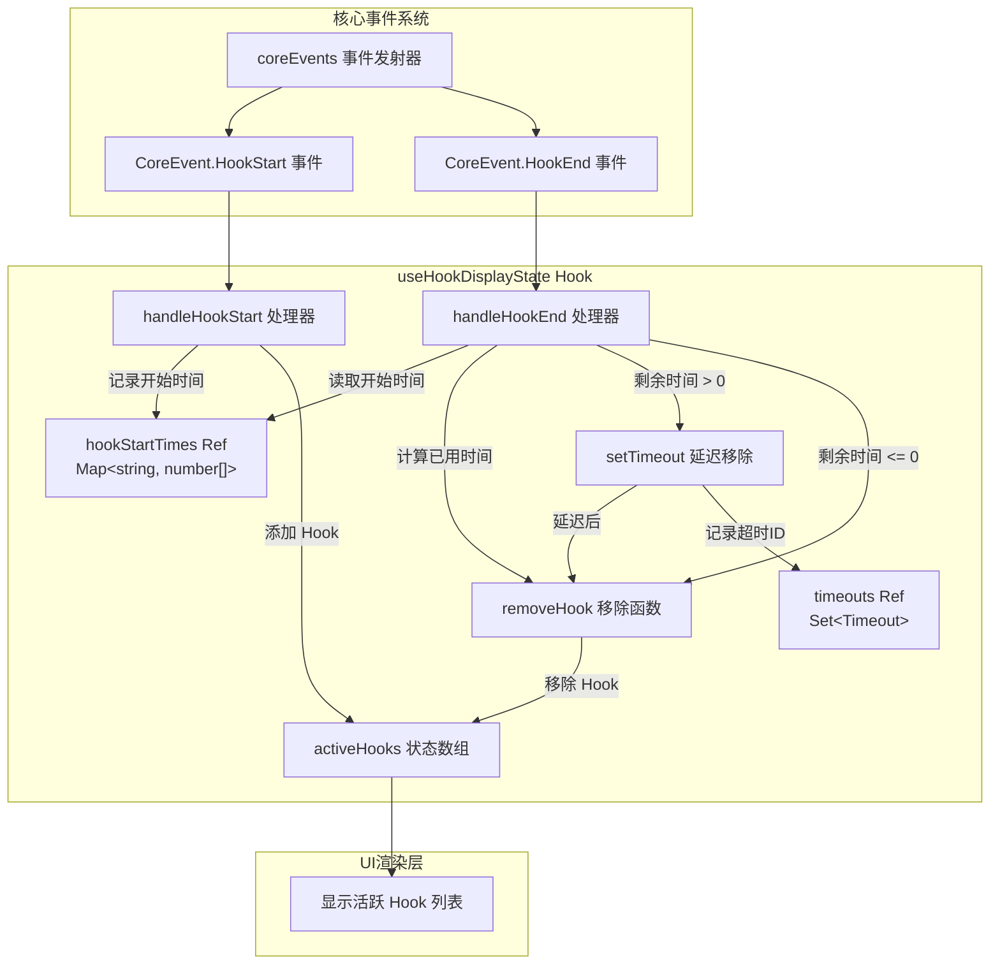

# useHookDisplayState.ts

## 概述

`useHookDisplayState` 是一个 React Hook，用于追踪和管理当前正在执行的 Hook（生命周期钩子）的显示状态。它监听核心事件系统中的 `HookStart` 和 `HookEnd` 事件，维护一个活跃 Hook 列表，并实现了最小显示时长机制，确保 Hook 的执行状态在 UI 上有足够的可见时间，避免快速闪烁。

该 Hook 主要用于在 CLI 界面中向用户展示当前正在运行的自定义 Hook（如 pre-prompt、post-response 等事件钩子），提供执行过程的可视化反馈。

## 架构图（Mermaid）



## 核心组件

### Hook 签名

```typescript
export const useHookDisplayState = () => ActiveHook[]
```

- **参数**：无
- **返回值**：`ActiveHook[]` - 当前活跃的 Hook 数组

### 内部状态

| 状态/引用 | 类型 | 说明 |
|-----------|------|------|
| `activeHooks` | `ActiveHook[]` | 当前活跃的 Hook 列表（React state，驱动 UI 渲染） |
| `hookStartTimes` | `Ref<Map<string, number[]>>` | 每个 Hook 的开始时间栈。键格式为 `hookName:eventName`，值为时间戳数组（FIFO 队列） |
| `timeouts` | `Ref<Set<NodeJS.Timeout>>` | 活跃的延迟清除定时器集合，用于卸载时清理 |

### `ActiveHook` 数据结构

每个活跃 Hook 条目包含以下字段：

| 字段 | 说明 |
|------|------|
| `name` | Hook 名称 |
| `eventName` | 触发事件名称 |
| `source` | Hook 来源 |
| `index` | 当前 Hook 在总数中的索引 |
| `total` | 同类 Hook 的总数 |

### 事件处理器

#### `handleHookStart(payload: HookStartPayload)`

当 Hook 开始执行时触发：

1. 以 `hookName:eventName` 为键，将当前时间戳 push 到开始时间栈中
2. 向 `activeHooks` 数组追加新的 `ActiveHook` 条目

使用栈（数组）而非单值来支持同名 Hook 的并发执行场景。

#### `handleHookEnd(payload: HookEndPayload)`

当 Hook 执行结束时触发：

1. 从开始时间栈中 shift 出最早的开始时间（FIFO 顺序）
2. 计算已用时间 `elapsed = now - startTime`
3. 计算剩余最小显示时间 `remaining = WARNING_PROMPT_DURATION_MS - elapsed`
4. **如果剩余时间 > 0**：设置定时器，在剩余时间后移除该 Hook 的显示
5. **如果剩余时间 <= 0**：立即移除
6. 清理空的开始时间数组条目

#### `removeHook()`

内部函数，从 `activeHooks` 中查找并移除第一个匹配的 Hook 条目（基于 `name` 和 `eventName`）。使用 `findIndex` + `splice` 确保只移除一个实例（支持同名 Hook 并存）。

### 生命周期管理

`useEffect` 中：
1. 订阅 `CoreEvent.HookStart` 和 `CoreEvent.HookEnd` 事件
2. 清理函数中：
   - 取消事件订阅
   - 清除所有待执行的定时器
   - 清空定时器集合

## 依赖关系

### 内部依赖

| 模块 | 用途 |
|------|------|
| `@google/gemini-cli-core` | `coreEvents` 核心事件发射器、`CoreEvent` 事件类型枚举、`HookStartPayload` / `HookEndPayload` 事件载荷类型 |
| `../types.js` | `ActiveHook` 活跃 Hook 显示类型 |
| `../constants.js` | `WARNING_PROMPT_DURATION_MS` 最小显示时长常量 |

### 外部依赖

| 包名 | 用途 |
|------|------|
| `react` | `useState`、`useEffect`、`useRef` |

## 关键实现细节

1. **最小显示时长机制**：Hook 执行可能非常快（几毫秒），如果立即移除 UI 提示会导致闪烁。通过 `WARNING_PROMPT_DURATION_MS` 设定最小显示时长，如果 Hook 在此时间内完成，则延迟到最小时长后再移除。这确保了用户能感知到 Hook 的执行。

2. **FIFO 时间栈**：同一个 `hookName:eventName` 组合可能并发执行多次。使用数组（FIFO 队列）存储开始时间，`handleHookEnd` 时 shift 出最早的时间戳，确保时间匹配的正确性。

3. **防御性时间计算**：如果在 `handleHookEnd` 时找不到对应的开始时间（理论上不应发生），默认将 `elapsed` 设为 `WARNING_PROMPT_DURATION_MS`，使 `remaining = 0`，从而立即移除。避免因状态不一致导致 Hook 永久留在列表中。

4. **定时器泄漏防护**：所有通过 `setTimeout` 创建的定时器都被追踪到 `timeouts` ref 中。组件卸载时逐一调用 `clearTimeout` 并清空集合，防止内存泄漏和卸载后的状态更新。

5. **Ref 与 State 分离**：`hookStartTimes` 和 `timeouts` 使用 `useRef` 而非 `useState`，因为它们是事件处理器中的内部簿记数据，不需要触发 UI 重渲染。只有 `activeHooks` 使用 `useState`，因为它直接驱动 UI 显示。

6. **单次 `useEffect`**：依赖数组为空 `[]`，确保事件监听器只设置一次。由于 `handleHookStart` 和 `handleHookEnd` 使用函数式 setState（`setActiveHooks(prev => ...)`），它们无需依赖外部变量的最新值，不会产生闭包陷阱。
