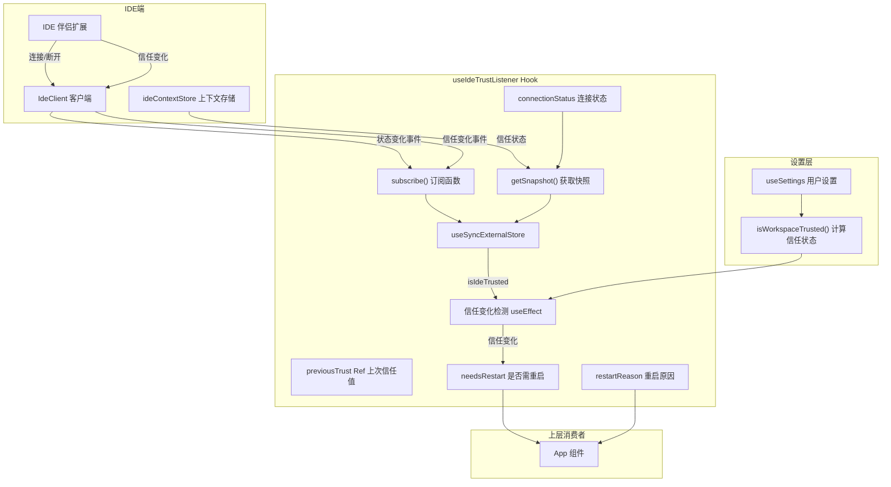

# useIdeTrustListener.ts

## 概述

`useIdeTrustListener` 是一个 React Hook，用于监听来自 IDE 伴侣扩展（如 VS Code 扩展）的工作区信任状态变化。它追踪 IDE 连接状态和信任状态，当信任状态发生变化时通知上层组件需要重启会话。

该 Hook 是 Gemini CLI 与 IDE 集成的安全桥梁，确保 CLI 在 IDE 信任状态变化时能够正确响应，例如当用户在 IDE 中将工作区标记为"受信任"或"不受信任"时。

## 架构图（Mermaid）



## 核心组件

### 类型定义

#### `RestartReason`

```typescript
export type RestartReason = 'NONE' | 'CONNECTION_CHANGE' | 'TRUST_CHANGE';
```

| 值 | 说明 |
|----|------|
| `NONE` | 无需重启 |
| `CONNECTION_CHANGE` | IDE 连接状态发生变化（连接/断开） |
| `TRUST_CHANGE` | 工作区信任状态发生变化 |

### Hook 签名

```typescript
export function useIdeTrustListener(): {
  isIdeTrusted: boolean | undefined;
  needsRestart: boolean;
  restartReason: RestartReason;
}
```

#### 返回值

| 字段 | 类型 | 说明 |
|------|------|------|
| `isIdeTrusted` | `boolean \| undefined` | IDE 报告的当前工作区信任状态。未连接时为 `undefined` |
| `needsRestart` | `boolean` | 是否需要重启会话以应用信任状态变化 |
| `restartReason` | `RestartReason` | 导致需要重启的原因 |

### 内部状态

| 状态/引用 | 类型 | 说明 |
|-----------|------|------|
| `connectionStatus` | `IDEConnectionStatus` | 当前 IDE 连接状态，初始值为 `Disconnected` |
| `previousTrust` | `Ref<boolean \| undefined>` | 上一次的信任状态，用于变化检测 |
| `restartReason` | `RestartReason` | 当前重启原因 |
| `needsRestart` | `boolean` | 是否需要重启 |

### 核心机制

#### 外部存储订阅 (`subscribe`)

使用 `useSyncExternalStore` 的 `subscribe` 函数，异步获取 `IdeClient` 单例并注册两类监听器：

1. **状态变化监听** (`handleStatusChange`)：
   - 更新 `connectionStatus`
   - 设置 `restartReason` 为 `CONNECTION_CHANGE`
   - 通知 `useSyncExternalStore` 数据已变更

2. **信任变化监听** (`handleTrustChange`)：
   - 设置 `restartReason` 为 `TRUST_CHANGE`
   - 通知 `useSyncExternalStore` 数据已变更

清理函数中异步移除这两个监听器。

#### 快照获取 (`getSnapshot`)

`useSyncExternalStore` 的 `getSnapshot` 函数：
- 如果 IDE 未连接，返回 `undefined`
- 如果已连接，从 `ideContextStore` 获取工作区的信任状态

#### 信任变化检测 (`useEffect`)

监听 `isIdeTrusted` 和 `settings.merged` 的变化：
1. 使用 `isWorkspaceTrusted(settings.merged)` 综合计算当前信任状态
2. 跳过初始值设置（`previousTrust.current === undefined` 时不触发重启）
3. 如果信任状态与上次不同，设置 `needsRestart = true`
4. 更新 `previousTrust` 引用

## 依赖关系

### 内部依赖

| 模块 | 用途 |
|------|------|
| `@google/gemini-cli-core` | `IdeClient` IDE 客户端单例、`IDEConnectionStatus` 连接状态枚举、`ideContextStore` IDE 上下文存储、`IDEConnectionState` 连接状态类型 |
| `../contexts/SettingsContext.js` | `useSettings` 用户设置 Hook |
| `../../config/trustedFolders.js` | `isWorkspaceTrusted` 综合信任状态计算函数 |

### 外部依赖

| 包名 | 用途 |
|------|------|
| `react` | `useCallback`、`useEffect`、`useState`、`useSyncExternalStore`、`useRef` |

## 关键实现细节

1. **`useSyncExternalStore` 的使用**：这是 React 18 引入的 Hook，专门用于订阅外部数据源。`ideContextStore` 是一个非 React 管理的外部存储，使用 `useSyncExternalStore` 确保在并发模式下数据一致性，避免撕裂（tearing）问题。

2. **异步初始化模式**：`subscribe` 函数内部使用立即执行异步函数 `(async () => {...})()` 来获取 `IdeClient` 单例。这是因为 `IdeClient.getInstance()` 返回 Promise，而 `subscribe` 必须同步返回 unsubscribe 函数。清理函数也采用相同的异步模式。

3. **初始值跳过**：`previousTrust.current` 初始为 `undefined`，`useEffect` 中检查 `previousTrust.current !== undefined` 确保首次设置信任值时不会误触发重启。只有在信任状态真正发生"变化"时才设置 `needsRestart`。

4. **综合信任计算**：最终的信任状态不仅来自 IDE（`isIdeTrusted`），还受用户设置的影响。`isWorkspaceTrusted(settings.merged)` 函数综合考虑 IDE 信任状态和用户在 settings 中的信任文件夹配置，计算出最终的信任决策。

5. **连接状态守卫**：`getSnapshot` 中检查 `connectionStatus !== Connected` 时返回 `undefined`，确保在 IDE 未连接时不会读取到过时的信任状态。

6. **事件驱动的双通道更新**：连接状态变化和信任状态变化通过不同的事件通道传递，但都会通过 `onStoreChange()` 通知 `useSyncExternalStore` 重新调用 `getSnapshot`，确保所有变化路径都能触发 UI 更新。

7. **重启语义**：Hook 本身不执行重启操作，仅通过 `needsRestart` 和 `restartReason` 通知上层组件。实际的重启逻辑由消费者（如 App 组件）根据这些信号决定。
