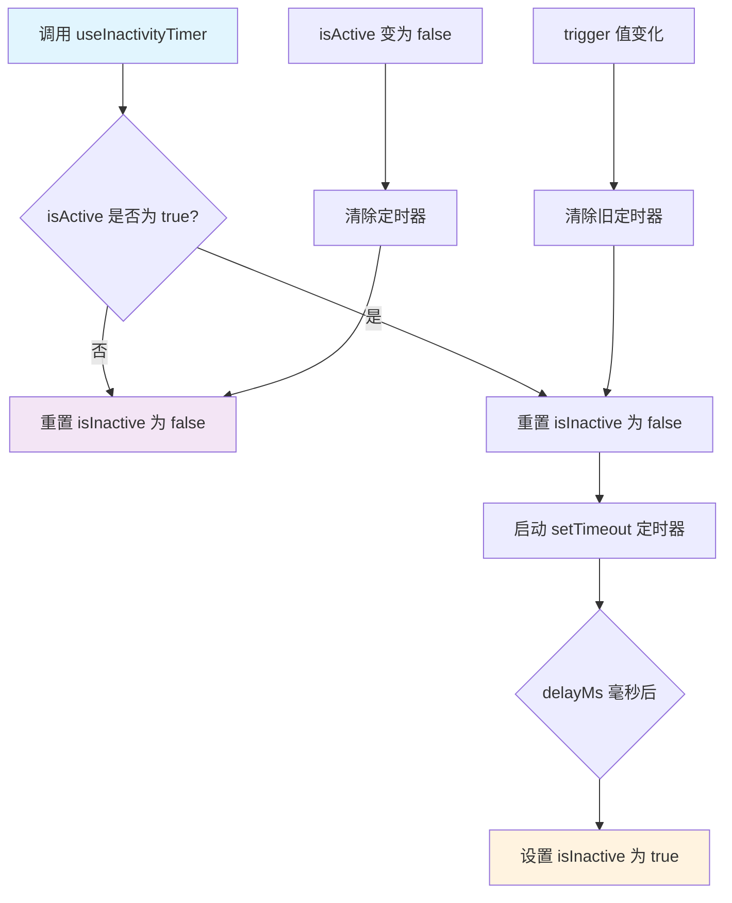

# useInactivityTimer.ts

## 概述

`useInactivityTimer` 是一个 React 自定义 Hook，用于检测"不活跃"状态。它的核心逻辑是：当某个触发值（`trigger`）在指定的延迟时间（`delayMs`）内没有发生变化时，就认为当前处于"不活跃"状态，并返回 `true`。

该 Hook 通常用于 CLI 的 UI 层，在用户或系统长时间没有新的活动（例如没有新的输出内容）时触发某些行为，例如显示提示、隐藏加载动画等。

## 架构图（Mermaid）



## 核心组件

### Hook 签名

```typescript
export const useInactivityTimer = (
  isActive: boolean,
  trigger: unknown,
  delayMs: number = 5000,
): boolean
```

### 参数说明

| 参数 | 类型 | 默认值 | 说明 |
|------|------|--------|------|
| `isActive` | `boolean` | 无（必填） | 是否激活定时器。为 `false` 时，定时器不运行，始终返回"活跃"状态 |
| `trigger` | `unknown` | 无（必填） | 触发值。当该值发生变化时，不活跃定时器会被重置。可以是任意类型的值 |
| `delayMs` | `number` | `5000` | 延迟时间（毫秒）。触发值在该时间内未变化则视为不活跃 |

### 返回值

| 返回值 | 类型 | 说明 |
|--------|------|------|
| `isInactive` | `boolean` | 当前是否处于不活跃状态。`true` 表示不活跃，`false` 表示活跃 |

### 内部状态

- **`isInactive`**（`useState<boolean>`）：用于追踪当前是否处于不活跃状态，初始值为 `false`。

### useEffect 逻辑详解

`useEffect` 的依赖项为 `[isActive, trigger, delayMs]`，在以下场景会重新执行：

1. **`isActive` 为 `false`**：直接将 `isInactive` 设为 `false` 并返回，不设定定时器。
2. **`isActive` 为 `true`**：
   - 先将 `isInactive` 重置为 `false`（表示刚发生了活动）。
   - 启动一个 `setTimeout`，在 `delayMs` 毫秒后将 `isInactive` 设为 `true`。
   - 返回清理函数，在 effect 重新执行或组件卸载时清除定时器，防止内存泄漏。

## 依赖关系

### 内部依赖

无。该 Hook 是一个独立的工具函数，不依赖项目中的其他模块。

### 外部依赖

| 依赖包 | 导入内容 | 用途 |
|--------|----------|------|
| `react` | `useState`, `useEffect` | React 核心 Hook，用于管理状态和副作用 |

## 关键实现细节

1. **防抖机制**：该 Hook 本质上实现了一个"防抖"（debounce）模式。每次 `trigger` 变化时，旧的定时器被清除，新的定时器被创建，只有当 `trigger` 持续不变超过 `delayMs` 毫秒后，才会判定为不活跃。

2. **双重重置保护**：在 `isActive` 为 `false` 和 `true` 两个分支中，都会调用 `setIsInactive(false)`，确保无论何种状态切换，不活跃标志都能被正确重置。

3. **清理函数**：`useEffect` 返回的 `() => clearTimeout(timer)` 确保在组件卸载、依赖项变化时都能正确清除定时器，避免内存泄漏和"对已卸载组件设置状态"的警告。

4. **泛型触发值**：`trigger` 参数类型为 `unknown`，使得调用者可以传入任意类型的值（字符串、数字、对象引用等），只要 React 的依赖比较检测到变化就会重置定时器。

5. **默认 5 秒超时**：默认的 `delayMs` 为 5000 毫秒（5 秒），这是一个合理的不活跃检测阈值，调用者可根据需要自行调整。
