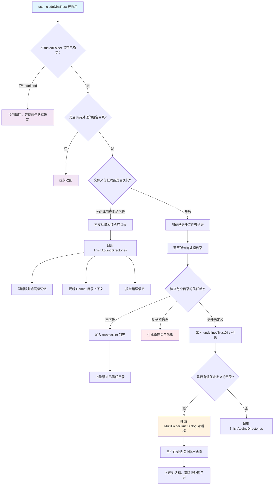

# useIncludeDirsTrust.tsx

## 概述

`useIncludeDirsTrust` 是一个 React 自定义 Hook，负责处理"包含目录"（include directories）的信任检查与添加流程。当用户配置了需要包含的额外目录时，该 Hook 会根据文件夹信任机制（folder trust）判断这些目录是否可信，并根据不同的信任状态执行不同的操作：

- **已信任的目录**：直接添加到工作区上下文中。
- **明确不信任的目录**：报错提示用户需要先修改信任级别。
- **信任状态未定义的目录**：弹出多文件夹信任确认对话框（`MultiFolderTrustDialog`），让用户决定是否信任。

该模块还包含一个辅助异步函数 `finishAddingDirectories`，用于在目录添加完成后刷新服务端层级记忆（hierarchical memory）并更新目录上下文。

## 架构图（Mermaid）



## 核心组件

### 辅助函数：`finishAddingDirectories`

```typescript
async function finishAddingDirectories(
  config: Config,
  addItem: (itemData: Omit<HistoryItem, 'id'>, baseTimestamp?: number) => number,
  added: string[],
  errors: string[],
): Promise<void>
```

该函数在目录添加流程结束后被调用，执行以下收尾工作：

| 步骤 | 条件 | 操作 |
|------|------|------|
| 1 | `config` 为空 | 向历史记录添加错误消息并返回 |
| 2 | `config.shouldLoadMemoryFromIncludeDirectories()` 返回 `true` | 调用 `refreshServerHierarchicalMemory` 刷新服务端层级记忆 |
| 3 | `added.length > 0` | 通过 `gemini.addDirectoryContext()` 更新 Gemini 客户端的目录上下文 |
| 4 | `errors.length > 0` | 向历史记录添加错误消息 |

### Hook：`useIncludeDirsTrust`

```typescript
export function useIncludeDirsTrust(
  config: Config,
  isTrustedFolder: boolean | undefined,
  historyManager: UseHistoryManagerReturn,
  setCustomDialog: (dialog: React.ReactNode | null) => void,
): void
```

#### 参数说明

| 参数 | 类型 | 说明 |
|------|------|------|
| `config` | `Config` | 全局配置对象，提供包含目录列表、工作区上下文、文件夹信任设置、Gemini 客户端等 |
| `isTrustedFolder` | `boolean \| undefined` | 当前工作区文件夹的信任状态。`undefined` 表示尚未确定 |
| `historyManager` | `UseHistoryManagerReturn` | 历史记录管理器，提供 `addItem` 方法用于向 UI 历史记录中添加消息 |
| `setCustomDialog` | `(dialog: React.ReactNode \| null) => void` | 设置自定义对话框的函数，用于弹出信任确认对话框 |

#### 返回值

无返回值（`void`）。该 Hook 通过副作用（side effects）工作。

### useEffect 核心逻辑

该 `useEffect` 的依赖项为 `[isTrustedFolder, config, addItem, setCustomDialog]`，其执行流程如下：

1. **前置检查**：如果 `isTrustedFolder` 为 `undefined` 或 `config` 为空，提前返回。
2. **获取待处理目录**：调用 `config.getPendingIncludeDirectories()` 获取待添加的目录列表，如果为空则返回。
3. **信任功能关闭或用户未信任当前文件夹**：直接调用 `batchAddDirectories` 批量添加所有目录，然后调用 `finishAddingDirectories` 收尾。
4. **信任功能开启**：
   - 加载已信任的文件夹列表（`loadTrustedFolders`）。
   - 遍历每个待处理目录，根据信任状态分为三类：已信任（`trustedDirs`）、不信任（`untrustedDirs`）、未定义（`undefinedTrustDirs`）。
   - 不信任的目录生成错误提示。
   - 已信任的目录直接批量添加。
   - 信任未定义的目录弹出 `MultiFolderTrustDialog` 对话框让用户选择。

## 依赖关系

### 内部依赖

| 模块路径 | 导入内容 | 用途 |
|----------|----------|------|
| `../../config/trustedFolders.js` | `loadTrustedFolders` | 加载本地存储的已信任文件夹列表 |
| `../utils/directoryUtils.js` | `expandHomeDir`, `batchAddDirectories` | 展开 `~` 路径、批量添加目录到工作区上下文 |
| `../components/MultiFolderTrustDialog.js` | `MultiFolderTrustDialog` | 多文件夹信任确认对话框 React 组件 |
| `./useHistoryManager.js` | `UseHistoryManagerReturn`（类型） | 历史记录管理器的返回类型 |
| `../types.js` | `MessageType`, `HistoryItem`（类型） | 消息类型枚举和历史记录条目类型 |

### 外部依赖

| 依赖包 | 导入内容 | 用途 |
|--------|----------|------|
| `react` | `useEffect` | React 副作用 Hook |
| `@google/gemini-cli-core` | `Config`（类型）, `debugLogger`, `refreshServerHierarchicalMemory` | 核心配置类型、调试日志器、服务端层级记忆刷新函数 |

## 关键实现细节

1. **三态信任模型**：目录的信任状态不是简单的布尔值，而是三态（`true` / `false` / `undefined`）：
   - `true`：用户明确信任该目录。
   - `false`：用户明确不信任该目录。
   - `undefined`：用户尚未对该目录做出信任决定。
   这种设计允许系统对未知目录进行交互式确认。

2. **信任功能可全局关闭**：通过 `config.getFolderTrust() === false` 检查，当文件夹信任功能被全局关闭时，所有目录都会被直接添加，无需信任检查。

3. **延迟执行机制**：Hook 会等待 `isTrustedFolder` 从 `undefined` 变为确定值后才执行，确保主文件夹的信任状态先被确定。这是通过 `useEffect` 的依赖项实现的。

4. **对话框模式处理未信任目录**：对于信任状态未定义的目录，不是自动拒绝或接受，而是通过 `setCustomDialog` 弹出 `MultiFolderTrustDialog` 组件，让用户逐个或批量决定是否信任这些目录。对话框关闭后会清除待处理目录列表。

5. **错误聚合**：整个流程中的错误信息被收集到 `errors` 数组中，最终统一通过 `addItem` 以 `MessageType.ERROR` 类型添加到历史记录，确保用户能一次性看到所有问题。

6. **记忆刷新**：添加目录后会根据配置决定是否刷新服务端层级记忆（`refreshServerHierarchicalMemory`），这与 Gemini CLI 的记忆系统集成，确保新增目录中的上下文能被 AI 模型感知。

7. **路径展开**：使用 `expandHomeDir` 函数将路径中的 `~` 展开为用户主目录的绝对路径，确保信任检查时路径匹配的准确性。

8. **浮动 Promise 抑制**：代码中多处使用 `// eslint-disable-next-line @typescript-eslint/no-floating-promises` 注释，表明 `finishAddingDirectories` 的异步调用是有意不等待的（fire-and-forget 模式），因为在 `useEffect` 中无法方便地处理异步操作的返回值。
