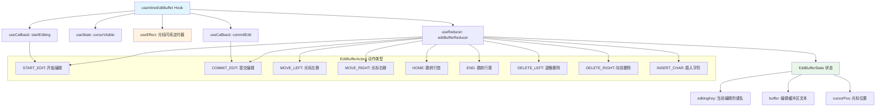

# useInlineEditBuffer.ts

## 概述

`useInlineEditBuffer` 是一个 React 自定义 Hook，提供了一套完整的**内联文本编辑缓冲区**（inline edit buffer）管理方案。它基于 `useReducer` 实现了一个类似文本编辑器的状态机，支持以下编辑操作：

- 光标左右移动、跳转到行首/行尾
- 插入字符（支持普通文本和数字类型的输入验证）
- 删除光标前/后的字符（退格键/Delete 键）
- 开始编辑和提交编辑

该 Hook 还内置了光标闪烁效果，用于在终端 UI 中模拟真实的文本编辑体验。

## 架构图（Mermaid）



## 核心组件

### 接口：`EditBufferState`

```typescript
export interface EditBufferState {
  editingKey: string | null;  // 当前正在编辑的配置项键名，null 表示未在编辑
  buffer: string;             // 编辑缓冲区中的当前文本
  cursorPos: number;          // 光标在缓冲区中的位置（基于 Unicode 码点）
}
```

### 类型：`EditBufferAction`

联合类型，定义了所有可能的编辑操作：

| Action 类型 | 附加数据 | 说明 |
|-------------|----------|------|
| `START_EDIT` | `key: string`, `initialValue: string` | 开始编辑指定键，用初始值初始化缓冲区，光标置于末尾 |
| `COMMIT_EDIT` | 无 | 提交编辑，重置状态为初始值 |
| `MOVE_LEFT` | 无 | 光标左移一个码点位置，不超过 0 |
| `MOVE_RIGHT` | 无 | 光标右移一个码点位置，不超过缓冲区长度 |
| `HOME` | 无 | 光标跳转到缓冲区开头（位置 0） |
| `END` | 无 | 光标跳转到缓冲区末尾 |
| `DELETE_LEFT` | 无 | 删除光标前一个字符（退格键行为），光标位置为 0 时不操作 |
| `DELETE_RIGHT` | 无 | 删除光标后一个字符（Delete 键行为），光标在末尾时不操作 |
| `INSERT_CHAR` | `char: string`, `isNumberType: boolean` | 在光标位置插入字符，根据 `isNumberType` 进行不同的输入验证 |

### Reducer：`editBufferReducer`

```typescript
function editBufferReducer(
  state: EditBufferState,
  action: EditBufferAction,
): EditBufferState
```

纯函数 reducer，根据不同的 action 类型计算新的状态。关键逻辑：

- **`INSERT_CHAR`**：这是最复杂的分支。
  - 如果 `isNumberType` 为 `true`，只允许数字字符（`0-9`）、正负号（`+-`）和小数点（`.`）。
  - 如果 `isNumberType` 为 `false`，允许所有 ASCII 可打印字符（码点 >= 32），并通过 `stripUnsafeCharacters` 过滤不安全字符。
  - 验证失败或过滤后字符为空时，返回原状态不做修改。

- **删除操作**：使用 `cpSlice` 进行 Unicode 码点安全的字符串切片，将光标前后的文本重新拼接。

### 接口：`UseEditBufferProps`

```typescript
export interface UseEditBufferProps {
  onCommit: (key: string, value: string) => void;
}
```

| 属性 | 类型 | 说明 |
|------|------|------|
| `onCommit` | `(key: string, value: string) => void` | 编辑提交时的回调函数。接收正在编辑的键名和最终的缓冲区值 |

### Hook：`useInlineEditBuffer`

```typescript
export function useInlineEditBuffer({ onCommit }: UseEditBufferProps)
```

#### 返回值

| 属性 | 类型 | 说明 |
|------|------|------|
| `editState` | `EditBufferState` | 当前编辑缓冲区的完整状态 |
| `editDispatch` | `React.Dispatch<EditBufferAction>` | Reducer 的 dispatch 函数，用于发送编辑操作 |
| `startEditing` | `(key: string, initialValue: string) => void` | 开始编辑的便捷方法（包装了 `START_EDIT` action） |
| `commitEdit` | `() => void` | 提交编辑的便捷方法（先调用 `onCommit` 回调，再 dispatch `COMMIT_EDIT`） |
| `cursorVisible` | `boolean` | 光标当前是否可见，用于实现闪烁效果 |

#### 光标闪烁 useEffect

- **依赖项**：`[state.editingKey, state.buffer, state.cursorPos]`
- **行为**：
  - 当不处于编辑状态时（`editingKey` 为 `null`），重置光标为可见并返回。
  - 当处于编辑状态时，立即设置光标可见，然后启动一个每 500ms 切换一次可见性的定时器。
  - 每次缓冲区内容或光标位置变化时，都会重新开始闪烁周期（先显示光标），提供更好的视觉反馈。

## 依赖关系

### 内部依赖

| 模块路径 | 导入内容 | 用途 |
|----------|----------|------|
| `../utils/textUtils.js` | `cpSlice`, `cpLen`, `stripUnsafeCharacters` | Unicode 码点安全的字符串切片、长度计算，以及不安全字符过滤 |

### 外部依赖

| 依赖包 | 导入内容 | 用途 |
|--------|----------|------|
| `react` | `useReducer`, `useCallback`, `useEffect`, `useState` | React 核心 Hook |

## 关键实现细节

1. **Unicode 码点安全**：所有字符串操作（切片、长度计算、光标移动）都使用 `cpSlice` 和 `cpLen` 函数，而非 JavaScript 原生的 `String.prototype.slice` 和 `.length`。这确保了对 emoji、中文等多字节字符的正确处理，光标不会停留在代理对（surrogate pair）的中间位置。

2. **Reducer 模式**：使用 `useReducer` 而非多个 `useState`，将所有编辑状态（键名、缓冲区、光标位置）集中管理，确保状态转换的原子性和一致性。每个 action 都产生一个完整的新状态，不存在中间不一致的状态。

3. **输入验证分层**：
   - **数字类型**：仅允许 `0-9`、`+`、`-`、`.` 字符，适用于数字配置项的编辑。
   - **普通类型**：允许 ASCII 可打印字符（码点 >= 32），并额外通过 `stripUnsafeCharacters` 过滤可能破坏终端渲染的不安全字符。

4. **光标闪烁重置**：每次编辑操作（缓冲区内容变化、光标位置变化）都会重置闪烁周期，先显示光标再开始闪烁。这是通过 `useEffect` 的依赖项包含 `state.buffer` 和 `state.cursorPos` 实现的，确保用户每次操作后都能立即看到光标位置。

5. **不可变状态更新**：reducer 中所有状态更新都创建新对象（`{ ...state, ... }`），遵循 React 不可变数据的原则，确保 React 能正确检测到状态变化并触发重新渲染。

6. **边界保护**：光标移动操作使用 `Math.max(0, ...)` 和 `Math.min(cpLen(state.buffer), ...)` 确保光标不会越界。删除操作在光标处于边界位置时直接返回原状态。

7. **初始状态设计**：`initialState` 将 `editingKey` 设为 `null`，使调用方可以通过检查 `editState.editingKey` 是否为 `null` 来判断当前是否处于编辑模式。
