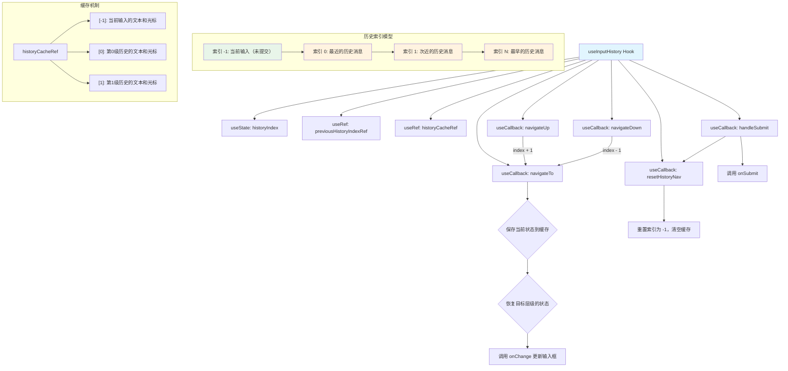

# useInputHistory.ts

## 概述

`useInputHistory` 是一个 React 自定义 Hook，为 CLI 输入框提供**命令历史导航**功能。它模拟了终端（如 bash/zsh）中按上下箭头键浏览历史命令的行为，允许用户在之前提交过的消息之间导航，并且能智能地保存和恢复每个历史层级的文本内容和光标位置。

核心特性：
- 上键（Up）浏览更早的历史消息
- 下键（Down）浏览更近的历史消息或回到当前编辑区
- 在历史层级间切换时缓存并恢复文本和光标位置
- 提交消息时自动重置导航状态

## 架构图（Mermaid）



## 核心组件

### 接口：`UseInputHistoryProps`

```typescript
interface UseInputHistoryProps {
  userMessages: readonly string[];
  onSubmit: (value: string) => void;
  isActive: boolean;
  currentQuery: string;
  currentCursorOffset: number;
  onChange: (value: string, cursorPosition?: 'start' | 'end' | number) => void;
}
```

| 属性 | 类型 | 说明 |
|------|------|------|
| `userMessages` | `readonly string[]` | 用户历史消息列表（只读数组），最新的消息在数组末尾 |
| `onSubmit` | `(value: string) => void` | 提交消息的回调函数 |
| `isActive` | `boolean` | 当前 Hook 是否处于激活状态，非激活时导航操作不生效 |
| `currentQuery` | `string` | 当前输入框中的文本内容 |
| `currentCursorOffset` | `number` | 当前光标在输入框中的偏移位置 |
| `onChange` | `(value: string, cursorPosition?) => void` | 更新输入框内容和光标位置的回调函数 |

### 接口：`UseInputHistoryReturn`

```typescript
export interface UseInputHistoryReturn {
  handleSubmit: (value: string) => void;
  navigateUp: () => boolean;
  navigateDown: () => boolean;
}
```

| 属性 | 类型 | 说明 |
|------|------|------|
| `handleSubmit` | `(value: string) => void` | 提交消息并重置历史导航状态 |
| `navigateUp` | `() => boolean` | 向上导航（浏览更早的历史），返回是否成功导航 |
| `navigateDown` | `() => boolean` | 向下导航（浏览更近的历史或回到当前输入），返回是否成功导航 |

### 内部状态和引用

| 名称 | 类型 | 说明 |
|------|------|------|
| `historyIndex` | `useState<number>` | 当前历史索引。`-1` 表示当前输入（未提交的编辑区），`0` 表示最近一条历史消息，依次递增 |
| `previousHistoryIndexRef` | `useRef<number \| undefined>` | 记录上一次导航前所处的历史索引，用于检测"返回"操作 |
| `historyCacheRef` | `useRef<Record<number, { text: string; offset: number }>>` | 缓存每个历史层级的文本内容和光标偏移位置 |

### 核心方法详解

#### `resetHistoryNav`

重置所有导航状态：将 `historyIndex` 设为 `-1`，清空 `previousHistoryIndexRef` 和 `historyCacheRef`。在消息提交后调用。

#### `handleSubmit`

1. 对输入值进行 `trim()` 处理。
2. 如果 trim 后非空，调用 `onSubmit` 回调提交消息。
3. 调用 `resetHistoryNav` 重置导航状态。

#### `navigateTo`

核心导航逻辑，执行三个步骤：

1. **保存当前状态**：将当前输入框的文本和光标位置保存到 `historyCacheRef` 中对应的索引位置。
2. **更新索引**：通过 `setHistoryIndex` 切换到目标索引。
3. **恢复目标状态**：根据以下优先级恢复文本和光标：
   - **返回到之前刚离开的层级**（且光标不在首尾位置）：精确恢复缓存中的文本和光标位置。
   - **返回到编辑区（索引 -1）**：恢复缓存中的文本，使用默认光标位置。
   - **常规历史浏览**：如果有缓存则使用缓存的文本，否则从 `userMessages` 中取出对应消息，都使用默认光标位置。

#### `navigateUp`

- 前置检查：`isActive` 为 `false` 或历史为空时返回 `false`。
- 如果当前索引未到达历史末尾，调用 `navigateTo(historyIndex + 1, 'start')`，光标默认置于行首。

#### `navigateDown`

- 前置检查：`isActive` 为 `false` 或已在编辑区（索引 -1）时返回 `false`。
- 调用 `navigateTo(historyIndex - 1, 'end')`，光标默认置于行尾。

## 依赖关系

### 内部依赖

| 模块路径 | 导入内容 | 用途 |
|----------|----------|------|
| `../utils/textUtils.js` | `cpLen` | Unicode 码点安全的字符串长度计算，用于判断光标是否在文本首尾 |

### 外部依赖

| 依赖包 | 导入内容 | 用途 |
|--------|----------|------|
| `react` | `useState`, `useCallback`, `useRef` | React 核心 Hook |

## 关键实现细节

1. **倒序索引设计**：`historyIndex` 的值与 `userMessages` 数组的索引是倒序映射关系。`historyIndex = 0` 对应 `userMessages[length - 1]`（最新消息），`historyIndex = N` 对应 `userMessages[length - 1 - N]`（更早的消息）。这使得"向上"导航（浏览更早历史）对应索引递增，符合直觉。

2. **双层缓存恢复策略**：
   - 当用户从某个历史层级导航走再导航回来时，不仅恢复文本内容，还恢复精确的光标位置（前提是光标不在首尾位置）。
   - 通过 `previousHistoryIndexRef` 跟踪"上一级"的索引，实现"返回检测"。只有检测到用户正在返回刚离开的层级时，才进行精确光标恢复。

3. **光标位置的边界判断**：通过 `saved.offset > 0 && saved.offset < cpLen(saved.text)` 判断光标是否在文本的首尾位置。如果在首尾，使用默认的 `'start'` 或 `'end'` 位置而非精确恢复，这样更符合用户的直觉预期。

4. **编辑区（索引 -1）的特殊处理**：索引 `-1` 代表当前未提交的输入内容。当用户从历史导航回到编辑区时，会恢复用户之前正在编写但未提交的内容，避免用户的输入丢失。

5. **导航返回值**：`navigateUp` 和 `navigateDown` 返回布尔值指示是否成功导航。调用方可以据此决定是否消费键盘事件（例如在已到达历史顶部时，上键事件不应被消费，可能需要执行其他行为如滚动）。

6. **提交时自动重置**：`handleSubmit` 不仅调用 `onSubmit` 回调，还会清空所有导航状态和缓存，确保下次历史导航从干净的状态开始。

7. **只读历史消息**：`userMessages` 参数类型为 `readonly string[]`，表明该 Hook 不会修改历史消息列表，历史消息的管理由外部组件负责。
