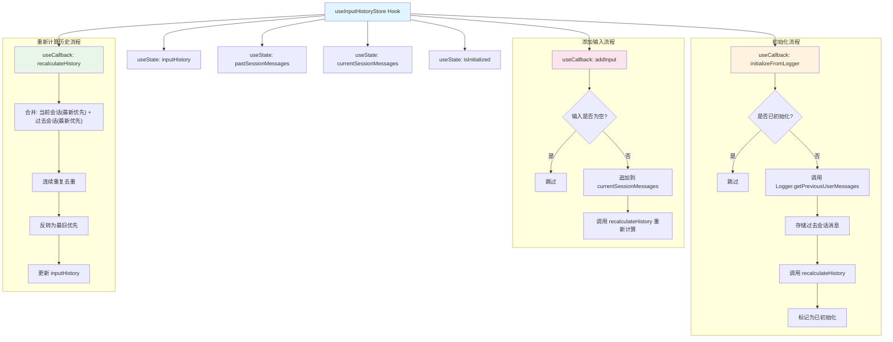

# useInputHistoryStore.ts

## 概述

`useInputHistoryStore` 是一个 React 自定义 Hook，负责**独立管理用户输入历史记录的持久化存储**。它与聊天历史（chat history）完全分离，不受 `/clear` 命令的影响。

该 Hook 的核心职责：
- 从日志器（Logger）加载过去会话（past session）中的用户消息作为历史基础。
- 在当前会话（current session）中追加新的用户输入。
- 合并两个会话的消息，进行**连续重复消息去重**，并维护一个最终的、按时间从旧到新排列的历史列表。
- 将去重后的历史列表提供给 `useInputHistory` Hook 使用，支撑上下箭头导航功能。

## 架构图（Mermaid）



## 核心组件

### 接口：`Logger`

```typescript
interface Logger {
  getPreviousUserMessages(): Promise<string[]>;
}
```

日志器接口，仅声明了一个方法，用于从持久化存储中异步获取之前会话的用户消息列表。

| 方法 | 返回值 | 说明 |
|------|--------|------|
| `getPreviousUserMessages` | `Promise<string[]>` | 返回过去会话中用户消息的数组，顺序为最新的在前 |

### 接口：`UseInputHistoryStoreReturn`

```typescript
export interface UseInputHistoryStoreReturn {
  inputHistory: string[];
  addInput: (input: string) => void;
  initializeFromLogger: (logger: Logger | null) => Promise<void>;
}
```

| 属性 | 类型 | 说明 |
|------|------|------|
| `inputHistory` | `string[]` | 去重后的完整输入历史，按时间从旧到新排列 |
| `addInput` | `(input: string) => void` | 向当前会话添加一条新的用户输入 |
| `initializeFromLogger` | `(logger: Logger \| null) => Promise<void>` | 从日志器加载过去会话的历史消息，仅在应用启动时调用一次 |

### 内部状态

| 状态名 | 类型 | 说明 |
|--------|------|------|
| `inputHistory` | `useState<string[]>` | 最终的、去重后的、按旧到新排列的完整历史列表。这是对外暴露的数据 |
| `_pastSessionMessages` | `useState<string[]>` | 过去会话中的消息列表（最新的在前）。由 `initializeFromLogger` 设置，之后不再改变 |
| `_currentSessionMessages` | `useState<string[]>` | 当前会话中的消息列表（按追加顺序，最旧的在前）。每次 `addInput` 时追加 |
| `isInitialized` | `useState<boolean>` | 是否已完成初始化的标志，防止 `initializeFromLogger` 被重复调用 |

### 核心方法详解

#### `recalculateHistory`

```typescript
const recalculateHistory = useCallback(
  (currentSession: string[], pastSession: string[]) => void,
  [],
);
```

重新计算并更新最终的历史列表，算法步骤：

1. **合并**：将 `currentSession`（最新优先）和 `pastSession`（最新优先）拼接为一个数组，当前会话在前（优先级更高）。
2. **连续去重**：遍历合并后的数组，移除与前一条相同的连续重复消息。注意这不是全局去重，而是仅移除**连续相同**的消息。
3. **反转**：将去重后的数组反转为"最旧优先"的顺序，这是 `useInputHistory` Hook 所期望的数据格式。
4. **更新状态**：调用 `setInputHistory` 更新最终历史列表。

#### `initializeFromLogger`

```typescript
const initializeFromLogger = useCallback(
  async (logger: Logger | null) => Promise<void>,
  [isInitialized, recalculateHistory],
);
```

从日志器加载历史数据的一次性初始化函数：

1. **防重入检查**：如果已初始化或 logger 为 `null`，直接返回。
2. **加载过去消息**：调用 `logger.getPreviousUserMessages()` 异步获取过去会话消息。
3. **存储并计算**：将过去消息存入 `_pastSessionMessages`，以空的当前会话调用 `recalculateHistory`。
4. **标记初始化完成**：设置 `isInitialized` 为 `true`。
5. **容错处理**：如果加载失败，使用空历史初始化并记录警告日志，不会崩溃。

#### `addInput`

```typescript
const addInput = useCallback(
  (input: string) => void,
  [recalculateHistory],
);
```

添加新用户输入的函数：

1. **输入验证**：对输入进行 `trim()`，如果为空或仅含空白字符则跳过。
2. **追加到当前会话**：通过 `setCurrentSessionMessages` 的函数式更新，将新输入追加到当前会话消息数组末尾。
3. **嵌套状态读取**：在 `setCurrentSessionMessages` 的更新函数内部，通过 `setPastSessionMessages` 的函数式更新获取最新的过去会话消息（不实际修改它），然后调用 `recalculateHistory` 重新计算。

## 依赖关系

### 内部依赖

无。该 Hook 不依赖项目中的其他内部模块（除了通过 `Logger` 接口进行间接交互）。

### 外部依赖

| 依赖包 | 导入内容 | 用途 |
|--------|----------|------|
| `react` | `useState`, `useCallback` | React 核心 Hook |
| `@google/gemini-cli-core` | `debugLogger` | 调试日志器，用于在初始化失败时输出警告信息 |

## 关键实现细节

1. **与聊天历史的完全分离**：这是该 Hook 最重要的设计决策。用户的输入历史独立于聊天历史管理，即使用户执行 `/clear` 命令清除聊天记录，输入历史仍然保留。这使得用户在清除聊天后仍能通过上下箭头键浏览之前的输入。

2. **双层会话模型**：
   - **过去会话**（`_pastSessionMessages`）：从日志器加载，在当前应用生命周期内不变。
   - **当前会话**（`_currentSessionMessages`）：仅包含本次应用运行期间新增的输入。
   这种分层设计简化了数据管理，避免了对持久化存储的频繁写入。

3. **连续去重算法**：去重策略是移除连续相同的消息，而非全局去重。例如 `["a", "b", "a"]` 不会被去重（因为两个 "a" 不连续），但 `["a", "a", "b"]` 会被去重为 `["a", "b"]`。这符合终端历史记录的常见行为——连续输入相同命令只记录一次。

4. **嵌套状态更新模式**：`addInput` 中使用了嵌套的 `setState` 函数式更新（`setCurrentSessionMessages` 内部调用 `setPastSessionMessages`），这是为了在 React 的并发模式下安全地访问两个状态的最新值。虽然 `_pastSessionMessages` 并未被实际修改（返回 `prevPast`），但通过函数式更新可以获取其最新值。

5. **一次性初始化保证**：`isInitialized` 标志确保 `initializeFromLogger` 只会成功执行一次，即使组件重新渲染或该函数被多次调用。这通过在 `useCallback` 的依赖项中包含 `isInitialized` 来实现。

6. **容错设计**：初始化失败时（例如日志器 I/O 错误），Hook 会优雅降级为空历史，不会阻塞应用启动。错误通过 `debugLogger.warn` 记录，便于调试。

7. **数据排序约定**：
   - 过去会话消息：**最新优先**（从日志器获取的原始顺序）。
   - 当前会话消息：**最旧优先**（按追加顺序）。
   - 在 `addInput` 中，当前会话消息在传给 `recalculateHistory` 前会通过 `.slice().reverse()` 转为最新优先。
   - 最终输出的 `inputHistory`：**最旧优先**（在 `recalculateHistory` 末尾通过 `.reverse()` 转换）。

8. **下划线前缀命名**：`_pastSessionMessages` 和 `_currentSessionMessages` 使用下划线前缀，表明这些是内部中间状态，不对外暴露。对外只暴露计算后的 `inputHistory`。
