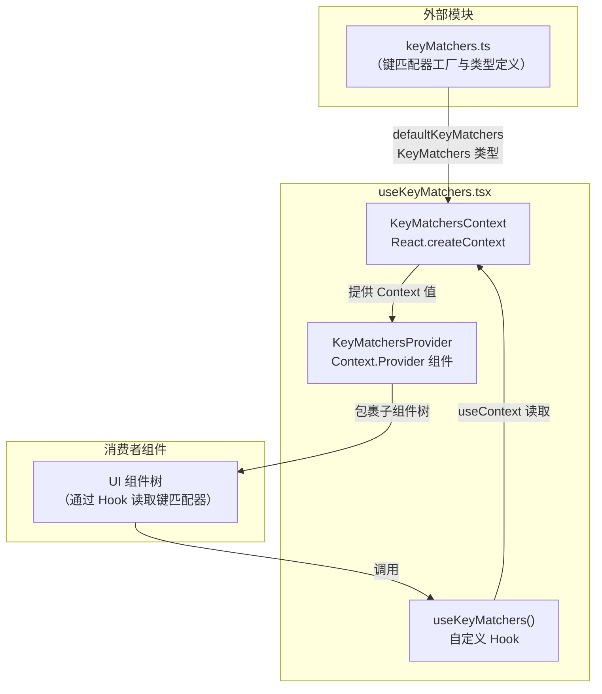

# useKeyMatchers.tsx

## 概述

`useKeyMatchers.tsx` 是一个 React Context + Hook 模块，负责在组件树中提供和消费 **键匹配器（KeyMatchers）**。键匹配器是一组按命令（Command）索引的函数，用于判断某个按键事件是否匹配预定义的快捷键绑定。该模块采用 React 的 Context API 实现依赖注入，使得整个 UI 组件树能够统一获取当前生效的键绑定配置，同时也方便在测试中提供自定义键绑定或使用默认值。

## 架构图（Mermaid）



## 核心组件

### 1. `KeyMatchersContext`

```tsx
export const KeyMatchersContext = createContext<KeyMatchers>(defaultKeyMatchers);
```

- **类型**: `React.Context<KeyMatchers>`
- **默认值**: `defaultKeyMatchers`（来自 `../key/keyMatchers.js`）
- **作用**: 创建一个 React Context，承载当前应用中生效的 `KeyMatchers` 对象。当组件树中没有 `KeyMatchersProvider` 包裹时，消费者将自动获取 `defaultKeyMatchers`，这使得单元测试无需额外包裹 Provider 即可正常运行。

### 2. `KeyMatchersProvider`

```tsx
export const KeyMatchersProvider = ({
  children,
  value,
}: {
  children: React.ReactNode;
  value: KeyMatchers;
}): React.JSX.Element => (
  <KeyMatchersContext.Provider value={value}>
    {children}
  </KeyMatchersContext.Provider>
);
```

- **类型**: React 函数式组件
- **Props**:
  - `children: React.ReactNode` — 被包裹的子组件树
  - `value: KeyMatchers` — 要注入到上下文中的键匹配器实例
- **作用**: 标准的 Context Provider 封装组件。上层应用在初始化时（通常在应用根部）使用此组件将经过用户自定义配置合并后的 `KeyMatchers` 注入到组件树中，下游所有组件即可通过 `useKeyMatchers()` 获取。

### 3. `useKeyMatchers()`

```tsx
export function useKeyMatchers(): KeyMatchers {
  return useContext(KeyMatchersContext);
}
```

- **返回值**: `KeyMatchers` — 一个以 `Command` 枚举为键、`(key: Key) => boolean` 匹配函数为值的只读映射对象。
- **作用**: 自定义 Hook，任何需要判断按键是否匹配某个命令的组件，只需调用此 Hook 即可获取当前上下文中的键匹配器。
- **备注**: 当没有被 `KeyMatchersProvider` 包裹时，返回 `defaultKeyMatchers`，确保测试环境中的兼容性。

## 依赖关系

### 内部依赖

| 依赖模块 | 导入内容 | 说明 |
|---|---|---|
| `../key/keyMatchers.js` (`packages/cli/src/ui/key/keyMatchers.ts`) | `defaultKeyMatchers`, `KeyMatchers` (类型) | `defaultKeyMatchers` 是用默认键绑定配置生成的匹配器实例；`KeyMatchers` 是类型定义，表示 `{ readonly [C in Command]: (key: Key) => boolean }` |

### 外部依赖

| 依赖包 | 导入内容 | 说明 |
|---|---|---|
| `react` | `createContext`, `useContext` | React 核心 API，用于创建和消费 Context |
| `react` (类型) | `React` (type import) | 用于 `React.ReactNode` 和 `React.JSX.Element` 类型标注 |

## 关键实现细节

1. **默认值设计**：`createContext<KeyMatchers>(defaultKeyMatchers)` 传入了非空默认值。这意味着即使组件没有被 `KeyMatchersProvider` 包裹，`useKeyMatchers()` 也会返回一个完整可用的 `KeyMatchers` 对象，而不是 `undefined`。这一设计简化了测试场景，测试中不必为每个使用键匹配器的组件都包裹一层 Provider。

2. **类型安全**：`KeyMatchers` 类型通过映射类型 `{ readonly [C in Command]: KeyMatcher }` 确保每个 `Command` 枚举值都有对应的匹配函数。TypeScript 编译器会在编译期检查是否遗漏了任何命令的匹配器。

3. **关注点分离**：该模块只负责 Context 的创建、Provider 组件和 Hook 的封装，不涉及键匹配的具体逻辑。键匹配的核心实现（如 `matchCommand`、`createKeyMatchers`、用户自定义键绑定加载等）全部在 `keyMatchers.ts` 模块中完成。

4. **Provider 组件的简洁性**：`KeyMatchersProvider` 是一个无状态的薄包装组件，没有任何副作用或内部状态管理，仅仅是 `KeyMatchersContext.Provider` 的语义化封装，提高了代码可读性。

5. **与 Kitty 键盘协议的关联**：在实际应用中，键匹配器可能需要处理来自 Kitty 终端协议的增强按键信息（参见 `useKittyKeyboardProtocol.ts`），`KeyMatchers` 的设计足够灵活，可以通过不同的 `KeyBindingConfig` 来适配不同的键盘输入模式。
