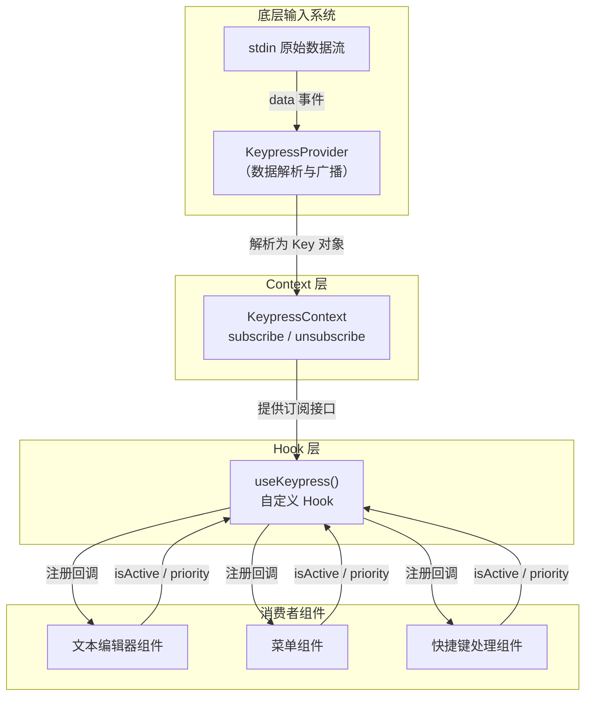

# useKeypress.ts

## 概述

`useKeypress.ts` 是一个 React 自定义 Hook 模块，为组件提供监听键盘按键事件的能力。它封装了 `KeypressContext` 的订阅/取消订阅机制，使组件能够以声明式的方式注册按键回调，并通过 `isActive` 标志控制监听的激活与停用，通过 `priority` 参数控制事件处理优先级。

该 Hook 是整个键盘输入系统面向 UI 组件层的主要入口，所有需要响应键盘事件的组件都应通过此 Hook 进行注册，而非直接操作 stdin 或 Context。

## 架构图（Mermaid）



## 核心组件

### 1. `useKeypress` Hook

```typescript
export function useKeypress(
  onKeypress: KeypressHandler,
  {
    isActive,
    priority,
  }: { isActive: boolean; priority?: KeypressPriority | boolean },
)
```

**参数说明：**

| 参数 | 类型 | 必填 | 说明 |
|---|---|---|---|
| `onKeypress` | `KeypressHandler` （即 `(key: Key) => boolean \| void`） | 是 | 按键事件回调函数。返回 `true` 可阻止低优先级处理器继续处理该事件（事件消费） |
| `options.isActive` | `boolean` | 是 | 是否激活监听。为 `false` 时不订阅任何事件，为 `true` 时订阅 |
| `options.priority` | `KeypressPriority \| boolean` | 否 | 处理优先级。枚举值包括 `Low(-100)`、`Normal(0)`、`High(100)`、`Critical(200)`。也支持布尔值（`true` = `High`，`false`/省略 = `Normal`），以兼容旧版 API |

**内部实现流程：**

1. 通过 `useKeypressContext()` 获取 Context 中的 `subscribe` 和 `unsubscribe` 函数。
2. 在 `useEffect` 中根据 `isActive` 状态：
   - **激活时**：调用 `subscribe(onKeypress, priority)` 将回调注册到事件广播系统中。
   - **清理时**（组件卸载或依赖变化）：调用 `unsubscribe(onKeypress)` 取消注册。
   - **未激活时**：直接返回，不做任何订阅操作。
3. `useEffect` 的依赖数组为 `[isActive, onKeypress, subscribe, unsubscribe, priority]`，确保任意依赖变化时都能正确重新订阅。

### 2. `Key` 类型（重导出）

```typescript
export type { Key };
```

模块重导出了 `KeypressContext` 中定义的 `Key` 接口，便于消费者直接从此模块导入，无需深入 Context 层：

```typescript
interface Key {
  name: string;        // 按键名称，如 'enter'、'escape'、'a'
  shift: boolean;      // 是否按下 Shift
  alt: boolean;        // 是否按下 Alt/Option
  ctrl: boolean;       // 是否按下 Ctrl
  cmd: boolean;        // 是否按下 Command/Windows/Super
  insertable: boolean; // 是否为可插入字符（非控制键）
  sequence: string;    // 原始字符序列
}
```

## 依赖关系

### 内部依赖

| 依赖模块 | 导入内容 | 说明 |
|---|---|---|
| `../contexts/KeypressContext.tsx` | `useKeypressContext`, `KeypressHandler` (类型), `Key` (类型), `KeypressPriority` (类型) | 键盘事件 Context 系统，提供 subscribe/unsubscribe 机制和相关类型定义 |

### 外部依赖

| 依赖包 | 导入内容 | 说明 |
|---|---|---|
| `react` | `useEffect` | React 副作用 Hook，用于管理订阅的生命周期 |

## 关键实现细节

1. **声明式订阅管理**：通过 `isActive` 参数实现条件性订阅。当组件处于非活跃状态（如模态框关闭、输入框失焦）时，`useEffect` 内部直接 `return`，既不订阅也不设置清理函数。这避免了非活跃组件响应键盘事件导致的意外行为。

2. **优先级机制**：`KeypressPriority` 枚举定义了四个级别：
   - `Critical(200)`：最高优先级，用于系统级快捷键（如退出）
   - `High(100)`：高优先级，用于模态对话框等覆盖场景
   - `Normal(0)`：默认优先级，大多数组件使用
   - `Low(-100)`：低优先级，用于背景监听

   事件广播时按优先级从高到低派发。同一优先级内，后订阅的处理器先执行（栈行为）。如果某个处理器返回 `true`，事件传播立即终止。

3. **布尔兼容性**：`priority` 参数支持 `boolean` 类型以向后兼容旧代码。`true` 映射为 `KeypressPriority.High`，`false` 或省略映射为 `KeypressPriority.Normal`。

4. **依赖数组的完整性**：`useEffect` 的依赖数组包含了所有外部引用（`isActive`、`onKeypress`、`subscribe`、`unsubscribe`、`priority`）。这意味着如果 `onKeypress` 回调在每次渲染时重新创建（未被 `useCallback` 包裹），Hook 会在每次渲染时先取消旧订阅再注册新订阅。调用方应注意使用 `useCallback` 稳定化回调以避免不必要的重订阅。

5. **事件消费模式**：`KeypressHandler` 的返回值约定为 `boolean | void`。返回 `true` 表示事件已被消费，广播系统将停止向更低优先级的处理器传播。返回 `void` 或 `false` 则继续传播。这是一种经典的责任链模式。

6. **与 KeypressProvider 的解耦**：`useKeypress` 不直接处理 stdin 数据解析、ANSI 转义序列识别、粘贴缓冲等复杂逻辑，这些全部由 `KeypressProvider` 中的 `emitKeys` 生成器和各种缓冲函数处理。Hook 只负责"订阅已解析好的 Key 事件"，实现了清晰的层次分离。
