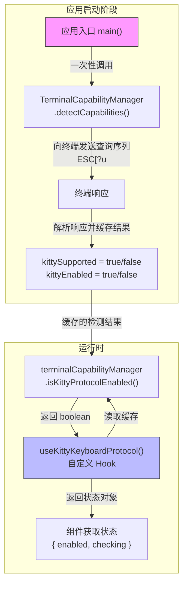

# useKittyKeyboardProtocol.ts

## 概述

`useKittyKeyboardProtocol.ts` 是一个轻量级 React Hook 模块，用于查询当前终端是否启用了 **Kitty 键盘协议（Kitty Keyboard Protocol）**。Kitty 键盘协议是一种现代终端键盘输入协议，能够提供比传统 VT 转义序列更精确、更丰富的按键信息（例如能区分 `Enter` 和 `Ctrl+M`、准确识别修饰键组合等）。

该 Hook 通过读取 `TerminalCapabilityManager` 单例的缓存状态来获取检测结果，而非在运行时发起查询。终端能力检测在应用启动时一次性完成，Hook 只负责将结果暴露给 React 组件。

## 架构图（Mermaid）



## 核心组件

### 1. `KittyProtocolStatus` 接口

```typescript
export interface KittyProtocolStatus {
  enabled: boolean;   // Kitty 协议是否已启用
  checking: boolean;  // 是否正在检测中
}
```

**字段说明：**

| 字段 | 类型 | 说明 |
|---|---|---|
| `enabled` | `boolean` | 指示 Kitty 键盘协议是否在当前终端中已启用。`true` 表示终端支持且已激活该协议 |
| `checking` | `boolean` | 指示是否正在进行检测。在当前实现中始终为 `false`，因为检测在应用启动时同步完成，Hook 调用时检测已结束 |

### 2. `useKittyKeyboardProtocol` Hook

```typescript
export function useKittyKeyboardProtocol(): KittyProtocolStatus {
  const [status] = useState<KittyProtocolStatus>({
    enabled: terminalCapabilityManager.isKittyProtocolEnabled(),
    checking: false,
  });

  return status;
}
```

**行为说明：**

- 使用 `useState` 初始化状态对象，初始值通过 `terminalCapabilityManager.isKittyProtocolEnabled()` 读取缓存的检测结果。
- `useState` 的初始值只在组件首次挂载时计算一次，之后保持不变。
- 没有 `useEffect` 或异步操作——这是一个纯粹的"读取缓存值"的 Hook。
- 返回的 `status` 对象在组件整个生命周期中保持稳定引用（因为 `useState` 不会被更新）。

## 依赖关系

### 内部依赖

| 依赖模块 | 导入内容 | 说明 |
|---|---|---|
| `../utils/terminalCapabilityManager.ts` | `terminalCapabilityManager` | `TerminalCapabilityManager` 类的单例实例，管理终端能力检测的完整生命周期。提供 `isKittyProtocolEnabled()` 方法查询 Kitty 协议启用状态 |

### 外部依赖

| 依赖包 | 导入内容 | 说明 |
|---|---|---|
| `react` | `useState` | React 状态 Hook，用于缓存检测结果 |

## 关键实现细节

1. **检测时序**：终端能力检测由 `TerminalCapabilityManager.detectCapabilities()` 在应用启动阶段完成。该方法通过 `fs.writeSync` 向 stdout 同步写入多个终端查询序列（包括 Kitty 查询 `ESC[?u`、OSC 11 背景色查询、终端名称查询、modifyOtherKeys 查询和设备属性查询），然后异步等待 stdin 的响应数据。所有响应在 1 秒超时内收集完毕后，检测结果被缓存到实例属性中。

2. **Kitty 协议检测流程**：
   - 发送 `ESC[?u` 查询终端当前的 Kitty 键盘标志
   - 如果终端支持 Kitty 协议，会回复 `ESC[?<flags>u` 格式的响应
   - 收到响应后 `kittySupported` 标记为 `true`
   - 随后在 `enableSupportedModes()` 中调用 `enableKittyKeyboardProtocol()` 激活协议，并将 `kittyEnabled` 标记为 `true`
   - `isKittyProtocolEnabled()` 返回的是 `kittyEnabled`（已激活），而非仅仅是 `kittySupported`（仅支持）

3. **`checking` 始终为 `false` 的原因**：由于检测在应用启动时同步完成（相对于 React 渲染循环而言是同步的——在 React 组件挂载之前就已完成），当 Hook 首次执行时检测必然已经结束。因此 `checking: false` 是硬编码的。这一设计假设了 `detectCapabilities()` 在 React 树渲染之前被调用。

4. **与输入处理的关联**：Kitty 协议的启用状态影响 `KeypressProvider` 中的输入处理策略：
   - 当 Kitty 协议未启用时，`KeypressProvider` 会启用 `bufferFastReturn` 处理器来检测快速连续的回车键（用于兼容不支持括号粘贴模式的旧终端）
   - 当 Kitty 协议启用时，跳过 `bufferFastReturn`，因为 Kitty 协议能够精确区分用户按下回车键和粘贴文本中的换行符

5. **降级策略**：如果终端不支持 Kitty 协议，`TerminalCapabilityManager` 会检查是否支持 `modifyOtherKeys` 模式（另一种增强键盘输入的协议）。如果两者都不支持，系统回退到标准 VT 转义序列解析。括号粘贴模式（Bracketed Paste Mode）则始终尝试启用，因为即使终端不支持也不会产生副作用。

6. **进程退出清理**：`TerminalCapabilityManager` 在检测时注册了 `exit`、`SIGTERM`、`SIGINT` 信号处理器，确保进程退出时向终端发送清理序列（关闭 Kitty 协议、modifyOtherKeys、括号粘贴模式和鼠标事件），恢复终端到正常状态。
