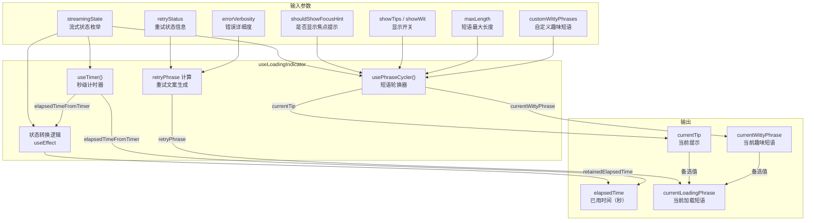

# useLoadingIndicator.ts

## 概述

`useLoadingIndicator.ts` 是一个复合型 React Hook 模块，负责管理 **加载指示器（Loading Indicator）** 的完整状态。它协调计时器、短语轮换和重试状态三个子系统，统一输出当前的已用时间和加载提示文本。该 Hook 是 UI 层展示"模型正在响应"这一状态的核心数据源，被加载指示器组件直接消费。

主要职责包括：
- 追踪模型响应的已用时间（秒级计时器）
- 根据流式状态（Responding / WaitingForConfirmation / Idle）切换和重置计时器
- 轮换显示信息提示（Tips）和趣味短语（Witty Phrases）
- 处理重试状态的展示文案（含低详细度和完整详细度两种模式）

## 架构图（Mermaid）



## 核心组件

### 1. `UseLoadingIndicatorProps` 接口

```typescript
export interface UseLoadingIndicatorProps {
  streamingState: StreamingState;
  shouldShowFocusHint: boolean;
  retryStatus: RetryAttemptPayload | null;
  showTips?: boolean;
  showWit?: boolean;
  customWittyPhrases?: string[];
  errorVerbosity?: 'low' | 'full';
  maxLength?: number;
}
```

| 属性 | 类型 | 默认值 | 说明 |
|---|---|---|---|
| `streamingState` | `StreamingState` | — | 当前流式状态：`Idle`、`Responding` 或 `WaitingForConfirmation` |
| `shouldShowFocusHint` | `boolean` | — | 是否显示交互式 Shell 焦点提示（"Shell awaiting input (Tab to focus)"） |
| `retryStatus` | `RetryAttemptPayload \| null` | — | 重试状态信息，包含当前尝试次数、最大尝试次数和模型名称。为 `null` 表示没有在重试 |
| `showTips` | `boolean` | `true` | 是否显示信息提示（来自 `INFORMATIVE_TIPS` 常量列表） |
| `showWit` | `boolean` | `false` | 是否显示趣味短语（来自 `WITTY_LOADING_PHRASES` 或自定义列表） |
| `customWittyPhrases` | `string[]` | `undefined` | 自定义趣味短语列表，替代内置的 `WITTY_LOADING_PHRASES` |
| `errorVerbosity` | `'low' \| 'full'` | `'full'` | 重试信息的详细度。`'low'` 模式下仅在第 2 次及以上尝试时显示简短提示 |
| `maxLength` | `number` | `undefined` | 短语的最大字符长度限制，超过此长度的短语会被过滤 |

### 2. `useLoadingIndicator` Hook

**返回值：**

```typescript
{
  elapsedTime: number;              // 已用时间（秒）
  currentLoadingPhrase: string | null | undefined;  // 当前优先显示的加载短语
  currentTip: string | undefined;   // 当前提示
  currentWittyPhrase: string | undefined;  // 当前趣味短语
}
```

**内部子系统：**

#### 2.1 计时器子系统

```typescript
const [timerResetKey, setTimerResetKey] = useState(0);
const isTimerActive = streamingState === StreamingState.Responding;
const elapsedTimeFromTimer = useTimer(isTimerActive, timerResetKey);
```

- 计时器仅在 `StreamingState.Responding` 状态下激活
- `timerResetKey` 的递增会触发计时器重置（归零并重新开始计时）
- `useTimer` 返回从上次重置以来的秒数

#### 2.2 短语轮换子系统

```typescript
const { currentTip, currentWittyPhrase } = usePhraseCycler(
  isPhraseCyclingActive, isWaiting, shouldShowFocusHint,
  showTips, showWit, customWittyPhrases, maxLength,
);
```

- 仅在 `Responding` 状态下激活短语轮换
- 信息提示每 10 秒切换一次
- 趣味短语每 5 秒切换一次
- 在等待确认状态下显示"Waiting for user confirmation..."
- 在焦点提示状态下显示"Shell awaiting input (Tab to focus)"

#### 2.3 状态转换逻辑

```typescript
useEffect(() => {
  // WaitingForConfirmation -> Responding: 重置计时器和保留时间
  // Responding -> Idle: 重置计时器和保留时间
  // -> WaitingForConfirmation: 捕获当前计时器值作为保留时间
  prevStreamingStateRef.current = streamingState;
}, [streamingState, elapsedTimeFromTimer]);
```

这是核心的状态机逻辑，管理三种状态之间的转换：

| 转换路径 | 触发动作 |
|---|---|
| `WaitingForConfirmation` -> `Responding` | 重置 `timerResetKey`（计时器归零），清除保留时间 |
| `Responding` -> `Idle` | 重置 `timerResetKey`（计时器归零），清除保留时间 |
| 任意 -> `WaitingForConfirmation` | 捕获当前 `elapsedTimeFromTimer` 到 `retainedElapsedTime` |

#### 2.4 重试文案生成

```typescript
const retryPhrase = retryStatus
  ? errorVerbosity === 'low'
    ? retryStatus.attempt >= LOW_VERBOSITY_RETRY_HINT_ATTEMPT_THRESHOLD
      ? "This is taking a bit longer, we're still on it."
      : null
    : `Trying to reach ${getDisplayString(retryStatus.model)} (Attempt ${retryStatus.attempt + 1}/${retryStatus.maxAttempts})`
  : null;
```

- `errorVerbosity === 'full'`：显示完整信息，如 "Trying to reach gemini-2.0 (Attempt 2/5)"
- `errorVerbosity === 'low'`：仅在第 2 次（`attempt >= 2`）及以上尝试时显示简短提示
- 无重试时返回 `null`

**优先级合并**：最终的 `currentLoadingPhrase` 按优先级为 `retryPhrase > currentTip > currentWittyPhrase`。

## 依赖关系

### 内部依赖

| 依赖模块 | 导入内容 | 说明 |
|---|---|---|
| `../types.js` | `StreamingState` | 流式状态枚举：`Idle`、`Responding`、`WaitingForConfirmation` |
| `./useTimer.js` | `useTimer` | 秒级计时器 Hook，支持激活/停用和重置 |
| `./usePhraseCycler.js` | `usePhraseCycler` | 短语轮换 Hook，管理提示和趣味短语的定时切换 |

### 外部依赖

| 依赖包 | 导入内容 | 说明 |
|---|---|---|
| `react` | `useState`, `useEffect`, `useRef` | React 核心 Hooks |
| `@google/gemini-cli-core` | `getDisplayString`, `RetryAttemptPayload` (类型) | 核心工具函数和类型。`getDisplayString` 用于将模型标识转为显示名称；`RetryAttemptPayload` 包含重试的元信息 |

## 关键实现细节

1. **计时器的时间保留机制**：当状态从 `Responding` 转为 `WaitingForConfirmation`（例如模型请求工具调用需要用户确认）时，计时器停止但已用时间被保留在 `retainedElapsedTime` 中。此时 `elapsedTime` 输出使用保留值而非计时器的当前值，确保用户看到的时间不会跳变或归零。当用户确认后状态回到 `Responding` 时，保留时间清除，计时器重新从 0 开始。

2. **状态转换使用 `useRef` 追踪前一状态**：`prevStreamingStateRef` 用于在 `useEffect` 中判断状态转换方向。这比仅依赖当前状态值更精确，因为同一目标状态可能来自不同的源状态，需要执行不同的逻辑（如从 `WaitingForConfirmation` 到 `Responding` 需要重置，但从 `Idle` 到 `Responding` 则由 `useTimer` 自动处理）。

3. **`LOW_VERBOSITY_RETRY_HINT_ATTEMPT_THRESHOLD` 阈值**：设为 2，意味着在低详细度模式下，前两次重试尝试（attempt 0 和 1）不显示任何提示，从第三次开始才显示"This is taking a bit longer"。这避免了短暂的网络波动给用户带来不必要的焦虑。

4. **`timerResetKey` 递增模式**：通过 `setTimerResetKey(prev => prev + 1)` 递增一个计数器来触发 `useTimer` 的重置。`useTimer` 内部检测到 `resetKey` 变化后会将已用时间归零。这种"key 递增"模式是 React 中常用的强制重置 Hook 状态的惯用法。

5. **加载短语的优先级规则**：`currentLoadingPhrase = retryPhrase || currentTip || currentWittyPhrase`。重试信息拥有最高优先级——当正在重试时，即使有提示或趣味短语可用也不显示。这确保用户在遇到错误时首先看到重试状态信息。

6. **短语长度过滤**：`maxLength` 参数被传递给 `usePhraseCycler`，后者在选择随机短语时过滤掉超过指定长度的项。这对于终端宽度有限的场景非常重要，避免提示文本溢出截断。
