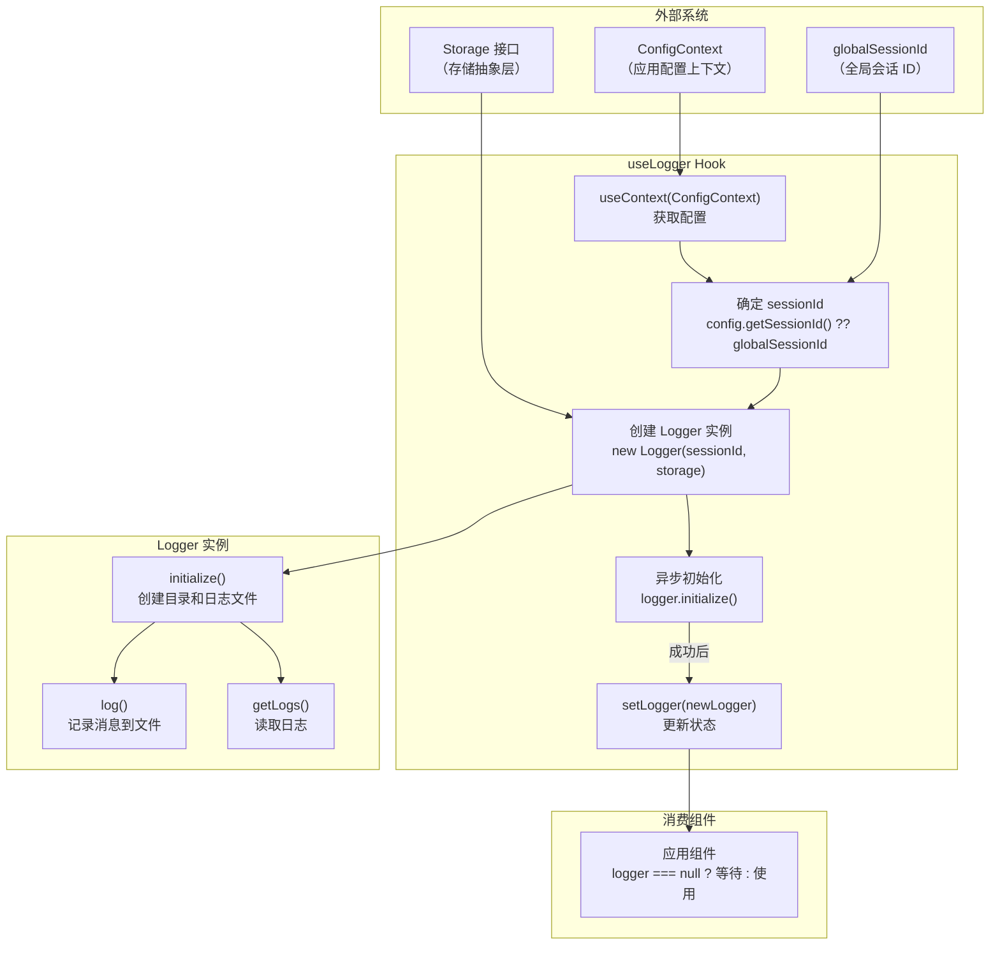

# useLogger.ts

## 概述

`useLogger.ts` 是一个 React Hook 模块，负责管理 **Logger（日志记录器）** 实例的创建和异步初始化。Logger 用于将会话消息（用户输入和模型回复）持久化到本地 JSON 日志文件中，实现会话历史记录功能。

该 Hook 的关键设计特点是**非阻塞初始化**：Logger 的初始化涉及文件系统操作（创建目录、读取/写入日志文件），这些操作通过异步方式在后台完成，不会阻塞 CLI 界面的首次渲染。在初始化完成之前，Hook 返回 `null`，消费组件应据此判断日志功能是否就绪。

## 架构图（Mermaid）



## 核心组件

### 1. `useLogger` Hook

```typescript
export const useLogger = (storage: Storage): Logger | null => {
  const [logger, setLogger] = useState<Logger | null>(null);
  const config = useContext(ConfigContext);

  useEffect(() => {
    const activeSessionId = config?.getSessionId() ?? globalSessionId;
    const newLogger = new Logger(activeSessionId, storage);

    newLogger
      .initialize()
      .then(() => {
        setLogger(newLogger);
      })
      .catch(() => {});
  }, [storage, config]);

  return logger;
};
```

**参数说明：**

| 参数 | 类型 | 说明 |
|---|---|---|
| `storage` | `Storage` | 存储抽象层实例，提供项目临时目录路径等文件系统相关功能。Logger 通过它确定日志文件的存储位置 |

**返回值：**

| 返回值 | 类型 | 说明 |
|---|---|---|
| `logger` | `Logger \| null` | Logger 实例。初始化完成前为 `null`，初始化成功后为可用的 `Logger` 实例。初始化失败时永远保持 `null` |

**内部执行流程：**

1. **获取配置**：通过 `useContext(ConfigContext)` 获取当前应用配置。`ConfigContext` 可能为 `undefined`（如果组件不在 Provider 内部）。
2. **确定会话 ID**：优先使用 `config.getSessionId()`（来自配置的会话 ID），如果不可用则回退到 `globalSessionId`（模块级全局会话 ID）。
3. **创建 Logger 实例**：使用会话 ID 和 storage 参数创建新的 `Logger` 实例。
4. **异步初始化**：调用 `newLogger.initialize()`，该方法执行以下操作：
   - 调用 `storage.initialize()` 初始化存储层
   - 获取项目临时目录路径
   - 创建日志目录（递归创建）
   - 读取现有日志文件（如果存在）
   - 初始化消息 ID 计数器（基于当前会话的最大 messageId + 1）
5. **更新状态**：初始化成功后通过 `setLogger(newLogger)` 将 Logger 实例设置到 React 状态中，触发消费组件重新渲染。
6. **错误静默处理**：`.catch(() => {})` 吞掉初始化错误，确保不会导致未处理的 Promise 拒绝。Logger 的内部 `initialize` 方法已经通过 `coreEvents.emitFeedback` 报告了错误细节。

## 依赖关系

### 内部依赖

| 依赖模块 | 导入内容 | 说明 |
|---|---|---|
| `../contexts/ConfigContext.tsx` | `ConfigContext` | 应用配置上下文，提供 `Config` 对象。通过 `config.getSessionId()` 获取当前会话 ID |

### 外部依赖

| 依赖包 | 导入内容 | 说明 |
|---|---|---|
| `react` | `useState`, `useEffect`, `useContext` | React 核心 Hooks |
| `@google/gemini-cli-core` | `sessionId` (重命名为 `globalSessionId`), `Logger`, `Storage` (类型) | `sessionId` 是模块级全局会话 ID 常量；`Logger` 是日志记录器类，负责将消息持久化到 JSON 文件；`Storage` 是存储抽象层接口 |

## 关键实现细节

1. **非阻塞初始化策略**：这是该 Hook 最重要的设计决策。代码注释明确指出："Start async initialization, no need to await. Using await slows down the time from launch to see the gemini-cli prompt and it's better to not save messages than for the cli to hanging waiting for the logger to loading." 即，宁可丢失少量早期消息，也不让用户在启动时感受到延迟。Logger 的 `initialize()` 返回 Promise，但 Hook 故意不 await 它——只在 `.then()` 中更新状态。

2. **`null` 状态的含义**：返回 `null` 有两种语义：
   - Logger 正在初始化中（正常的瞬态状态）
   - Logger 初始化失败（永久状态，日志功能不可用）

   消费组件无法区分这两种情况，统一按"日志不可用"处理。这是一种优雅降级——日志记录是非关键功能，不应影响核心 AI 对话体验。

3. **依赖数组 `[storage, config]`**：`useEffect` 会在 `storage` 或 `config` 变化时重新执行，创建新的 Logger 实例。这意味着：
   - 如果 `storage` 实例在组件生命周期中被替换（极少见），Logger 会重新初始化
   - 如果 `config` 变化（如配置热更新），Logger 也会重新初始化以使用新的会话 ID
   - 注意：旧的 Logger 实例没有显式的 `dispose` 或 `close` 调用，依赖垃圾回收清理

4. **会话 ID 回退机制**：`config?.getSessionId() ?? globalSessionId` 使用可选链和空值合并运算符实现两级回退：
   - 优先级 1：从 `ConfigContext` 中的 `Config` 对象获取会话 ID
   - 优先级 2：使用从 `@google/gemini-cli-core` 导入的全局会话 ID
   - 这确保即使在没有 `ConfigContext.Provider` 的环境中（如某些测试场景），Hook 也能正常工作

5. **Logger 的日志文件格式**：Logger 将消息存储为 JSON 数组格式的文件（`conversation_logs.json`），每条记录包含 `sessionId`、`messageId`（会话内递增计数器）、`timestamp`、`type` 和 `message` 字段。初始化时会读取现有文件以恢复消息 ID 计数器，避免 ID 冲突。

6. **错误处理的分层设计**：
   - **初始化级错误**：由 `Logger.initialize()` 内部通过 `coreEvents.emitFeedback('error', ...)` 报告，用户可在错误反馈通道中看到
   - **Hook 级错误**：`.catch(() => {})` 静默处理，仅导致 `logger` 保持 `null`
   - **日志文件损坏**：Logger 内部有自动备份和重建机制（`_backupCorruptedLogFile`），将损坏文件重命名为 `.bak` 后创建新文件

7. **Logger 没有清理逻辑**：`useEffect` 没有返回清理函数。这意味着当依赖变化导致重新创建 Logger 时，旧 Logger 实例不会被显式关闭。由于 Logger 不持有文件句柄（每次写入都是独立的文件操作），这不会导致资源泄漏，但如果旧 Logger 的 `initialize()` 尚未完成，其 `.then()` 中的 `setLogger` 可能在新 Logger 创建后执行，导致短暂的状态不一致。在实际使用中，由于 `storage` 和 `config` 极少变化，此问题的影响可忽略不计。
