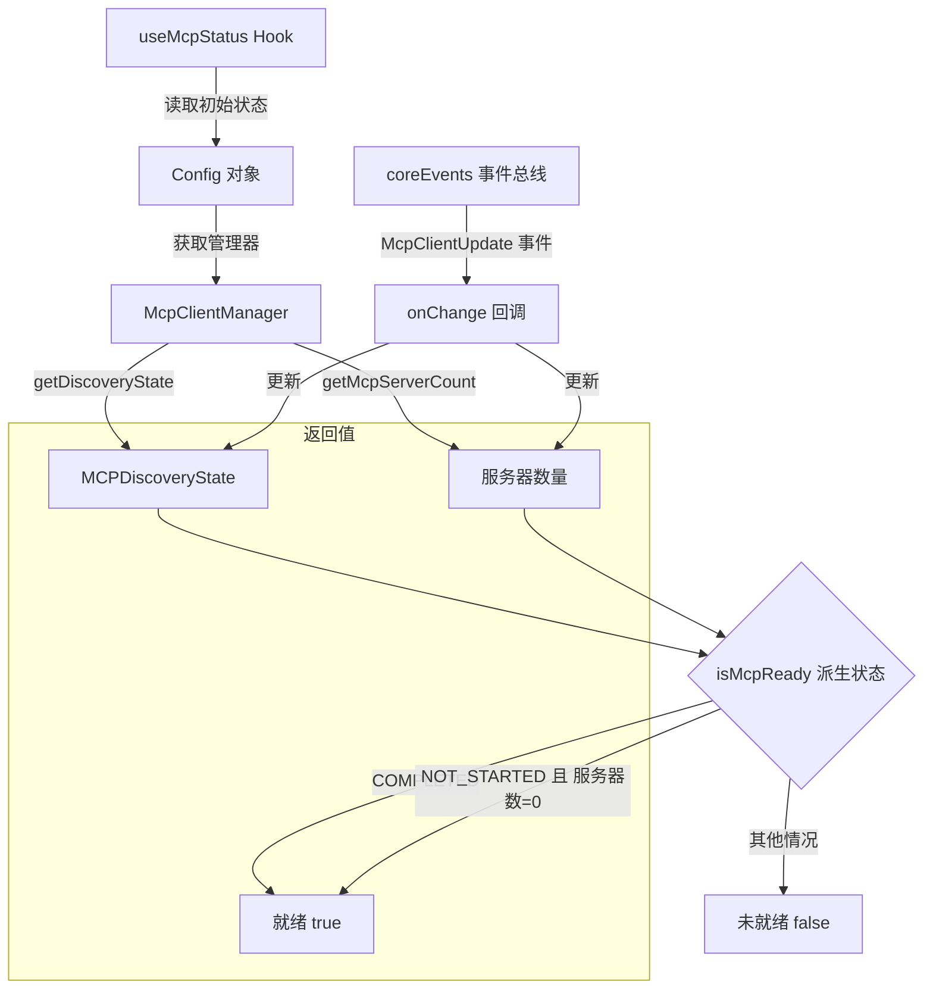

# useMcpStatus.ts

## 概述

`useMcpStatus` 是一个 React 自定义 Hook，用于追踪 MCP（Model Context Protocol）服务的发现状态和服务器数量。它通过订阅核心事件系统 (`coreEvents`) 来实时监听 MCP 客户端管理器的状态变化，并对外暴露三个关键状态值：发现状态 (`discoveryState`)、MCP 服务器数量 (`mcpServerCount`) 以及一个派生的就绪标志 (`isMcpReady`)。

该 Hook 的典型使用场景是在 CLI 的 UI 层判断 MCP 工具链是否已就绪，从而决定是否允许用户发起依赖 MCP 工具的操作。

## 架构图（Mermaid）



## 核心组件

### `useMcpStatus(config: Config)` 函数签名

| 参数 | 类型 | 说明 |
|------|------|------|
| `config` | `Config` | 核心配置对象，提供对 `McpClientManager` 的访问入口 |

### 内部状态

| 状态名 | 类型 | 初始值 | 说明 |
|--------|------|--------|------|
| `discoveryState` | `MCPDiscoveryState` | 从 `McpClientManager.getDiscoveryState()` 获取，若管理器不存在则为 `NOT_STARTED` | MCP 服务发现的当前阶段 |
| `mcpServerCount` | `number` | 从 `McpClientManager.getMcpServerCount()` 获取，若管理器不存在则为 `0` | 当前已发现的 MCP 服务器数量 |

### 派生状态

| 状态名 | 类型 | 说明 |
|--------|------|------|
| `isMcpReady` | `boolean` | 当 `discoveryState === COMPLETED` 或 `discoveryState === NOT_STARTED && mcpServerCount === 0` 时为 `true` |

`isMcpReady` 的判断逻辑有两种就绪条件：
1. **发现已完成** (`COMPLETED`)：正常的就绪路径，所有 MCP 服务器都已被发现。
2. **未启动且无服务器** (`NOT_STARTED` + 数量为 0)：表示当前配置中根本没有 MCP 服务器需要发现，因此也视为就绪。

### 返回值

```typescript
{
  discoveryState: MCPDiscoveryState;  // 当前发现状态枚举
  mcpServerCount: number;             // MCP 服务器数量
  isMcpReady: boolean;                // 是否就绪
}
```

## 依赖关系

### 内部依赖

| 依赖模块 | 导入项 | 用途 |
|----------|--------|------|
| `@google/gemini-cli-core` | `Config` | 核心配置类型，通过 `getMcpClientManager()` 获取 MCP 客户端管理器 |
| `@google/gemini-cli-core` | `coreEvents` | 核心事件总线实例，用于订阅/取消订阅 MCP 状态变更事件 |
| `@google/gemini-cli-core` | `MCPDiscoveryState` | MCP 发现状态枚举，包含 `NOT_STARTED`、`COMPLETED` 等值 |
| `@google/gemini-cli-core` | `CoreEvent` | 核心事件枚举，使用 `CoreEvent.McpClientUpdate` 事件 |

### 外部依赖

| 依赖包 | 导入项 | 用途 |
|--------|--------|------|
| `react` | `useEffect` | 用于在组件挂载时订阅事件、卸载时清理订阅 |
| `react` | `useState` | 用于管理 `discoveryState` 和 `mcpServerCount` 两个响应式状态 |

## 关键实现细节

1. **惰性初始化（Lazy Initialization）**：两个 `useState` 均使用函数式初始化器（传入回调函数而非直接传值），这确保了 `getMcpClientManager()` 和后续的 `getDiscoveryState()` / `getMcpServerCount()` 仅在组件首次渲染时执行一次，避免了每次重渲染时的冗余调用。

2. **可选链安全访问**：通过 `config.getMcpClientManager()?.getDiscoveryState()` 使用可选链操作符，安全处理 `McpClientManager` 可能为 `null` 或 `undefined` 的情况，并用空值合并运算符 (`??`) 提供合理的默认值。

3. **事件驱动的状态同步**：Hook 通过 `coreEvents.on(CoreEvent.McpClientUpdate, onChange)` 订阅全局事件总线，当 MCP 客户端管理器的状态发生变化时，`onChange` 回调会被触发，从而拉取最新的状态值更新到 React 状态中。这是一种典型的「推拉结合」模式 -- 事件推送通知变化，回调中再主动拉取最新状态。

4. **清理副作用**：`useEffect` 的清理函数中通过 `coreEvents.off(CoreEvent.McpClientUpdate, onChange)` 取消事件订阅，防止组件卸载后出现内存泄漏或对已卸载组件的状态更新（React 警告）。

5. **`isMcpReady` 的双重就绪条件**：除了正常的 `COMPLETED` 状态外，还将 `NOT_STARTED && mcpServerCount === 0` 视为就绪。这是因为如果配置中完全没有 MCP 服务器，发现过程不会启动（保持 `NOT_STARTED`），但此时系统不应阻塞等待一个永远不会发生的发现完成事件。

6. **依赖数组 `[config]`**：`useEffect` 的依赖数组只包含 `config`，意味着只有当 `config` 对象引用发生变化时才会重新设置事件订阅。在实际使用中 `config` 通常是稳定的单例，因此事件订阅在组件生命周期中只会建立一次。
