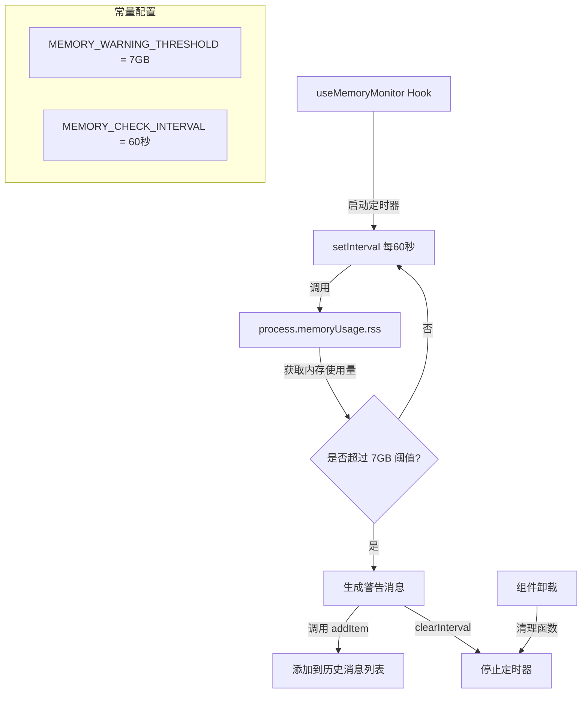

# useMemoryMonitor.ts

## 概述

`useMemoryMonitor` 是一个 React 自定义 Hook，用于定期监控 Node.js 进程的内存使用情况。它以每分钟一次的频率检测进程的 RSS（Resident Set Size，常驻内存集）使用量，当内存超过 7GB 阈值时，向用户界面的历史消息中添加一条警告信息，并自动停止后续检测。

该 Hook 的设计目标是在 CLI 长时间运行过程中，提前发现潜在的内存泄漏或过高的内存占用，向用户发出预警，避免因进程被操作系统 OOM Killer 杀死而导致用户丢失上下文。

## 架构图（Mermaid）



## 核心组件

### `useMemoryMonitor(options: MemoryMonitorOptions)` 函数签名

| 参数 | 类型 | 说明 |
|------|------|------|
| `options` | `MemoryMonitorOptions` | 配置对象，包含 `addItem` 回调 |

### `MemoryMonitorOptions` 接口

| 字段 | 类型 | 说明 |
|------|------|------|
| `addItem` | `(item: HistoryItemWithoutId, timestamp: number) => void` | 向 UI 历史消息列表中添加一条消息的回调函数 |

### 导出常量

| 常量名 | 值 | 说明 |
|--------|-----|------|
| `MEMORY_WARNING_THRESHOLD` | `7 * 1024 * 1024 * 1024`（7,516,192,768 字节，即 7GB） | 内存使用的警告阈值 |
| `MEMORY_CHECK_INTERVAL` | `60 * 1000`（60,000 毫秒，即 1 分钟） | 内存检查的时间间隔 |

### 警告消息格式

当内存超过阈值时，生成的消息内容如下：

```
High memory usage detected: X.XX GB. If you experience a crash, please file a bug report by running `/bug`
```

其中 `X.XX` 是当前实际内存使用量，以 GB 为单位保留两位小数。

## 依赖关系

### 内部依赖

| 依赖模块 | 导入项 | 用途 |
|----------|--------|------|
| `../types.js` | `HistoryItemWithoutId` | 历史消息条目的类型定义（不含 `id` 字段），用于构造警告消息对象 |
| `../types.js` | `MessageType` | 消息类型枚举，使用 `MessageType.WARNING` 标记消息为警告类型 |

### 外部依赖

| 依赖包 | 导入项 | 用途 |
|--------|--------|------|
| `react` | `useEffect` | 用于在组件挂载时启动定时器、卸载时清理定时器 |
| `node:process` | `process`（默认导入） | 访问 `process.memoryUsage().rss` 获取当前进程的常驻内存使用量 |

## 关键实现细节

1. **RSS 而非 heapUsed**：Hook 使用 `process.memoryUsage().rss` 而非 `heapUsed` 或 `heapTotal`。RSS（Resident Set Size）反映的是操作系统实际分配给该进程的物理内存大小，包括代码段、堆、栈以及共享库等所有内存区域，是衡量进程对系统内存压力最全面的指标。

2. **一次性触发（Fire Once）机制**：当检测到内存超过阈值后，Hook 会立即调用 `clearInterval(intervalId)` 停止定时器。这意味着整个 Hook 生命周期中最多只会发出一次警告。这样的设计避免了每分钟重复告警造成的消息刷屏，同时也停止了不必要的持续检测以节省计算资源。

3. **阈值选择 7GB 的合理性**：Node.js 默认的 V8 堆内存上限通常在 1.5GB-4GB 之间（取决于系统），但 RSS 还包含了非堆内存。7GB 是一个相当高的值，意味着该警告主要针对长时间运行导致的严重内存泄漏场景，而不是一般性的内存波动。

4. **定时器清理**：`useEffect` 返回的清理函数确保在组件卸载或 `addItem` 引用变化时（依赖数组 `[addItem]`），之前的定时器会被正确清除，防止内存泄漏和对已卸载组件的状态更新。

5. **时间戳注入**：添加消息时使用 `Date.now()` 获取当前时间戳作为第二个参数传入 `addItem`，确保警告消息带有精确的触发时间信息。

6. **内存格式化**：警告消息中将字节转换为 GB 并保留两位小数 (`(usage / (1024 * 1024 * 1024)).toFixed(2)`)，使用户能够直观了解当前内存使用量级。

7. **依赖数组 `[addItem]`**：`useEffect` 的依赖数组中包含 `addItem`。如果父组件未使用 `useCallback` 稳定化 `addItem` 引用，每次父组件重渲染都会导致定时器重建。在实践中，调用方通常会确保 `addItem` 的引用稳定性。
