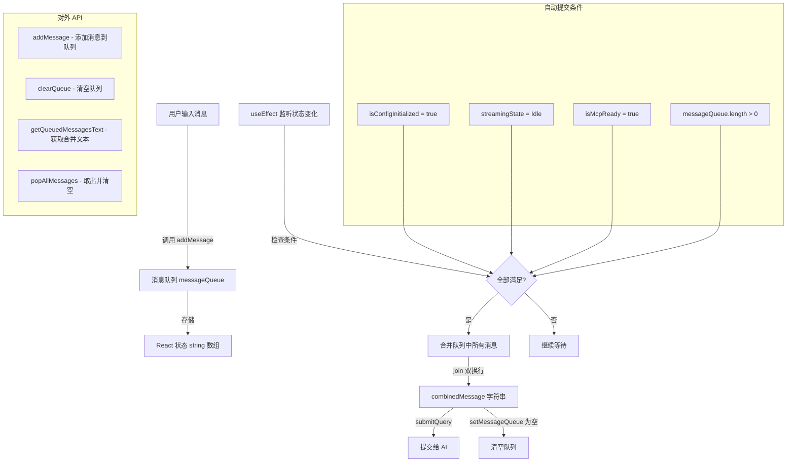

# useMessageQueue.ts

## 概述

`useMessageQueue` 是一个 React 自定义 Hook，用于管理 AI 流式响应期间的用户消息排队机制。当 AI 正在生成回复（流式传输状态）时，用户仍然可以输入新的消息，这些消息会被暂存到队列中。一旦流式传输完成（状态变为 `Idle`），队列中的所有消息将被自动合并并提交给 AI 处理。

该 Hook 解决了一个核心交互问题：在 AI 尚未完成当前回复时，用户的新输入不会丢失，而是被有序缓存，待 AI 空闲后自动发送。这大大提升了 CLI 交互的流畅性和用户体验。

## 架构图（Mermaid）

## 核心组件

### `useMessageQueue(options: UseMessageQueueOptions)` 函数签名

#### `UseMessageQueueOptions` 接口（输入参数）

| 字段 | 类型 | 说明 |
|------|------|------|
| `isConfigInitialized` | `boolean` | 配置是否已初始化完毕 |
| `streamingState` | `StreamingState` | 当前 AI 的流式传输状态（`Idle`、`Streaming` 等） |
| `submitQuery` | `(query: string) => void` | 向 AI 提交查询的函数 |
| `isMcpReady` | `boolean` | MCP 服务是否就绪 |

#### `UseMessageQueueReturn` 接口（返回值）

| 字段 | 类型 | 说明 |
|------|------|------|
| `messageQueue` | `string[]` | 当前队列中的所有消息（只读状态） |
| `addMessage` | `(message: string) => void` | 向队列末尾添加一条消息（会自动 trim，空消息被忽略） |
| `clearQueue` | `() => void` | 清空整个消息队列 |
| `getQueuedMessagesText` | `() => string` | 将队列中所有消息用双换行 (`\n\n`) 连接成单一字符串，队列为空时返回空字符串 |
| `popAllMessages` | `() => string \| undefined` | 取出并返回所有消息（合并为字符串），同时清空队列；队列为空时返回 `undefined` |

### 内部状态

| 状态名 | 类型 | 初始值 | 说明 |
|--------|------|--------|------|
| `messageQueue` | `string[]` | `[]` | 消息队列，存储用户在流式响应期间输入的待发送消息 |

### 核心方法详解

#### `addMessage(message: string)`

- 使用 `useCallback` 包裹，依赖数组为空 `[]`，引用永远稳定
- 对输入消息先进行 `trim()` 处理
- 只有非空字符串才会被加入队列
- 通过函数式更新 `setMessageQueue((prev) => [...prev, trimmedMessage])` 确保并发安全

#### `clearQueue()`

- 使用 `useCallback` 包裹，依赖数组为空 `[]`，引用永远稳定
- 直接将队列重置为空数组

#### `getQueuedMessagesText()`

- 使用 `useCallback` 包裹，依赖 `[messageQueue]`
- 队列为空返回空字符串 `''`
- 非空时使用 `'\n\n'` 双换行连接所有消息

#### `popAllMessages()`

- 使用 `useCallback` 包裹，依赖 `[messageQueue]`
- 队列为空返回 `undefined`
- 非空时先合并所有消息，然后清空队列，最后返回合并结果
- 类似于数据结构中的 "drain" 操作

### 自动提交逻辑（useEffect）

`useEffect` 监听五个依赖项的变化，当以下四个条件**同时满足**时触发自动提交：

1. `isConfigInitialized === true` -- 配置已初始化
2. `streamingState === StreamingState.Idle` -- AI 当前空闲，没有在进行流式输出
3. `isMcpReady === true` -- MCP 工具链已就绪
4. `messageQueue.length > 0` -- 队列中有待处理的消息

触发后执行：
1. 使用 `'\n\n'` 将所有排队消息合并为单一字符串
2. 清空队列 `setMessageQueue([])`
3. 调用 `submitQuery(combinedMessage)` 提交合并后的消息

## 依赖关系

### 内部依赖

| 依赖模块 | 导入项 | 用途 |
|----------|--------|------|
| `../types.js` | `StreamingState` | 流式传输状态枚举，用于判断 AI 是否处于空闲状态 |

### 外部依赖

| 依赖包 | 导入项 | 用途 |
|--------|--------|------|
| `react` | `useCallback` | 稳定化回调函数引用，防止不必要的重渲染 |
| `react` | `useEffect` | 监听状态变化，实现自动提交逻辑 |
| `react` | `useState` | 管理消息队列状态 |

## 关键实现细节

1. **消息合并策略**：多条排队消息使用双换行 (`\n\n`) 而非单换行连接。这种分隔方式在提交给 AI 时更易于区分不同的用户意图，相当于给 AI 一个段落分隔的信号。

2. **空消息过滤**：`addMessage` 会先 `trim()` 输入，再检查长度是否大于 0。这防止了用户误按回车产生的空消息污染队列。

3. **三重就绪门控**：自动提交需要 `isConfigInitialized`、`streamingState === Idle` 和 `isMcpReady` 三个条件同时满足。这确保了消息只在系统完全就绪时才被提交，避免了配置未就绪或 MCP 工具未加载时的提交失败。

4. **函数式状态更新**：`addMessage` 中使用 `setMessageQueue((prev) => [...prev, trimmedMessage])` 的函数式更新模式，确保即使在短时间内连续调用 `addMessage`，每次更新都基于最新的队列状态，不会丢失消息。

5. **`popAllMessages` 的读-清原子性**：该方法先读取当前队列内容，再清空队列，最后返回读取的内容。虽然 React 的状态更新是异步的，但在同一个同步执行上下文中，`messageQueue` 的引用是确定的，因此读取和清空操作在逻辑上是原子的。

6. **`useCallback` 的依赖策略**：`addMessage` 和 `clearQueue` 的依赖数组为空，保证引用永远稳定；`getQueuedMessagesText` 和 `popAllMessages` 依赖 `[messageQueue]`，因为它们需要访问最新的队列内容。这种差异化的依赖设计在性能和正确性之间取得了平衡。

7. **竞态条件防护**：`useEffect` 中先清空队列再提交查询（`setMessageQueue([])` 在 `submitQuery(combinedMessage)` 之前），确保不会因为 `submitQuery` 触发重渲染而导致同一批消息被重复提交。
